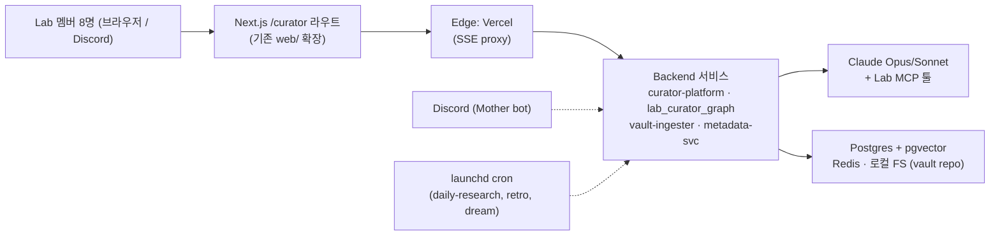
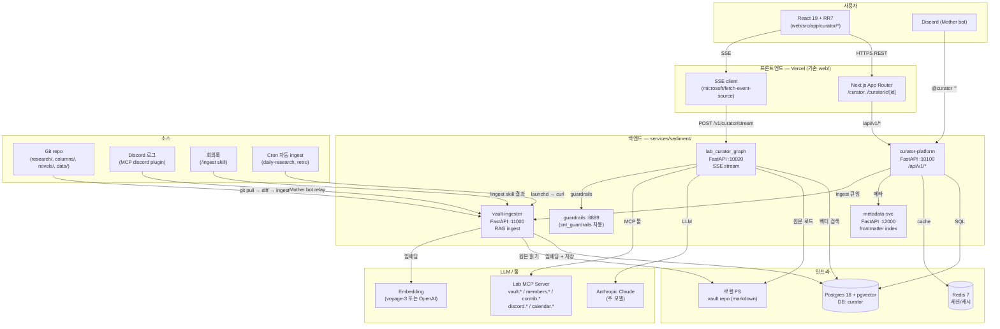
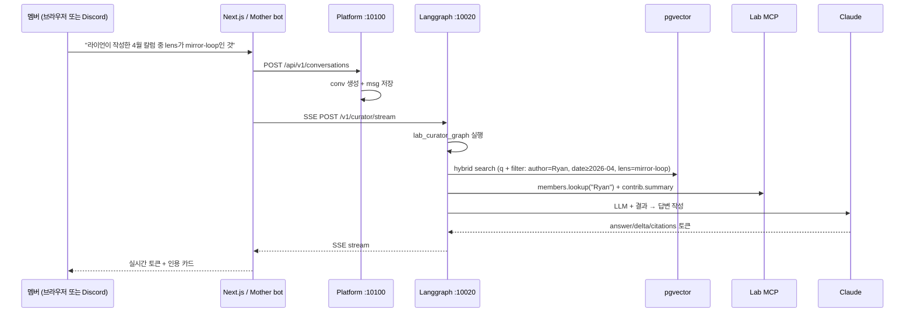
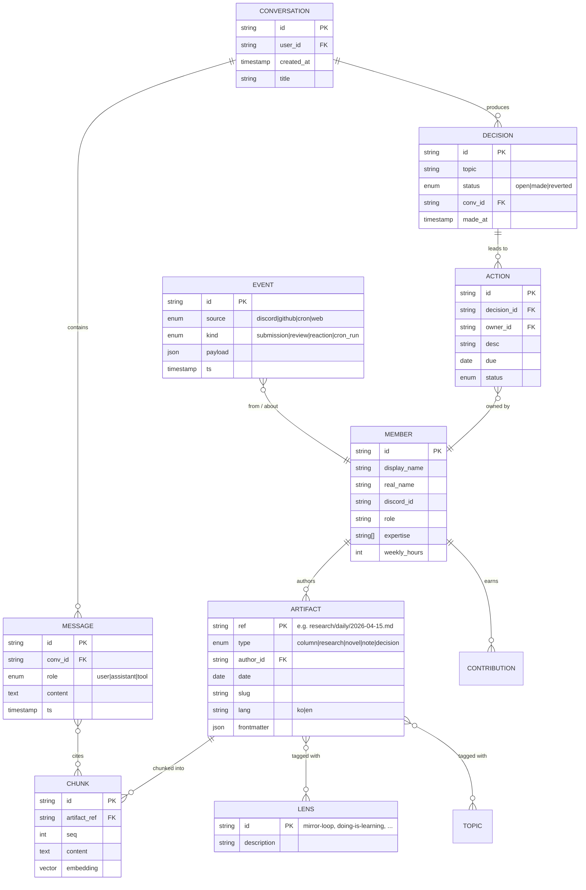
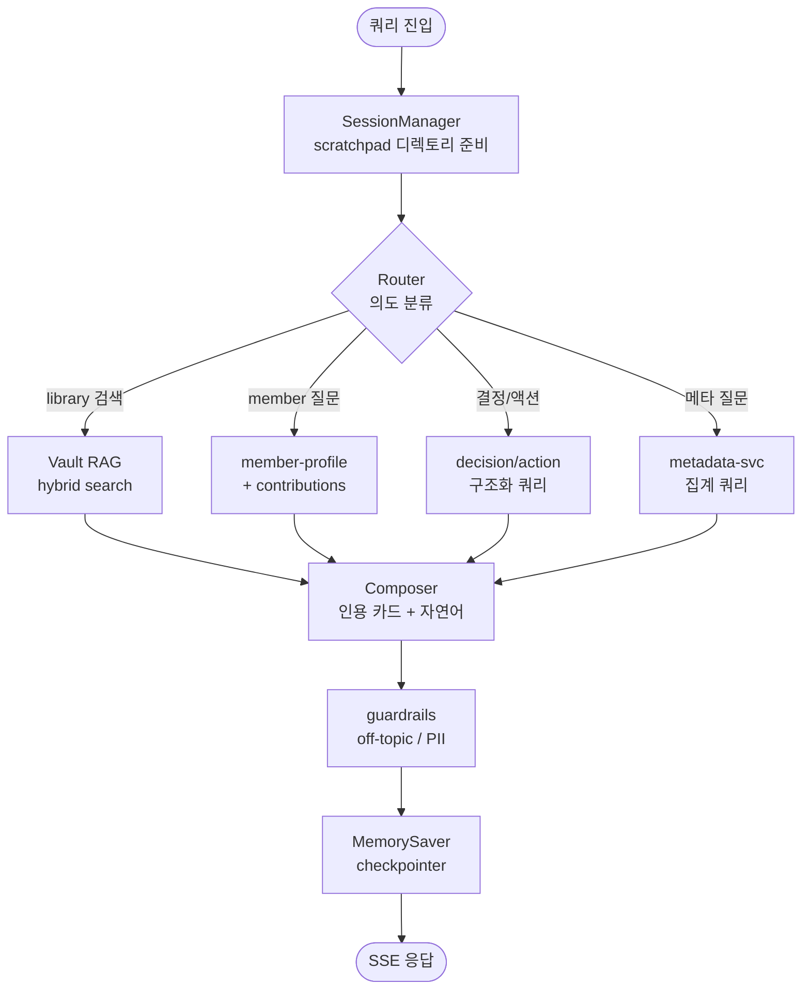
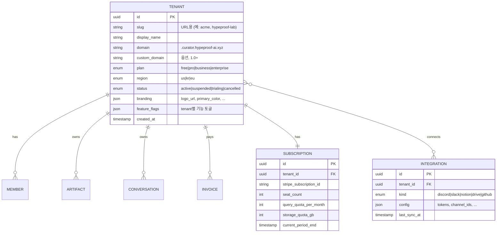

# Sediment — HypeProof Lab Internal Product 구조 설계

> **Brand**: Sediment — "where doing becomes knowing". **Codename**: `ai-curator` (file paths, env vars, rubric IDs all retain the codename).
> 작성일: 2026-05-05 (v0.2 — 상업화 경로 추가) · 2026-05-15 (rebranded → Sediment)
> 1차 사용자: HypeProof Lab 8명 (Jay, JY, Ryan, Kiwon, TJ, BH, Sebastian, JeHyeong)
> **상업화 목표**: 내부 dogfood → **SaaS multi-tenant** (공유 인프라, tenant 격리)
> 참조 모델: Sonatus AI Technician (`sonatus/ai-technician-frontend` + `sonatus/gen_ai`)
> 본 문서: AIT 구조를 차용해 Lab의 **Vault 정리 + Memory 누적** 프러덕트를 설계 + SaaS 상업화 경로.
> 단일 살아있는 문서 — 후속 단계(스키마 상세, MVP 계약, per-tenant 평가)는 새 파일을 만들지 않고 본 문서에 append.

---

## 0. 한 페이지 요약 — AIT vs Sediment

| 축 | AI Technician (참조) | Sediment (본 제안) |
|---|---|---|
| **도메인** | 차량 진단 (CAN/DBC, DTC) | Lab 콘텐츠 + 의사결정 메모리 |
| **본질** | 자동차 MCP 툴을 가진 Claude 에이전트 | **Lab의 collective memory MCP 툴을 가진 Claude 에이전트** |
| **1차 사용자** | OEM 엔지니어 | HypeProof Lab 8명 → 외부 SaaS 고객 (미정) |
| **자산** | 차량 파일, DBC, 진단 로그 | tenant별 칼럼/리서치/소설/회의록/Discord 로그/결정·액션 |
| **에이전트** | LangGraph `vehicle_diag_graph` | 신규 `workspace_curator_graph` + 기존 27개 agent 재활용 |
| **도메인 툴** | `automotive_mcp_server.py` | `workspace_mcp_server` (tenant-aware: vault, members, contributions, discord, calendar) |
| **멀티 환경** | 7개 (Marston/CES/RP129/Wolverine/...) | 1개 인프라 + N개 tenant (RLS 격리). 대형 고객은 dedicated instance 옵션 (1.0+) |
| **배포** | env-scoped AWS EC2 + S3/CloudFront | 기존 Vercel(`web/`) + 단일 인프라(`services/sediment/`) — tenant 격리는 DB row-level |
| **상태 관리** | TanStack Query + Zustand | 동일 패턴 차용 |
| **상업화 모델** | 자동차 OEM 내부 도구 | **SaaS multi-tenant**, seat 기반 과금 (Phase 7+) |

**핵심 통찰**: AIT 실제 차별 가치는 멀티에이전트 LangGraph가 아니라 **(a) 도메인 MCP 툴**과 **(b) SessionManager scratchpad** 두 가지다. Sediment도 이 두 가지를 Lab 도메인으로 갈아끼우면 된다. 나머지(7개 환경, MinIO, mockoon, Wolverine helm)는 8명 팀 규모에서 오버스펙.

**상업화 통찰**: SaaS multi-tenant는 **MVP부터 추상화를 박아둬야** 1년 뒤 retrofit 지옥을 피한다. 핵심 추상화 3개:
1. **Tenant** (= AIT의 "환경/customer") — 모든 데이터/검색/대화의 root scope
2. **Workspace MCP** — tenant-aware 툴 (`vault.search` 호출시 자동으로 `tenant_id` 필터)
3. **DB Row-Level Security** — Postgres RLS 정책으로 격리 enforcement (애플리케이션 버그가 있어도 cross-tenant leak 차단)

이 3개만 MVP에 박으면 dogfooding 단계는 `tenant_id='hypeproof-lab'` 단일 row로 운영, 외부 고객 들어오는 순간 row 추가만으로 확장된다.

---

## 1. Executive View



| 축 | 한 줄 요약 |
|---|---|
| **구성** | 기존 `web/` (FE) + 신규 `services/sediment/` (BE) + 기존 `data/` + 기존 `.claude/` agent |
| **에이전트 본체** | `lab_curator_graph` (LangGraph) — Claude + Lab MCP 툴 |
| **인덱스 대상** | `research/`, `web/src/content/`, `data/*.json`, `novels/`, `.claude/skills/`, Discord history, 회의록 |
| **배포** | FE: Vercel (기존). BE: 단일 인스턴스(EC2 t3.small / Fly.io shared-cpu-1x). DB: Supabase 또는 self-hosted PG |
| **운영자** | Jay(admin) + 7명(creator). RBAC는 Discord role 기반 |

---

## 2. 아키텍처 (Mermaid)



**AIT와의 핵심 구조 차이**:

1. **단일 환경**: `env-scoped CloudFront/EC2 7세트` → `lab` 1세트
2. **MinIO 제거**: 8명 규모 + vault가 이미 git repo → 로컬 FS로 충분 (S3 호환은 향후 옵션)
3. **mockoon 제거**: 실제 Lab MCP 서버 직결, 외부 API 모킹 불필요
4. **Wolverine helm 제거**: k8s 없이 단일 docker-compose
5. **Discord ingest 추가**: AIT엔 없는 핵심 ingest 채널
6. **cron consolidation 추가**: AIT는 사람이 트리거, Curator는 launchd가 자동 트리거
7. **Lens 시스템 추가**: HypeProof 7-lens(mirror-loop, doing-is-learning, ...)를 query rewriter로 사용

---

## 3. 컴포넌트 맵

### 3.1 프론트엔드 — `web/src/app/curator/` (기존 web/ 확장)

기존 `web/` Next.js 위에 새 라우트만 추가. 별도 SPA 만들지 않는다 (vanilla wins).

| 계층 | 상세 |
|---|---|
| **Framework** | Next.js 14 App Router (기존), React 19 |
| **Routes** | `/curator` (NewConversation), `/curator/c/[id]` (Conversation), `/curator/library` (vault browse), `/curator/members` (멤버 디렉토리) |
| **상태** | TanStack Query 5 (server) — AIT와 동일 패턴 / Zustand 5 (client) |
| **HTTP** | fetch + JWT bearer, `@microsoft/fetch-event-source` 2.0 (SSE) — **AIT 그대로 차용** |
| **스타일** | Tailwind 4 + shadcn/ui + Radix — 기존 web/와 호환 |
| **i18n** | next-intl (KO/EN) — 기존 컨벤션 따라감 |
| **인증** | Discord OAuth (NextAuth.js) — `members.json`의 `id` 매칭으로 RBAC |
| **Feature flags** | `NEXT_PUBLIC_CURATOR_*` env (file_upload, dictation, search, projects, settings) — AIT 패턴 차용. 초기엔 모두 OFF, MVP는 chat + library만 |
| **배포** | 기존 Vercel `vercel --prod --yes`. 별도 워크플로 불필요 |

라우트 구조 예시:
```
/curator                 → 새 대화 시작 + 최근 대화 사이드바
/curator/c/[id]          → 대화 상세 + SSE 스트림
/curator/library         → vault 콘텐츠 브라우저 (칼럼/리서치/소설/회의록 필터)
/curator/library/[ref]   → 단일 문서 + 메타데이터 + 인용된 대화 역참조
/curator/members         → 8명 멤버 카드 + 기여 점수 + 최근 산출물
/curator/admin           → (admin only) ingest 상태, cron 헬스, 토큰 사용량
```

### 3.2 백엔드 — `services/sediment/` (신규)

AIT의 `sonatus/gen_ai` 모노레포 패턴을 따르되 4개 서비스로 압축.

| 디렉토리 | 역할 | 포트 | AIT 대응 |
|---|---|---|---|
| `applications/sediment_platform/` | 메인 REST API — conversations, messages, users, files, members, contributions, costs, feedback | 10100 | `ai_technician_platform` |
| `applications/sediment_langgraph/` | `lab_curator_graph` 실행 + SSE 스트리밍 | 10020 | `ai_technician_langgraph` |
| `applications/vault_ingester/` | RAG 파이프라인: read → clean → chunk → embed → pgvector | 11000 | `document_processor` |
| `applications/metadata_svc/` | frontmatter 파서 + 메타데이터 인덱스 + 검색 필터 | 12000 | `file_governor` |
| `applications/curator_guardrails/` | off-topic / 민감 내용 가드 | 8889 | `snt_guardrails` |
| `lab_platform/` | 에이전트 스킬 프레임워크: `agents/`, `agent_tools/`, `skills/`, `mcp_servers/` | — | `ait_platform` |
| `lab_solutions/` | (보류, 1.0+) per-member 패키지 — Jay/Ryan/JY 전용 톤 | — | `ait_solutions` |
| `lab_lib/` | 공용 라이브러리 (`lab_fastapi_common`, `lab_logging`, `lab_metrics`, `lab_db_persistence`) | — | `snt_lib` |
| `infra/` | docker-compose + Fly.io toml | — | `infra/terraform` |
| `Jenkinsfile` 대신 `.github/workflows/curator-deploy.yml` | CI: lint + test + Fly deploy | — | Jenkinsfile |

### 3.3 데이터 & 인프라

| 서비스 | 이미지 / 위치 | 역할 |
|---|---|---|
| **Postgres** | `pgvector/pgvector:0.8.1-pg18` | OLTP + 벡터. DB명 `curator`. 호스팅: Supabase free tier 또는 Fly.io PG |
| **Redis** | `redis:7-alpine` | 세션 + SSE 채널 fanout |
| **로컬 FS** | repo working copy | vault 원본. 별도 blob store 불필요 (AIT MinIO 제거) |
| **Embedding** | Voyage `voyage-3` 또는 OpenAI `text-embedding-3-small` | RAG용. 768d 또는 1024d |
| **Anthropic Claude** | API | 주 추론 모델 (Opus 4.7 / Sonnet 4.6) |
| **Discord** | 기존 Mother bot | ingest 소스 + 출력 채널 |

**오버스펙으로 빠진 것**: MinIO, mockoon, Wolverine helm, env-scoped CloudFront, Atlas DB migration 도구, Jenkinsfile.

### 3.4 에이전트 (재활용 + 신규)

| 분류 | Agent | 출처 | 역할 |
|---|---|---|---|
| 재활용 | `mother` | 기존 `.claude/agents/` | Discord 인터페이스 + orchestrator |
| 재활용 | `herald` | 기존 | content QA 게이트 |
| 재활용 | `qa-reviewer` | 기존 | read-only QA |
| 재활용 | `research-analyst` | 기존 | daily research → vault ingest |
| 재활용 | `community-manager` | 기존 | Discord 공지 콘텐츠 |
| 재활용 | `paper-scout`, `paper-surveyor` | 기존 | 논문 lens 매칭 |
| 신규 | `lab-curator` | 본 SPEC | 메인 query orchestrator (LangGraph 진입점) |
| 신규 | `vault-ingester-agent` | 본 SPEC | 변경 파일 감지 → embed → 색인 |
| 신규 | `memory-consolidator` | 기존 `/dream` skill의 agent화 | episodic → semantic 승격 |
| 신규 | `member-profile-agent` | 본 SPEC | 멤버별 expertise/contribution 갱신 |

---

## 4. 런타임 데이터 흐름

### 4.1 쿼리 왕복 (메인 경로)



SSE 프레임 (AIT 패턴 그대로):
```
event: message  data: {v, metadata: {step, agent, tag:"status", agent_id}}
event: delta    data: {v, metadata: {step, agent, tag:"answer_word", agent_id}}
event: citation data: {v: {ref:"research/daily/2026-04-15.md", chunk_id:"...", score:0.81}}
event: message  data: {v, metadata: {tag:"answer_end"}}
data: [DONE]
```

### 4.2 Ingest 경로 (Repo + Discord + 회의록)

```
[Repo 변경]   git push → GitHub Action → POST /api/v1/ingest/repo
                   → vault-ingester가 diff에서 추가/수정 파일 추출
                   → frontmatter 파싱 (metadata_svc)
                   → 청킹 (1500 tokens, 200 overlap)
                   → 임베딩 → pgvector
                   → 부수 효과: contributions.json 갱신, members.expertise 학습 신호

[Discord]     Mother bot이 메시지 수신 → 시그널 분류(질문/결정/액션/잡담)
                   → 결정/액션만 ingest (잡담 제외)
                   → POST /api/v1/ingest/discord
                   → 동일 임베딩 파이프라인

[회의록]      `/ingest` skill (기존) 결과 markdown
                   → POST /api/v1/ingest/document
                   → 전용 스키마 (date, attendees, decisions[], actions[])

[Cron]        launchd:
              · daily-research (06:00)  → research-analyst → ingest
              · retro (22:00)            → retro skill → ingest
              · dream (Sun 02:00)        → memory-consolidator → 승격
```

### 4.3 Memory 누적 경로 (3-tier)

```
신규 입력 → Episodic                  (즉시 저장, TTL 90일)
              ↓ 동일 주제 3회 출현 / 인용 5회
            Semantic                  (영구, 구조화 엔티티)
              ↓ 1주간 5회 이상 동일 패턴 감지
            Procedural                (skill / workflow로 추출 → .claude/skills/)
```

승격 트리거 (memory-consolidator agent):
- **Episodic → Semantic**: 동일 entity(member/decision/lens)가 다른 conversation 3개 이상에서 언급
- **Semantic → Procedural**: 같은 query 패턴이 1주 5회 이상 → 자동으로 `/skill draft` 제안
- **감쇠**: 90일 무참조 episodic은 archive 테이블로 이동 (삭제 X, recall은 가능)

이 모델은 기존 `/dream` skill의 자동화 + 팀 공유 버전이다. Jay 개인 `~/.claude/.../memory/`와 별도로 팀 PG에 저장하되, MEMORY.md export는 양방향.

### 4.4 회신/공유 경로

| 트리거 | 경로 |
|---|---|
| 멤버가 web에서 질문 | SSE 스트림 → 답변 + 인용 카드 |
| 멤버가 Discord에서 `@curator` | Mother bot → Curator API → 답변 → Discord reply |
| 칼럼 발행 후 자동 nudge | publish-orchestrator → curator.suggest_questions → Discord 멘션 |
| 일별 morning briefing | morning skill → curator.summarize_yesterday → Jay DM |

---

## 5. API 서비스

### 5.1 Curator Platform (`/api/v1`, 10100)

| 라우터 | 경로 |
|---|---|
| `auth.py` | `POST /login`, `POST /refresh`, `POST /logout` (Discord OAuth callback) |
| `users.py` | `GET /me`, `PATCH /me`, `GET /users/{id}` (members.json 동기화) |
| `conversations.py` | `POST /conversations`, `GET /conversations`, `GET /conversations/search`, `GET /conversations/{id}`, `PATCH /conversations/{id}`, `DELETE /conversations/{id}`, `POST /conversations/{id}/messages` |
| `library.py` | `GET /library` (필터: type, author, date, lens, tag), `GET /library/{ref}`, `GET /library/{ref}/citations` |
| `members.py` | `GET /members`, `GET /members/{id}/profile` (expertise, contributions, recent outputs) |
| `contributions.py` | `GET /contributions/leaderboard`, `POST /contributions/log` (admin) |
| `ingest.py` | `POST /ingest/repo`, `POST /ingest/discord`, `POST /ingest/document`, `GET /ingest/jobs/{id}` |
| `feedback.py` | `POST /messages/{id}/feedback` (👍/👎, 인용 정확도) |
| `costs.py` | `GET /costs/summary` (admin only, 토큰 사용량) |

### 5.2 Curator LangGraph (`/v1/curator`, 10020)

| 경로 | 설명 |
|---|---|
| `POST /curator/stream` | SSE 스트림 — `lab_curator_graph` 실행 |
| `POST /curator/threads/{id}/replay` | checkpoint 재실행 (debug) |
| `GET /healthz`, `GET /readyz` | 헬스체크 |

### 5.3 Vault Ingester (`/v1/ingest`, 11000)

| 경로 | 설명 |
|---|---|
| `POST /document` | 단일 markdown ingest |
| `POST /batch` | 다수 파일 batch ingest |
| `GET /jobs/{id}` | 진행 상태 |
| `DELETE /chunks?ref=...` | 재인덱싱 전 삭제 |

### 5.4 Metadata Service (`/v1/meta`, 12000)

| 경로 | 설명 |
|---|---|
| `GET /by-author/{member_id}` | 작성자별 산출물 |
| `GET /by-lens/{lens}` | lens 태그별 |
| `GET /by-date?from=&to=` | 기간별 |
| `GET /tags/cooccurrence` | 태그 동시출현 그래프 |

---

## 6. Vault 도메인 모델 (`vehicle_diag_graph` 자리)

### 6.1 핵심 엔티티



### 6.2 메타데이터 표준 (frontmatter)

기존 `web/src/content/columns/` 컨벤션을 확장:

```yaml
---
title: "..."
slug: must-match-filename
author: JY            # members.json id 또는 displayName
date: 2026-04-15
type: column          # column|research|novel|note|decision|meeting
lang: ko              # ko|en
lens: [mirror-loop, doing-is-learning]   # 0~N
topic: [agent, claude-code]
confidence: high      # research only — high|medium|low|speculation
series: SIMULACRA     # novels only
volume: 1
chapter: 6
excerpt: "..."
creator_image: /members/jy.png
status: published     # draft|review|published|archived
---
```

신규 필드: `lens[]`, `topic[]`, `confidence`, `status`. 기존 칼럼은 마이그레이션 cron으로 일괄 채움.

### 6.3 핵심 쿼리 패턴 (Curator가 답할 수 있어야 하는 것)

| 자연어 | 내부 변환 |
|---|---|
| "라이언이 4월에 쓴 mirror-loop 칼럼" | `library.search(author=Ryan, type=column, date≥2026-04, lens=mirror-loop)` |
| "지난 주 회의에서 결정한 5/5 파일럿 관련 액션" | `decisions.recent(topic=5/5-pilot)` → `actions.by_decision(...)` |
| "JY가 쓴 글 중 BH가 댓글 단 거" | `events.kind=reaction & target.author=JY & actor=BH` |
| "Daily research에서 Claude Code 관련 high-confidence 결론" | `library.search(type=research, topic=claude-code, confidence=high)` |
| "지금 Discord에서 묻는 사람 누구?" | `events.recent(source=discord, kind=question)` |

이 5개를 **MVP 검증 쿼리 셋**으로 둔다 (8명에게 직접 입력시켜 답변 정확도 측정).

---

## 7. Memory 모델

### 7.1 3계층

| 계층 | 저장소 | TTL | 누가 쓰나 |
|---|---|---|---|
| **Episodic** | PG `messages`, `events` | 90일 (이후 archive) | 모든 입력 (대화, Discord, cron run) |
| **Semantic** | PG `decisions`, `actions`, `members.expertise`, `topics`, `lens_co_occurrence` | 영구 | memory-consolidator가 episodic에서 추출 |
| **Procedural** | `.claude/skills/`, `.claude/agents/` (git) | 영구 | 사람이 승인 후 머지 |

### 7.2 누적/감쇠/승격 규칙

| 규칙 | 트리거 | 액션 |
|---|---|---|
| Episodic 감쇠 | 90일 무참조 | `messages.archived=true`, recall은 가능, 검색 기본 제외 |
| 인용 강화 | 같은 chunk가 3개 이상 conversation에서 인용 | `chunks.boost += 0.05` (재검색 가산점) |
| Decision 추출 | conversation에 "결정", "정함", "go/no-go" 키워드 + LLM 분류 | `decisions` row 생성 → 사람 승인 |
| Action 추출 | "내가 ~할게", "~까지" 패턴 | `actions` row 생성 → 담당자 자동 매핑 |
| Skill 제안 | 동일 query 패턴 1주 5회 이상 | `memory-consolidator`가 `/skill draft` 제안 → Jay 승인 → 머지 |
| Expertise 학습 | 멤버 X가 작성한 글에 토픽 T가 N회 이상 등장 | `members[X].expertise` 후보 추가 (사람 승인 필요) |

### 7.3 Mirror Loop 통합

기존 `/dream` skill의 cron 자동화 + 팀 버전. AIT의 `MemorySaver checkpointer`는 conversation 수준 메모리이고, Curator는 그 위에 **팀 의미론 메모리** 계층을 올린다.

- **일별** (22:00, retro skill): 그 날의 conversation/event를 episodic에 정착
- **주간** (Sun 02:00, dream skill): episodic → semantic 승격, archive 정리
- **월간** (1일 02:00): semantic → procedural 승격 후보 리포트, lens 분포 변화 추적

### 7.4 Jay 개인 메모리와의 관계

| 관심사 | 결정 |
|---|---|
| Jay `~/.claude/.../memory/MEMORY.md` 통합? | **양방향 동기화하지 않는다.** Jay 개인 메모리 = 인지적 partner 영역. Curator = 팀 영역. 단, Jay가 명시적으로 `/curator publish <memory-file>` 하면 팀 vault로 promote |
| 다른 멤버도 개인 메모리? | 1.0+에서 per-member memory namespace. MVP는 팀 공통만 |

---

## 8. 에이전트

### 8.1 LangGraph 워크플로우 — `lab_curator_graph`



AIT `vehicle_diag_graph`의 정확한 패턴 차용:
- `SessionManager` — conversation별 scratchpad 디렉토리 (`/tmp/curator/sessions/{conv_id}/`)
- `VaultDataAgent` (= `VehicleDataAgent` 자리) — vault 검색 툴 묶음
- `with_default_offtopic_guard(graph)` 래핑
- `MemorySaver` checkpointer — conversation 재시작 가능

### 8.2 Lab MCP 서버 (`lab_mcp_server.py`)

AIT `automotive_mcp_server.py` 자리에 들어가는 도메인 툴.

```python
# lab_platform/mcp_servers/lab_mcp_server.py
@tool
def vault_search(query: str, filters: VaultFilter) -> list[Citation]: ...
@tool
def vault_read(ref: str) -> Document: ...
@tool
def members_lookup(name_or_id: str) -> MemberProfile: ...
@tool
def members_expertise_match(topic: str) -> list[Member]: ...
@tool
def contributions_summary(member_id: str, since: date) -> ContribReport: ...
@tool
def discord_recent(channel: str, hours: int) -> list[Message]: ...
@tool
def calendar_search(query: str) -> list[Event]: ...
@tool
def decisions_open(topic: str | None) -> list[Decision]: ...
@tool
def actions_by_owner(member_id: str, status: str) -> list[Action]: ...
@tool
def lens_explain(lens_id: str) -> str: ...
@tool
def lens_apply(text: str, lens: str) -> str: ...   # philosophical reframer
```

12개 툴. AIT의 자동차 MCP가 ~10개 수준이었음을 고려하면 비슷한 규모.

### 8.3 신규 에이전트 사양

| Agent | Model | 역할 | 호출 시점 |
|---|---|---|---|
| `lab-curator` | sonnet | LangGraph 진입점 | 매 쿼리 |
| `vault-ingester-agent` | haiku | 변경 파일 → 청킹/임베딩 → 색인 | git push, cron, ingest API |
| `memory-consolidator` | opus | episodic → semantic 승격 | 일/주/월 cron |
| `member-profile-agent` | sonnet | members.expertise 학습 신호 추출 | 신규 artifact 인덱싱 시 |

---

## 9. AIT vs Sediment — 차이/공통점 결산

### ✅ AIT에서 가져올 것
- LangGraph 멀티에이전트 + `SessionManager` + `MemorySaver` 패턴
- `with_default_offtopic_guard` 래핑
- pgvector RAG + `presigned URL` 업로드 → ingest 비동기 큐잉
- SSE 프로토콜 (event: message/delta + tag: status/answer/answer_end)
- `microsoft/fetch-event-source` (FE) + FastAPI EventSourceResponse (BE)
- TanStack Query + Zustand 상태 분리
- shadcn/ui + Radix + CVA
- `VITE_FEATURE_*` 패턴 (Curator는 `NEXT_PUBLIC_CURATOR_*`)
- 도메인 MCP 서버 분리 (자동차 → Lab)
- 에이전트 스킬 프레임워크 (`ait_platform/` → `lab_platform/`)

### ❌ AIT에서 버릴 것 (MVP 단계)
- **환경별 EC2 + S3/CloudFront × 7세트** — 1개 공유 인프라 + RLS 격리. 1.0+ 대형 고객 dedicated 옵션은 `ait_solutions/` 패턴으로 부활 (Appendix C 참조)
- **MinIO** — git repo + S3-compatible(R2/Supabase Storage)로 대체. tenant별 prefix
- **mockoon** — 실제 MCP 직결, 외부 API 모킹 불필요
- **Wolverine helm/k8s** — 단일 docker-compose 충분 (1.0+ tenant 폭증 시 k8s 재검토)
- **Atlas DB migration** — Alembic 또는 Drizzle로 충분
- **Jenkinsfile** — GitHub Actions + Vercel 충분
- **`legacy ai_technician :10000`** — 그런 부채 없음
- **DBC cleaner / file_driver / `vss_can`** — 도메인 다름
- **`evaluation_*` 하네스** — 1.0+에 검토, MVP는 사람 평가

### 🔁 AIT에서 처음엔 뺐다가 1.0+에 부활할 것
- **`ait_solutions/{marston,rp129,wolverine}` 패턴** → `workspace_solutions/{enterprise-edition,...}` (대형 고객 dedicated instance)
- **환경별 cloud-init + Terraform** — 대형 고객 on-prem/private cloud 요구 시
- **`evaluation_*` 하네스** — paying customer SLA 검증
- **`policy_generator`** — 고객사 콘텐츠 정책 자동 생성 (예: "당사 기자 윤리강령 위반 검출")

### ➕ AIT에 없지만 Curator에 추가
- **Discord ingest** — Mother bot 연계 (HypeProof 핵심 채널)
- **Cron-driven memory consolidation** — `/dream` 자동화
- **Lens 시스템** — 7-lens query rewriter + lens_apply 툴
- **Contribution ledger 자동 갱신** — `data/contributions.json`
- **Per-member expertise 학습** — `members[].expertise` 동적 갱신
- **양방향 회신 채널** — Discord에서 `@curator` 멘션 직접 응답
- **Tenant 추상화 + RLS** — AIT는 환경별 클론으로 격리, Curator는 단일 인프라 + DB 격리
- **Tenant onboarding flow** — sign-up → workspace 생성 → vault import → 초기 색인 자동화 (AIT는 SE가 수동)
- **Seat 기반 billing** — AIT는 OEM 라이선스, Curator는 Stripe Subscriptions

---

## 10. 단계별 로드맵

### 10.1 내부 dogfooding (Phase 0~5.5)

| Phase | 기간 | 산출물 | 검증 게이트 |
|---|---|---|---|
| **0. Spec & Scaffolding** | 0.5w (~5/12) | 본 SPEC + `services/sediment/` 빈 디렉토리 + `web/src/app/curator/` 스텁 + **DB schema with `tenant_id` columns + RLS policies** | merge to main |
| **1. Read-only 인덱스** | 1w (~5/19) | pgvector 인덱스 (`tenant_id` 인덱스 포함) + `vault-ingester` + `metadata-svc` + `GET /api/v1/library/search` (tenant-scoped) | 5개 검증 쿼리 답변 (tenant=`hypeproof-lab`) |
| **2. Chat MVP** | 2w (~6/02) | `/curator` 라우트 + SSE stream + `workspace_curator_graph` 최소판 + Workspace MCP 12 툴 (모두 tenant-aware) | 8명 × 5쿼리 = 40 query 통과 |
| **3. Ingest 자동화** | 1w (~6/09) | Discord ingest + cron 통합 + GitHub Action repo ingest (모두 tenant 컨텍스트 전파) | 일 50+ events 처리 |
| **4. Memory consolidation** | 1w (~6/16) | dream cron + 승격 규칙 + decision/action 추출 | 주간 retention 측정 |
| **5. Auth + RBAC** | 1w (~6/23) | **NextAuth.js + Organizations** (또는 Clerk) + role 기반 view + admin 페이지 | 8명 sign-in 성공 |
| **5.5. Polish + 발표** | 0.5w (~6/26) | Lab 내부 발표, feedback loop 1회 | Jay GO/NO-GO |

총 7주. 시작 가능 시점: 2026-05-12 (5/5 파일럿 끝나고 1주 뒤).

**MVP 정의 = Phase 2 종료 시점**. Phase 5는 외부 테스트 가능 상태 도달.

### 10.2 SaaS 상업화 (Phase 6~9)

| Phase | 기간 | 산출물 | 검증 게이트 |
|---|---|---|---|
| **6. Tenant onboarding** | 2w (~7/10) | sign-up flow, tenant 생성 마법사, vault import wizard (Drive/Notion/Markdown zip), 초기 색인 자동 실행, 도메인 가이드 (`<tenant>.curator.hypeproof-ai.xyz`) | 외부 베타 1팀 self-serve onboarding 성공 |
| **7. Billing + Quota** | 2w (~7/24) | Stripe Subscriptions, seat 기반 과금, 토큰/스토리지/쿼리 quota, 사용량 대시보드, 미납 처리 | 실제 결제 1건 |
| **8. Beta launch (3~5 tenants)** | 4w (~8/21) | 외부 베타 고객 모집 + 운영 + 피드백 → 제품 수정. 한국어/영어 i18n 안정화. compliance(개인정보처리방침, 이용약관, DPA) | 4주간 NPS ≥ 30 |
| **9. GA + Pricing 확정** | 2w (~9/04) | 가격표 공개, 마케팅 사이트, churn/retention 대시보드, support 채널 (Discord 전용 server 또는 intercom) | 유료 전환 1건 |

총 추가 10주 (베타 4주 포함). 상업 출시: **2026-09-04** 목표.

### 10.3 Enterprise tier (Phase 10+, 1.0+)

대형 고객(미디어 그룹, 대학, 대기업) 요청 시 등장:

| Phase | 트리거 | 산출물 |
|---|---|---|
| **10. Dedicated instance** | 첫 enterprise 계약 | `workspace_solutions/<customer>/` 패키징 (AIT `ait_solutions/` 패턴), 별도 EC2/Fly 배포 |
| **11. SSO** | 보안 요구 | SAML, Okta, Azure AD, Google Workspace |
| **12. Data residency** | 한국/EU 고객 | KR region 배포 (Naver Cloud / AWS Seoul), EU region (Frankfurt) |
| **13. On-prem / private cloud** | 정부/금융 | Helm chart, air-gapped 배포 가이드, license key 시스템 |
| **14. Custom MCP integrations** | 산업별 | 미디어 (CMS connector), 연구 (arXiv/Semantic Scholar), 법조 (판례 DB) |
| **15. White-label** | 컨설팅사 / OEM | 자체 도메인, 자체 브랜딩, "Powered by HypeProof" 옵션 토글 |

---

## 11. 미해결 질문 (Jay 결정 필요)

### 11.1 제품/기술 (MVP 결정 필요)

1. **이름 확정** — `Sediment` (제안) / `AI Archivist` / `Lab Memory` / `Echo` / `Mirror` / 기타? **상업화 고려 시 영문 우선 추천** (도메인/SEO).
2. **백엔드 위치 & 스택** — (a) 신규 `services/sediment/` Python FastAPI 모노리포 [AIT 그대로, multi-tenant 친화] / (b) 기존 `web/` Next.js API Routes만으로 [stack 단일화, RLS는 Drizzle로 처리] / (c) Mother bot 안에 흡수 [최소 노력, 상업화 시 분리 비용]. **상업화 고려 시 (a) 또는 (b) 추천**.
3. **DB 호스팅** — Supabase (RLS 네이티브 지원, 추천) / Vercel Postgres + RLS / Fly.io PG / Neon (branch-per-tenant 옵션)?
4. **Auth** — **NextAuth.js + Organizations** (자체 구축, 가성비) / **Clerk** (Organizations 즉시 사용 가능, $25/mo부터) / **WorkOS** (enterprise SSO 강함, 비쌈) / Discord OAuth (내부만, 외부 못 씀)
5. **Ingest 우선순위** — `research/daily/` / `web/src/content/columns/` / Discord / 회의록 — MVP는 어떤 1개부터?
6. **개인-팀 메모리 경계** — Jay `~/.claude/.../memory/` 자동 동기화 (위험) / 명시적 `/curator publish` 명령으로만 (안전, 추천)
7. **MCP 위치** — Workspace MCP를 (a) `services/sediment/` 안의 별도 포트 / (b) Mother bot 내장 / (c) `.claude/skills/` Claude Code 스킬로. **상업화 고려 시 (a) 추천** (외부 고객은 Claude Code 안 씀)
8. **첫 사용자 그룹** — Jay 단독 dogfooding 1주 → JY/Ryan 추가 → 8명 / 처음부터 8명 동시?
9. **비용 한도 (내부)** — 토큰 월 한도 (제안: $200/mo, 8명 × 25 query/day × 30일 × ~$0.03/query)
10. **5/5 파일럿과의 우선순위** — Curator 시작은 파일럿 종료 후? 병행?

### 11.2 상업화 (Phase 6+ 전에 결정 필요)

11. **Tenancy 격리 모델** — **Postgres RLS** (single DB, 추천 — 빠르고 ~100 tenants까지 OK) / schema-per-tenant (격리 ↑, 마이그레이션 ↑) / DB-per-tenant (최강 격리, 비쌈)
12. **Pricing 모델** — seat 기반 (Notion 스타일, 권장) / usage 기반 (쿼리당 토큰) / hybrid (base + overage) / flat (Linear 스타일 freemium → fixed)
13. **무료 tier 존재?** — Yes (3 seat, 1k query/mo, viral 효과) / No (B2B only, 처음부터 paid). **Yes 추천 — Lab dogfooding은 자연스럽게 free tier에 들어감**
14. **출시 가격 가설** — $20/seat/mo (Notion AI 수준) / $40/seat/mo (Glean 보다 싸게) / $60/seat/mo (premium 포지션)
15. **Custom domain** — `<tenant>.curator.hypeproof-ai.xyz` (서브도메인 자동) / 고객사 자체 도메인 옵션 (1.0+, CNAME)
16. **Brand 노출** — `Powered by HypeProof` 푸터 (free tier 강제, paid 토글) / 완전 white-label (enterprise only)
17. **데이터 거주 (residency)** — MVP는 US 단일 (Vercel + Supabase). KR 고객 들어오면 어떻게? (ko region 배포는 큰 공사)
18. **Compliance** — 개인정보처리방침 + 이용약관(MVP) → DPA + GDPR (외부 베타) → SOC 2 Type I (paid 10+ tenant) → SOC 2 Type II / ISO 27001 (enterprise)
19. **고객 지원 채널** — Discord 전용 server (cheap, community) / Intercom (premium feel, $100+/mo) / Email + Notion 헬프센터 (가성비)
20. **Sales motion** — Self-serve only (PLG) / Self-serve + outbound (대형 고객 sales) / Sales-led (enterprise 위주). **MVP: Self-serve, Phase 9부터 hybrid**

### 11.3 1차 외부 고객 시나리오 (도그푸딩 후 결정)

| 후보 | 도메인 | 우선 검증 query 셋 | 진입 채널 |
|---|---|---|---|
| 동아일보 / 미디어사 | editorial | "지난 6개월 우리 매체 ESG 기사 중 인용된 학술 논문" | donga-roi 연장선 |
| Academy 졸업생 | personal/edu | "내가 작성한 회의록 중 'AI 전략' 관련" | Academy 운영 직접 채널 |
| CERN / 연구 그룹 | research | "BH가 인용한 paper 중 mirror-loop lens 적용 가능한 것" | BH 네트워크 |
| 컨설팅사 (작은) | knowledge mgmt | "Q3 deliverable 중 ESG 관련 chunk" | Sebastian 네트워크 |

---

## 12. 상업화 경로 (SaaS Multi-Tenant)

> Jay 결정 (2026-05-05): MVP는 내부 dogfood, 1.0은 SaaS multi-tenant. 1차 고객은 도그푸딩 후 결정.
> 본 섹션은 dogfood 단계에서도 retrofit 부담 없이 SaaS로 전환할 수 있도록 **MVP에 박아둘 추상화**와 **Phase 6+ 작업**을 정의.

### 12.1 핵심 설계 원칙 (MVP에 박아둘 것)

| 원칙 | MVP 구현 | SaaS 전환 시 추가 비용 |
|---|---|---|
| **모든 데이터에 `tenant_id`** | 모든 테이블에 `tenant_id UUID NOT NULL`. 내부는 단일 row (`hypeproof-lab`) | 0 — 그대로 row 추가만 |
| **Postgres RLS 정책 활성화** | 정책 정의하되 superuser는 우회. 애플리케이션은 `SET app.tenant_id = '...'` 후 쿼리 | 0 — 정책 그대로 |
| **모든 API에 tenant 컨텍스트** | JWT의 `org_id` claim → 미들웨어가 PG session에 SET | 0 — 미들웨어 동작 변경 없음 |
| **파일/벡터 prefix** | S3 경로 `tenants/{tid}/...`, pgvector `WHERE tenant_id = $1` | 0 |
| **MCP 툴 tenant-aware** | 모든 툴 시그니처에 암묵적 `ctx.tenant_id` (FastMCP context) | 0 |
| **URL 구조** | `/curator/...` (단일 tenant), Phase 6에 `/[tenant]/curator/...` 또는 서브도메인 | 라우터 변경 1회 |

### 12.2 Tenancy 격리 모델 (제안: Postgres RLS)

```mermaid
flowchart TB
  REQ["요청<br/>(JWT.org_id = 'acme')"] --> AUTH[Auth 미들웨어]
  AUTH --> SESS["PG session<br/>SET app.tenant_id='acme'"]
  SESS --> Q["SELECT * FROM artifacts<br/>WHERE author_id = ..."]
  Q --> RLS{RLS 정책<br/>USING tenant_id = current_setting('app.tenant_id')}
  RLS -->|allow| ROWS[acme의 row만 반환]
  RLS -.x.-> OTHER[다른 tenant row 차단]
```

**RLS 정책 예시**:
```sql
-- 모든 테이블에 RLS 활성화
ALTER TABLE artifacts ENABLE ROW LEVEL SECURITY;

-- tenant_id 정책
CREATE POLICY tenant_isolation ON artifacts
  USING (tenant_id::text = current_setting('app.tenant_id', true));

-- service role(superuser)은 우회 (cron, ingest용)
CREATE POLICY service_bypass ON artifacts
  TO service_role USING (true);
```

**왜 RLS인가**:
- 애플리케이션 버그(WHERE 절 누락)가 있어도 cross-tenant leak 차단 — defense-in-depth
- ~100 tenant까지 단일 DB로 운영 가능 (Supabase 사례 다수)
- enterprise 고객 등장 시 schema-per-tenant 또는 dedicated DB로 마이그레이션 가능 (Phase 10)

**RLS 한계 + 보완**:
- Connection pooling (PgBouncer transaction mode) 호환 — `SET LOCAL`만 사용
- 임베딩 검색 시 `WHERE tenant_id = ...` 필수 (HNSW 인덱스에 `tenant_id` 포함하지 않으면 성능 저하 → composite index)
- pgvector composite index: `CREATE INDEX ON chunks USING hnsw (embedding vector_cosine_ops) WHERE tenant_id IS NOT NULL;` 또는 partition

### 12.3 Tenant 데이터 모델 (도메인 모델 §6 확장)



### 12.4 Tenant onboarding flow

```
[Sign-up]
  ↓ Email + 회사명 입력
[Workspace 생성]
  ↓ slug 자동 생성 (acme-corp), tenant row 생성, owner role 할당
[Invite 팀]
  ↓ Email 또는 magic link, max(plan.seat_count)
[Vault 소스 연결]
  ↓ 옵션 1: Markdown zip 업로드
  ↓ 옵션 2: Google Drive 폴더 연결
  ↓ 옵션 3: Notion 워크스페이스 연결
  ↓ 옵션 4: GitHub repo 연결 (read-only)
  ↓ 옵션 5: Discord server 연결 (Mother bot처럼)
[초기 색인]
  ↓ vault-ingester가 백그라운드 잡으로 처리
  ↓ 진행률 대시보드 (영수)
  ↓ 완료 시 owner에게 이메일
[첫 쿼리 가이드]
  ↓ 5개 검증 쿼리 자동 제안 (tenant 콘텐츠 기반)
  ↓ 예: "지난 30일간 가장 많이 작성한 멤버는?"
[Trial → Paid]
  ↓ 14일 무료 trial
  ↓ Stripe checkout, seat 수 확정
```

### 12.5 가격 모델 (제안)

| Tier | 가격 | Seat | Query/mo | Storage | 기능 |
|---|---|---|---|---|---|
| **Free** | $0 | 3 | 1,000 | 1 GB | Powered by HypeProof, MCP 1개, 14일 history |
| **Pro** | $20/seat/mo | 25 | seat × 500 | 10 GB | 브랜딩 토글, MCP 3개, 90일 history |
| **Business** | $40/seat/mo | 100 | seat × 1500 | 50 GB | Custom domain, MCP 무제한, 무한 history, SSO (Google) |
| **Enterprise** | Contact | 무제한 | 협의 | 협의 | Dedicated instance (`workspace_solutions/`), SAML, audit log, on-prem 옵션, SLA |

**Free tier 전략**: HypeProof Lab dogfooding은 자연스럽게 Free에 fit. Academy 졸업생도 Free로 viral 채널.

### 12.6 Auth 스택 결정 매트릭스

| 옵션 | MVP 비용 | 외부 고객 지원 | Organizations 즉시? | 비고 |
|---|---|---|---|---|
| **Discord OAuth만** | 0 | ❌ | ❌ | 외부 SaaS 불가 |
| **NextAuth.js + 자체 Org 모델** | 1주 | ✅ Email/Google/Discord | ❌ (직접 구현) | 자유도 ↑, 유지비 ↑ |
| **Clerk** | $25/mo부터 | ✅ | ✅ | 가장 빠름. 추천 |
| **WorkOS** | $0 (sub-1000 user 무료) | ✅ + SAML | ✅ | enterprise 강함 |
| **Stack Auth (오픈소스)** | 0 | ✅ | ✅ | 신생, 호환성 미지수 |

**추천 경로**: MVP/Phase 5 = Clerk (빠름) → Phase 11 enterprise SSO 요구 시 WorkOS로 마이그레이션 또는 Clerk Enterprise.

### 12.7 Compliance + 개인정보 로드맵

| Phase | 의무 | 실현 |
|---|---|---|
| MVP (내부) | — | 사내용, 외부 노출 없음 |
| Phase 6 (외부 베타) | 개인정보처리방침, 이용약관 | 변호사 검토 1회 ($500~) |
| Phase 7 (paid) | DPA (Data Processing Agreement) 템플릿 | 표준 GDPR-compliant DPA |
| Phase 8+ | 한국 개인정보보호법 (PIPA) 동의 | KR 고객 등장 시 |
| Phase 10+ (enterprise) | SOC 2 Type I → Type II | $20-50k 외부 감사 |

### 12.8 비즈니스 메트릭 (Phase 7부터 계측)

- **활성 tenant 수** / **유료 tenant 수** / **유료 전환율**
- **Seat utilization** (구매한 seat 중 실사용 %)
- **Query/seat/day** (engagement proxy)
- **NPS** (분기별 in-app)
- **Churn rate** (월간 logo / revenue)
- **CAC** (Customer Acquisition Cost)
- **LTV/CAC** (목표: 3:1 이상)

### 12.9 도그푸딩 → 외부 베타 전환 체크리스트 (Phase 5.5 → 6 게이트)

- [ ] HypeProof Lab 8명이 평균 일 5쿼리 이상 4주 연속 사용
- [ ] NPS 자체 측정 ≥ 40
- [ ] Critical 버그 (cross-tenant leak, data loss) 0건 4주 연속
- [ ] 수동 테스트로 RLS 정책 검증 (tenant A로 로그인 후 tenant B 데이터 쿼리 차단 확인)
- [ ] 평균 응답 latency p95 ≤ 4초
- [ ] 토큰 비용 / 쿼리 ≤ $0.04 (수익성 확보)
- [ ] 문서: 사용 가이드 + Onboarding 영상 + Pricing FAQ

이 7개 모두 통과해야 Phase 6 외부 베타 진입.

---

## Appendix A. AIT 컴포넌트 전체 매핑표

| AIT 컴포넌트 | 포트 | Sediment 대응 | MVP 포함? |
|---|---|---|---|
| `ai_technician_platform` | 10100 | `curator-platform` | ✅ Phase 2 |
| `ai_technician_langgraph` | 10020 | `curator-langgraph` | ✅ Phase 2 |
| `document_processor` | 11000 | `vault-ingester` | ✅ Phase 1 |
| `file_governor` | 12000 | `metadata-svc` | ✅ Phase 1 |
| `snt_guardrails` | 8889 | `curator-guardrails` | ✅ Phase 2 |
| `eval_ai` | 11001 | (보류) | ⏸ 1.0+ |
| `legacy ai_technician` | 10000 | — | ❌ 부채 없음 |
| `analytics_agent` | 별도 | (보류) | ⏸ 1.0+ |
| `policy_generator` | 별도 | (보류) | ⏸ 1.0+ |
| `ait_platform/agents/` | — | `lab_platform/agents/` | ✅ Phase 2 |
| `ait_platform/skills/filesystem_skills/` | — | `.claude/skills/` (기존 재활용) | ✅ Phase 0 |
| `ait_solutions/{marston,rp129,wolverine}` | — | `lab_solutions/{jay,ryan,...}` | ⏸ 1.0+ |
| Postgres + pgvector :5432 | 5432 | 동일 (DB명 `curator`) | ✅ Phase 1 |
| MinIO :9000 | 9000 | (생략) | ❌ |
| Redis :6379 | 6379 | 동일 | ✅ Phase 2 |
| mockoon :10009 | 10009 | (생략) | ❌ |
| nginx :443 | 443 | Vercel edge | ✅ Phase 0 |
| `infra/terraform/` | — | `infra/fly.toml` 또는 `infra/docker-compose.yml` | ✅ Phase 2 |
| `Jenkinsfile` | — | `.github/workflows/curator.yml` | ✅ Phase 2 |

---

## Appendix B. AIT에서 발견한 운영 패턴 메모

- **Feature flag로 미공개 기능 숨김**: AIT는 technician selector/signup/file upload/dictation/search-chats/projects/settings/message editing/retry/feedback이 전부 flag 뒤. → **Curator도 동일하게.** 데모 시 보여줄 기능만 ON.
- **Express SSR shell**: AIT는 `server/app.ts`에서 SSE protocol 미러링 mock 운영 (실제 LangGraph 죽었을 때도 FE 개발 가능). → Curator도 dev mode mock 라우트 만든다.
- **모노레포에서 deprecated 폴더는 `_THIS_IS_DEPRECATED_FOLDER.md`로 명시**. → 우리도 차용. legacy 정리 신호.
- **Make 플래그로 customer 변형 토글**: `make run-marston`, `make run-wolverine`. → Curator도 `make run-jay-pov`, `make run-ryan-pov` 가능 (1.0+).
- **graphs(langgraph.json)으로 graph 분리**: `graphs.vehicle_diag_graph:build_graph`. → 우리도 `graphs.lab_curator_graph:build_graph`.
- **무관한 질문 가드**: 차량 무관 질문은 `with_default_offtopic_guard`로 차단. → Curator는 "Lab/멤버/콘텐츠 무관" 가드.

---

## Appendix C. SaaS Multi-Tenant 상세 설계

### C.1 AIT의 `ait_solutions/` 패턴 — Curator의 multi-tenant 변형

AIT는 **per-customer 코드 분기**를 위해 `ait_solutions/{marston,rp129,wolverine}/` 디렉토리를 두고 Make 플래그로 토글했다. Curator도 1.0+에서 동일 패턴을 부활시키되, 의미를 다르게 쓴다:

| AIT | Curator MVP/SaaS | Curator Enterprise (Phase 10+) |
|---|---|---|
| `ait_solutions/marston/` | (없음 — 공유 인프라) | `workspace_solutions/<customer-slug>/` |
| Make 플래그로 빌드 | tenant_id 컬럼으로 런타임 분기 | 빌드 분기 (dedicated 패키지) |
| 환경별 Docker compose | 단일 stack, RLS 격리 | 환경별 stack 부활 |

이 이중 구조의 의미: SaaS 공유 tenant는 RLS 격리만, enterprise 대형 고객(요청 시)은 AIT 패턴 그대로 dedicated instance.

### C.2 Tenant 컨텍스트 전파 (요청 → DB)

```python
# services/sediment/lab_lib/middleware/tenant.py
async def tenant_context_middleware(request, call_next):
    token = request.headers.get("Authorization", "").replace("Bearer ", "")
    claims = jwt.decode(token, ...)
    tenant_id = claims.get("org_id")
    if not tenant_id:
        return JSONResponse({"error": "missing tenant"}, 401)

    async with db.session() as session:
        await session.execute(text("SET LOCAL app.tenant_id = :tid"), {"tid": tenant_id})
        request.state.tenant_id = tenant_id
        request.state.db = session
        return await call_next(request)
```

LangGraph 측에서도 동일:
```python
# services/sediment/lab_platform/graphs/lab_curator_graph.py
def build_graph(tenant_id: str):
    graph = StateGraph(CuratorState)
    # 모든 노드가 state['tenant_id']를 명시적으로 사용
    ...
```

### C.3 임베딩 인덱스 — tenant 격리 + 성능

**문제**: 단일 pgvector HNSW 인덱스에 모든 tenant 청크가 섞이면, 쿼리당 다른 tenant 벡터까지 스캔해야 함 (느림).

**해법 3가지** (선택):

1. **Composite filter + HNSW** (MVP):
   ```sql
   CREATE INDEX chunks_embedding_hnsw ON chunks
     USING hnsw (embedding vector_cosine_ops);
   -- 쿼리: WHERE tenant_id = $1 ORDER BY embedding <=> $2 LIMIT 20
   ```
   `tenant_id` 필터 후 HNSW 검색. ~10k tenant까지 OK.

2. **Partial index per tier** (~100 tenant 시):
   대형 tenant에 별도 partial index. 작은 tenant는 공용.

3. **Partition by tenant** (Phase 10+):
   `chunks_<tenant>` 파티션. enterprise 전용.

MVP: 옵션 1로 시작.

### C.4 Per-tenant configuration

`tenants.feature_flags` JSON으로 tenant별 토글:

```json
{
  "lens_enabled": ["mirror-loop", "doing-is-learning"],
  "mcp_tools_enabled": ["vault_search", "members_lookup", "discord_recent"],
  "max_query_complexity": "standard",
  "branding": {
    "logo_url": "https://acme.com/logo.png",
    "primary_color": "#0066ff",
    "footer_brand": false
  },
  "ingest_sources": {
    "discord": { "enabled": true, "channels": ["1234..."] },
    "github": { "enabled": false },
    "drive": { "enabled": true, "folder_id": "xyz" }
  },
  "memory_policy": {
    "episodic_ttl_days": 90,
    "decision_extraction": true
  }
}
```

이 패턴 덕분에 같은 코드베이스에서 미디어사 / 연구소 / 컨설팅 / Lab 도메인을 모두 지원.

### C.5 Seat 관리 + 사용량 추적

```sql
-- 매 쿼리마다 카운트
INSERT INTO usage_events (tenant_id, member_id, kind, tokens_in, tokens_out, ts)
VALUES ($1, $2, 'query', $3, $4, now());

-- 일별 집계 (cron)
INSERT INTO usage_daily (tenant_id, date, query_count, tokens_total, cost_cents)
SELECT tenant_id, date_trunc('day', ts), count(*), sum(tokens_in+tokens_out),
       sum((tokens_in+tokens_out) * 0.003)::int
FROM usage_events
WHERE ts >= now() - interval '1 day'
GROUP BY tenant_id, date_trunc('day', ts)
ON CONFLICT (tenant_id, date) DO UPDATE SET
  query_count = excluded.query_count,
  tokens_total = excluded.tokens_total;

-- Quota 체크 (요청 진입 시)
WITH used AS (
  SELECT sum(query_count) AS q FROM usage_daily
  WHERE tenant_id = $1
    AND date >= date_trunc('month', current_date)
)
SELECT q FROM used;
-- q >= subscription.query_quota_per_month → 429 + 업그레이드 안내
```

### C.6 Stripe 통합 (Phase 7)

- Stripe Customer = Tenant
- Stripe Subscription = `subscriptions` row
- Webhook: `customer.subscription.updated` → seat_count, plan, status 동기화
- Webhook: `invoice.payment_failed` → tenant.status = 'suspended' (3일 grace)
- Self-serve upgrade/downgrade는 Stripe Customer Portal 임베드

### C.7 Cross-tenant 누출 방지 — 정기 검증

**자동 테스트 (CI)**:
```python
def test_rls_blocks_cross_tenant():
    # tenant A로 데이터 작성
    with as_tenant("a"):
        create_artifact(...)
    # tenant B로 로그인 후 검색 — 0건이어야 함
    with as_tenant("b"):
        results = search("...")
        assert len(results) == 0
```

**수동 검증 (Phase 6 게이트)**:
- 2개 테스트 tenant 생성, 각각에 distinctive 콘텐츠 ingest
- 한 쪽으로 로그인 후 다른 쪽 키워드 쿼리 — 0건 결과 확인
- API direct curl 시도 (인증 헤더 변조) — 401 차단 확인

### C.8 운영 도구 (admin only)

- `/admin/tenants` — tenant 목록, 사용량, 상태
- `/admin/tenants/[id]` — drill-down, members, integration health
- `/admin/usage` — 글로벌 토큰 사용량, 코스트 집계
- `/admin/audit-log` — 모든 admin 액션 로그
- `/admin/feature-flags` — tenant별 flag 토글

---

*Last updated: 2026-05-05 (v0.2)*
*Status: Draft v0.2 — Jay 11.1/11.2 질문 답변 후 v0.3*
*Major changes from v0.1: 상업화 경로(§12) + multi-tenant 상세 설계(Appendix C) 추가, §0/§9/§10/§11 inline 업데이트*
