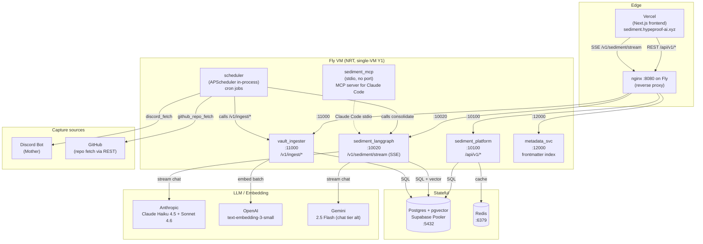

# 01 — Architecture Overview

> **One-line:** Sediment is a single-VM (Y1) multi-tenant memory engine — 5 FastAPI services behind nginx, Postgres+pgvector for storage, Anthropic+OpenAI for intelligence, Discord+GitHub+future-Slack for capture, Next.js for UI. 3 logical layers (platform / agent / tenant) keep tenant code from contaminating common code.

## 1. Executive view

Sediment exists because Korean SMBs have no data layer at all — their institutional knowledge lives in meetings, chat, paper, and the founder's head. We capture the ephemera, distill it into citable evidence, and serve it back as cited chat. Sediment is *the* first knowledge layer for companies that never had one.

Architecturally, three concerns dominate every design decision:
1. **Multi-tenancy from line 1** — single-tenant first feels fast; the retrofit cost destroys margin
2. **Evidence-grounded** — every answer cites; no citation = regression
3. **Cost discipline** — Y1 per-tenant LLM cost ≤ $5/mo for D+A archetype, achievable only if we stay on cheap models for ingest + reserve heavy models for chat

This doc fixes the layer boundaries and the service topology. Every other doc operates within these constraints.

## 2. The 3 layers, in detail

### 2.1 Layer 1 — Common Platform (infrastructure)

Code that doesn't know LLMs, doesn't know connectors, doesn't know tenants by name. Just: read/write/route/serve.

| Module | Responsibility | File path |
|---|---|---|
| FastAPI services × 5 | HTTP/SSE surface for everything | `services/sediment/applications/*` |
| Postgres + pgvector | OLTP + vector storage | DB cluster (Supabase or self-hosted PG18) |
| Redis | session, SSE fanout, light cache | container |
| Auth middleware | JWT validation, RLS context injection | `lab_lib/auth.py`, `lab_lib/tenant_middleware.py` |
| Cost tracking | LLM call metering → `llm_calls` | `lab_lib/cost_tracker.py` |
| Structured logging | JSON logs with tenant_id + request_id | `lab_lib/logging.py` |
| Frontend shell | Next.js App Router routing + auth UX | `frontend/app/sediment/*` |

What Layer 1 **does not** do: classify events, choose models, route notifications, hold per-tenant prompts.

### 2.2 Layer 2 — Common Agent (intelligence)

The *thinking* layer. Tenant-agnostic but LLM-aware, connector-aware, retrieval-aware.

| Module | Responsibility | File path |
|---|---|---|
| Collection AI Agent | `decide(event) → {ingest?, notify?, channels[]}` per source kind | `lab_lib/connectors/`, `scripts/*_fetch.py`, `scripts/scheduler.py` |
| Connector framework | `ConnectorABC`, `NormalizedEvent` shape, watermark contract | `lab_lib/connectors/base.py` |
| Concrete connectors | Discord, GitHub, future Slack/Notion/Drive/Voice/OCR | `lab_lib/connectors/{discord,github_repo,...}.py` |
| Distillation strategies | Per-event-kind YAML + Anthropic tool schema | `prompts/distill/strategies/*.yaml` + `lab_lib/prompts.py` |
| Chunking | Markdown-aware splitter, heading-path preservation | `lab_lib/chunker.py` |
| Embedding | OpenAI `text-embedding-3-small` (1536d) | `lab_lib/embeddings.py` |
| Retrieval | BM25 (tsvector) + pgvector (cosine HNSW) + RRF rerank | inside `sediment_langgraph` graph nodes |
| LangGraph composition | router → retrieval → compose → cite | `applications/sediment_langgraph/main.py` |
| Notification engine | template render + transport dispatch + circuit breaker | (planned) `lab_lib/notifications/` |
| Phase 4 consolidator | conv → decisions/actions extraction | `scripts/consolidate_memory.py` |

What Layer 2 **does not** do: hardcode tenant slugs, read per-tenant prompts directly from files (must go through tenant override loader), bypass Layer 1's auth.

### 2.3 Layer 3 — Tenant-specific (per-customer extensions)

Everything that varies per tenant lives here. **No code goes here.** Only config rows + (optional) tenant-scoped template overrides.

| Asset | Where it lives | What it varies |
|---|---|---|
| Tenant identity | `tenants` table row | slug, display_name, domain, plan, feature_flags |
| Member roster | `members` table rows | who has access, role (admin/creator/viewer) |
| Connector config | `integrations` table rows (one per `(tenant, kind)`) | which repos/channels/spaces, path filters, schedule, watermark state |
| Notification routes | `integrations.config.notify.routes[]` JSONB (v1) → `notification_routes` table (v3) | event_type → channel mapping |
| Prompt overrides | `tenants.feature_flags.prompt_override` JSONB (text addenda only — base template never replaced) | tone, language hints, taxonomy |
| Template overrides | (planned) `notification_templates` table | per-tenant message wording |

What Layer 3 **does not** contain: Python files, code branches, deploy-time toggles.

## 3. Service topology



**5 backend services on one VM, supervised by `supervisord`.** Each `uvicorn` binds `127.0.0.1:<port>`. Only nginx (`:8080`) is exposed externally. The scheduler is a 6th process inside supervisord, no HTTP port.

| Service | Port | Purpose | Workers |
|---|---|---|---|
| `sediment_platform` | 10100 | REST for conversations, messages, members, library, admin | 2 |
| `sediment_langgraph` | 10020 | LangGraph chat + SSE | 2 |
| `vault_ingester` | 11000 | RAG ingest (chunk + embed + upsert) | 1 |
| `metadata_svc` | 12000 | frontmatter index, filter helpers | 1 |
| `sediment_mcp` | — | MCP server (stdio) for Claude Code | — |
| `scheduler` | — | APScheduler in-process | — |
| `nginx` | 8080 | reverse proxy, only public port | — |

Why split into 5? Process isolation: a crashed `vault_ingester` (large file → OOM) doesn't take down chat. Workers can scale per-service (chat needs concurrency, ingest doesn't).

Why single VM (Y1)? Until > 10 tenants with hourly cadences, the per-tenant marginal CPU is negligible. The migration trigger to multi-VM is documented in 11.

## 4. Repository layout

```
sediment/                                    ← this repo (jayleekr/sediment)
├── README.md                                 quick start
├── SPEC.md                                   exec summary (200 lines, points here)
├── DECISIONS.md                              ADR log
├── CLAUDE.md                                 project-level Claude rules
├── docs/design/                              ← THIS DIRECTORY
├── infra/
│   ├── init.sql                              schema (guard.json-blocked)
│   └── deploy/                               Dockerfile, fly.toml, nginx, supervisord
├── services/sediment/
│   ├── applications/
│   │   ├── sediment_platform/                Layer 1 — REST
│   │   ├── sediment_langgraph/               Layer 2 — LangGraph + retrieval
│   │   ├── vault_ingester/                   Layer 2 — RAG pipeline
│   │   ├── metadata_svc/                     Layer 1 — frontmatter
│   │   └── sediment_mcp/                     Layer 2 — MCP server
│   ├── lab_lib/                              Layer 1+2 shared libs
│   │   ├── connectors/                       Layer 2 — ConnectorABC + impls
│   │   ├── auth.py, settings.py, db.py       Layer 1
│   │   ├── chunker.py, embeddings.py, llm.py Layer 2
│   │   └── ...
│   ├── scripts/                              cron entry points + ops
│   ├── prompts/                              distillation strategies + system prompts
│   ├── config/                               cron.yaml, channels, etc.
│   ├── validator/                            rubric harness (see 09)
│   ├── tests/
│   └── pyproject.toml
├── frontend/                                 Next.js App Router (deployed to Vercel)
│   └── app/sediment/
├── harness/                                  Ralph supervisor + helper scripts
└── .github/workflows/                        CD (fly-deploy + nightly-recall)
```

**Cross-repo map** (the other repos this design coordinates with):

```
jayleekr/sediment            ← backend + frontend (this repo)
jayleekr/hypeprooflab        ← the lab's vault content (markdown)
jayleekr/hypeproof-harness   ← cross-product shared skills/scripts (rsync vendored)
jayleekr/hypeproof-studio    ← VS Code fork (Track A education product)
jayleekr/hypeproof-studio-releases  ← binary releases for Studio
JinyongShin/hypeproof_kids_edu      ← second tenant's vault + backend
```

Detailed per-tenant ingest inventory is maintained in the operational tenant
registry, not in the public architecture docs.

## 5. Runtime data flows (the 4 canonical paths)

### 5.1 Chat (the value-add path)

```
user types in /sediment/c/<id>
  → Next.js POST /api/v1/conversations/<id>/messages (save user turn)
  → Next.js POST /v1/sediment/stream (SSE)
    → require_identity → JWT → set_config app.tenant_id
    → graph: router → retrieval (BM25 + vector + RRF) → compose
      → for token in llm_stream: yield SSE delta
      → for c in citations: yield SSE citation
    → persist assistant message (BEFORE [DONE])
    → emit query event
    → yield [DONE]
  → Next.js renders deltas + citations
```

### 5.2 Capture (the dogfood path)

```
APScheduler fires github_repo_sync (hourly, 09-22 KST)
  → scripts.github_repo_fetch --all
    → SELECT integrations WHERE kind='github'
    → for each integration:
      → GitHubRepoConnector(config)
      → fetch_since(resource, watermark)
        → returns NormalizedEvent[]
      → for each event:
        → INSERT INTO events (dedup on external_id)
        → POST /v1/ingest/document (vault_ingester)
          → chunk_markdown → embed → UPSERT artifacts + chunks
      → UPDATE integrations.config.state.head_sha
```

Discord path is structurally identical — different connector, same shape.

### 5.3 Distillation (the memory path)

```
APScheduler fires consolidate (12h)
  → scripts.consolidate_memory --tenant hypeproof-lab --since-hours 13
    → SELECT recent conversations + raw events
    → load_strategy("distill", "chat_thread") for messages
    → Anthropic Haiku → structured tool call → decisions[] + actions[]
    → INSERT INTO decisions / actions
    → INSERT INTO events kind='decision_extracted' (audit)
```

### 5.4 Notification (the back-out path, planned)

```
trigger (deploy success / recall regression / digest cron / new decision)
  → notify(event_type, tenant_id, payload)
    → look up routes for (tenant, event_type)
    → for each route:
      → check circuit breaker + cooldown
      → render template (Jinja2)
      → dispatch to transport (Discord webhook / Slack / email)
      → INSERT INTO notification_log
```

See 07-notifications.md for the planned shape.

## 6. API surface (master inventory, links to detail)

| Port | Service | Routes | Detail |
|---|---|---|---|
| 10100 | platform | `/api/v1/auth/*`, `/api/v1/conversations/*`, `/api/v1/library/*`, `/api/v1/members/*`, `/api/v1/admin/*`, `/api/v1/cite/*`, `/api/v1/feedback/*`, `/api/v1/onboarding/*` | 03 (auth), 10 (frontend) |
| 10020 | langgraph | `/v1/sediment/stream` (SSE chat), `/healthz` | 06 |
| 11000 | vault_ingester | `/v1/ingest/document`, `/v1/ingest/batch`, `/v1/chunks` (DELETE), `/webhook/ingest` | 04, 05 |
| 12000 | metadata_svc | `/v1/metadata/*` | 10 |
| stdio | sediment_mcp | MCP tools — `vault.search`, `library.list`, `decisions.recent`, etc | 06 |

Per-service detail of every route, with request/response shape, lives in the linked doc.

## 7. Boundary principle (the architectural law)

This is the rule that keeps Layer 1 and Layer 2 reusable across all tenants:

> **No Python file under `lab_lib/` or `applications/` may reference a tenant by name.**
>
> - **Allowed**: `current_tenant_id()`, `tenants.feature_flags.prompt_override`, `integrations.config[...]`
> - **Forbidden**: `if tenant == "hypeproof-lab":`, `KIDS_EDU_DEFAULT_PATH = "..."`, hardcoded slug lookups

Enforcement is by code review. The single test you should run mentally: *"If a new tenant signed up tomorrow, would my change require a code edit, or just a config row?"* If the answer is "code edit," reconsider — there's usually a config-driven path.

**Exceptions that prove the rule:**
- `seed_lab.py` *creates* the three known tenants (`hypeproof-lab`, `acme-test`, `kids-edu`). Acceptable because seed code's job is bootstrapping known state.
- `tests/test_rls.py` uses `acme-test` to verify cross-tenant isolation. Acceptable because the test is *about* the isolation.
- `validator/golden_queries_kids_edu.yaml` lives in this repo for now. Acceptable because golden sets are tenant-specific test data, not runtime code. Future: each tenant's golden set lives in their own repo, mounted as a fixture.

## 8. Configuration model (where decisions live)

| Decision granularity | Storage | Editable by |
|---|---|---|
| Layer 1 service behavior (ports, log level, base URLs) | env vars / `fly.toml` | platform owner |
| Cron cadence | `services/sediment/config/cron.yaml` | platform owner via PR |
| Default model selection (Haiku/Sonnet/Gemini) | env `LLM_PROVIDER`, `LLM_MODEL_*` | platform owner |
| Per-tenant integration (which repos, channels) | `integrations.config` JSONB | tenant admin (v3 UI) / Jay (v1 seed_lab) |
| Per-tenant member list | `members` table | tenant admin / Jay |
| Per-tenant prompt addendum | `tenants.feature_flags.prompt_override` JSONB | tenant admin (v2) |
| Per-tenant notification routes | `integrations.config.notify.routes[]` JSONB (v1) → `notification_routes` table (v3) | tenant admin |
| Per-tenant template override | `notification_templates` table (v3) | tenant admin |
| Per-user preferences (digest opt-in) | `members.preferences` JSONB (planned) | member |

The migration from JSONB-in-existing-table to dedicated tables happens when the UI needs to edit, not before. Avoid premature normalization.

## 9. Coverage matrix

| Layer | hypeproof-lab | kids-edu | acme-test | future paying tenant |
|---|---|---|---|---|
| Layer 1 (platform) | ✅ identical | ✅ identical | ✅ identical | ✅ identical |
| Layer 2 connectors — Discord | ✅ | — | — | (per tenant signup) |
| Layer 2 connectors — GitHub | — | ✅ | — | (per tenant signup) |
| Layer 2 connectors — Voice/OCR | ⏳ Phase A | ⏳ Phase A | — | (Phase A onwards) |
| Layer 2 retrieval (BM25+vec+RRF) | ✅ recall@3 27/40 | ✅ recall@3 5/10 | — | ✅ at signup |
| Layer 2 chat composition | ✅ | ✅ | — | ✅ at signup |
| Layer 2 distillation (Phase 4) | ✅ 12h | ⏳ wiring | — | Phase 1 |
| Layer 2 notifications | ⏳ v1 design | ⏳ v1 design | — | Phase 1 |
| Layer 3 config rows | full | full | minimal (RLS test only) | onboarded |

## 10. Open questions

- **Q1** (carried from README): embedding provider abstraction is currently hardcoded to OpenAI. Per-tenant choice (e.g., a tenant using Voyage AI) is Phase B. Cost impact analysis pending.
- **Q2** (carried from README): APScheduler → Celery migration trigger. Concrete numeric trigger documented but no rehearsal yet.
- **Q5**: MCP server — does it stay as a Layer 2 component (used by Claude Code clients) or move to a separate service? Current: in-process, stdio-only. Probably fine until external customer Claude Code workflows materialize.
- **Q6**: Should the planned `decide()` function (Collection AI Agent) be a stateless pure function or hold per-source state? Stateless preferred; per-tenant state lives in DB rows.

## 11. References

- Code paths cited above (resolve from `services/sediment/`).
- `SPEC.md` (top-level) — original v0.2 spec, now superseded by this doc dir.
- `DECISIONS.md` (top-level) — append-only ADR log; reference by date when citing.

## Changelog

- 2026-05-22 — v0.1 — established 3-layer model + boundary principle + service topology.
