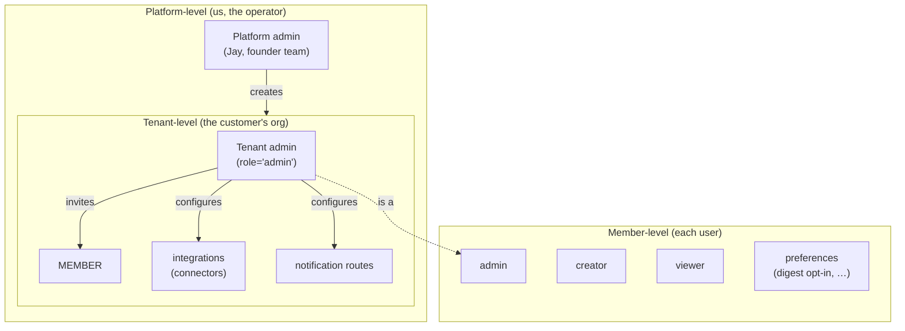

# 02 — Multi-tenancy & RBAC

> **One-line:** Every byte of tenant data is isolated by Postgres Row Level Security; every API call carries a tenant context set via `app.tenant_id`; every member belongs to exactly one tenant and has one of three roles. The boundary principle (`01-architecture-overview.md §7`) is enforced at the DB level, not just by code review.

## 1. Executive view

A single Postgres database hosts every tenant. Isolation comes from RLS policies that filter every `SELECT/INSERT/UPDATE/DELETE` by the session-local `tenant_id`. The application sets that context on every request via JWT validation. Tenants never see each other's data — even if application code has a bug that omits a `WHERE tenant_id = ?` clause, RLS still blocks the read.

Three roles inside a tenant:
- **admin** — full access, can edit `integrations`, invite members
- **creator** — read all, create conversations, contribute artifacts
- **viewer** — read only, can use chat

No cross-tenant roles exist. A person who works at two tenants is two separate `members` rows with the same email.

## 2. The 3-layer RBAC model



| Layer | Who | Permissions |
|---|---|---|
| **Platform** | Us (Sediment ops) | Create tenants, suspend tenants, run migrations, observe metrics across all tenants (via `service_session` which bypasses RLS) |
| **Tenant** | `members.role = 'admin'` within a tenant | Read/write everything in that tenant scope: members, integrations, conversations, decisions, settings |
| **Member** | `creator` or `viewer` within a tenant | Per-role: chat, contribute, browse library; no admin actions |

## 3. The RLS contract

### 3.1 Schema (already shipped in `infra/init.sql`)

Every tenant-scoped table has:
```sql
CREATE TABLE IF NOT EXISTS <table> (
  id           UUID PRIMARY KEY DEFAULT uuid_generate_v4(),
  tenant_id    UUID NOT NULL REFERENCES tenants(id) ON DELETE CASCADE,
  ...
);
ALTER TABLE <table> ENABLE ROW LEVEL SECURITY;
ALTER TABLE <table> FORCE ROW LEVEL SECURITY;
CREATE POLICY tenant_isolation ON <table>
  USING (tenant_id = current_tenant_id());
```

`current_tenant_id()` is:
```sql
CREATE OR REPLACE FUNCTION current_tenant_id() RETURNS UUID LANGUAGE plpgsql AS $$
BEGIN
  RETURN nullif(current_setting('app.tenant_id', true), '')::UUID;
EXCEPTION WHEN others THEN
  RETURN NULL;
END;
$$;
```

Tables under RLS:
`tenants`, `subscriptions`, `integrations`, `members`, `artifacts`, `chunks`, `conversations`, `messages`, `decisions`, `actions`, `events`, `usage_events`, `usage_daily`, `audit_log` — every table with `tenant_id`.

`FORCE ROW LEVEL SECURITY` ensures even the table owner's queries go through the policy. Without `FORCE`, the owner role (often the migration role) bypasses RLS — a foot-gun.

### 3.2 Two DB roles (the cornerstone)

| Role | Bypass RLS? | Used by |
|---|---|---|
| `curator_app` | No | All user-facing requests (web app, chat, library) |
| `curator_service` | **Yes** (`BYPASSRLS`) | Cron jobs, ingest pipeline, admin endpoints, seed scripts |

Two connection pools, two engines:
```python
# lab_lib/db.py
_engine_app = create_async_engine(settings.database_url_app, ...)      # curator_app
_engine_service = create_async_engine(settings.database_url_service, ...)  # curator_service
```

Two session helpers:
```python
async def app_session(tenant_id: str) -> AsyncSession:
    # sets app.tenant_id BEFORE returning the session
    s.execute("SELECT set_config('app.tenant_id', :tid, true)", {"tid": tenant_id})

async def service_session() -> AsyncSession:
    # no tenant context set — must be used carefully
```

**Rule:** API handlers always use `app_session(identity.tenant_id)`. Cron + ingest use `service_session()` and always supply `tenant_id` explicitly in the query.

### 3.3 The `app.tenant_id` GUC (Grand Unified Configuration parameter)

PostgreSQL allows setting session-local variables via `SET LOCAL` or `SELECT set_config(name, value, true)`. We use the latter form — it works in async contexts where transactions get split across operations.

```python
# Set on every request via FastAPI dependency:
async def require_identity(...) -> Identity:
    payload = jwt.decode(token, ...)
    tenant_id = payload["tenant_id"]
    # Tenant-scoped session sets this automatically
    return Identity(tenant_id=tenant_id, member_id=payload["sub"], ...)
```

```python
# Inside app_session():
await s.execute(text("SELECT set_config('app.tenant_id', :tid, true)"), {"tid": tenant_id})
# All subsequent queries in this session see only rows where tenant_id = :tid
```

**Anti-pattern:** `SET LOCAL app.tenant_id = $1` — this used to fail intermittently with asyncpg's prepared-statement mode. Always use `SELECT set_config(name, value, true)`.

### 3.4 Three classes of cross-tenant attack and how RLS blocks each

| Attack | Example | Why RLS blocks it |
|---|---|---|
| **Application bug** | `SELECT * FROM artifacts WHERE id = :id` (forgot tenant_id filter) | RLS appends `AND tenant_id = current_tenant_id()` |
| **JWT injection** | Attacker sets `tenant_id: <other_tenant>` in token | JWT signature check prevents forgery; valid tokens are issued only for the user's own tenant |
| **SQL injection** | Crafted input alters WHERE clause | `set_config('app.tenant_id', …, true)` is per-session and unaffected by query injection — RLS still filters |

The validator check `tests/test_rls.py` proves all three by signing in as `acme-test`, issuing queries with `hypeproof-lab` UUIDs in path/body, and asserting zero rows return. Runs in every CI pass.

## 4. Identity & member modeling

```sql
CREATE TABLE members (
  id           UUID PRIMARY KEY DEFAULT uuid_generate_v4(),
  tenant_id    UUID NOT NULL REFERENCES tenants(id) ON DELETE CASCADE,
  external_id  TEXT,           -- e.g., Discord snowflake
  github_login TEXT,           -- GitHub OAuth identity (SSO key)
  email        TEXT,
  display_name TEXT NOT NULL,
  real_name    TEXT,
  role         TEXT NOT NULL DEFAULT 'creator' CHECK (role IN ('admin','creator','viewer')),
  title        TEXT,
  expertise    JSONB NOT NULL DEFAULT '[]',
  interests    JSONB NOT NULL DEFAULT '[]',
  avatar_url   TEXT,
  created_at   TIMESTAMPTZ NOT NULL DEFAULT now(),
  UNIQUE (tenant_id, email),
  UNIQUE (tenant_id, external_id),
  UNIQUE (tenant_id, github_login)
);
```

Three UNIQUE constraints, all scoped by `tenant_id` — the same email/Discord/GitHub identity can exist in multiple tenants as separate rows. This is intentional. The composition is **identity ⊕ tenant ⇒ member**.

**Member resolution order** at sign-in:
1. JWT carries `(tenant_slug, github_login)` (or `(tenant_slug, email)` in dev-token path)
2. `SELECT id FROM members WHERE tenant_id = (SELECT id FROM tenants WHERE slug = :slug) AND github_login = :gh`
3. If not found → 401 (must be invited first; no auto-provisioning in v1)

See `03-auth.md` for the OAuth flow details.

## 5. Tenant lifecycle

### 5.1 Creation (v1 — manual)

`scripts/seed_lab.py`:
```python
async def upsert_tenant(s, slug, name) -> str:
    INSERT INTO tenants (slug, display_name, domain, plan, status)
    VALUES (:slug, :name, :domain, 'free', 'active')
    ON CONFLICT (slug) DO UPDATE ...
    RETURNING id
```

Plus the same call seeds:
- A `subscriptions` row with default quotas (8 seats, 10K queries/month, 5GB storage)
- Initial `members` rows from `data/members.json` or hardcoded admins

Today the public examples cover `hypeproof-lab`, `kids-edu`, and `acme-test`.
Detailed per-tenant inventory is maintained in the operational tenant registry.

### 5.2 Creation (v2 — admin endpoint, planned)

```
POST /api/v1/admin/tenants
  { slug, display_name, domain, plan, admin_email, admin_github_login }
→ creates tenant + subscription + 1 admin member in a single transaction
→ returns tenant_id + invite link for first admin
```

Authorization: platform-admin only. Implementation pending.

### 5.3 Creation (v3 — self-service signup, planned)

Public signup page → GitHub OAuth → on first sign-in:
- Check if `github_login` already in `members` → reject (already a member somewhere)
- Otherwise: create new tenant slugged from github_login, mint admin role

Out of scope for Y1 (paid signup only).

### 5.4 Suspension

```sql
UPDATE tenants SET status = 'suspended' WHERE id = :tid
```

`require_identity` checks `tenants.status`; non-`active` → 403. No data deleted; can be reactivated.

### 5.5 Deletion

`ON DELETE CASCADE` on every `tenant_id` FK means a single `DELETE FROM tenants WHERE id=:tid` removes every byte. Auditable via `audit_log` because the row insertion happens BEFORE the cascade.

## 6. Configuration model

| Decision | Storage | Scope |
|---|---|---|
| Plan, seat quota, query quota | `subscriptions` table | Per-tenant |
| Feature flags (e.g., `prompt_override`) | `tenants.feature_flags` JSONB | Per-tenant |
| Custom domain | `tenants.domain` | Per-tenant |
| Allowed members | `members` table | Per-tenant |
| Roles | `members.role` | Per-(tenant, member) |
| Discord/GitHub linkage | `members.external_id`, `members.github_login` | Per-(tenant, member) |
| Personal preferences | `members.preferences` JSONB (planned) | Per-(tenant, member) |

## 7. Boundary principle (for this doc)

> **No application code may bypass RLS by using `service_session()` to read/write tenant data on behalf of a user.**
>
> Allowed: cron jobs that operate across all tenants (`github_repo_fetch --all`) using `service_session()` and explicit `tenant_id IN (...)` filters.
> Forbidden: a user-triggered API endpoint that uses `service_session()` "because it was easier".

The single test: *"Was this code reached via a user's JWT, or via a system clock?"* If JWT → `app_session`. If clock → `service_session`.

## 8. Coverage matrix

| Capability | hypeproof-lab | kids-edu | acme-test |
|---|---|---|---|
| Tenant row | ✅ | ✅ | ✅ |
| Admin members | Jay, Ryan, JY, … (8) | Jay, Jinyong (2) | 1 placeholder |
| RLS policy enforced | ✅ | ✅ | ✅ |
| Cross-tenant negative test | ✅ E2E-08 | ⏳ extend | ✅ (as target tenant) |
| Custom domain | sediment.hypeproof-ai.xyz | — | — |
| Feature flags | none yet | none yet | none |
| Prompt override | none yet | none yet | none |

## 9. Open questions

- **Q1**: When multiple `members` rows share an email (same person at two tenants), how does the OAuth flow pick which tenant to log into? *Current:* `tenant_slug` is part of the OAuth state. *Open:* tenant-picker UI when a user has more than one membership.
- **Q2**: Should role be (tenant, member) — yes, already. Open: do we need a 4th role (e.g., `billing`) for the person who pays but doesn't read content? Probably yes at SaaS launch.
- **Q3**: Audit log retention — keep forever? Per-tenant export for compliance? *Current:* keep 1 year, no export. PIPA does not require longer.

## 10. References

- `infra/init.sql` (lines 31–315) — schema, RLS setup, two-role split
- `services/sediment/lab_lib/db.py` — `app_session`, `service_session`
- `services/sediment/lab_lib/tenant_middleware.py` — request → tenant_id resolution
- `services/sediment/lab_lib/auth.py` — JWT validation
- `services/sediment/tests/test_rls.py` — cross-tenant negative coverage
- `services/sediment/scripts/seed_lab.py` — current bootstrap path
- `validator/e2e_spec.yaml` E2E-08 — Playwright cross-tenant flow

## Changelog
- 2026-05-22 — v0.1 — extracted from `SPEC.md` Appendix D + lived implementation.
