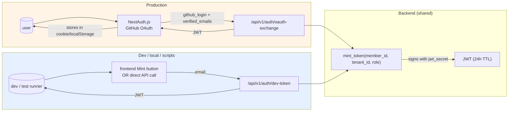

# 03 — Auth

> **One-line:** Two authentication paths: GitHub OAuth (prod) and dev-token by email (local). Both produce the same JWT, which carries `(member_id, tenant_id, role, email)`. The backend is the single source of truth — it never trusts a client-supplied tenant.

## 1. Executive view

Auth is small but load-bearing. Wrong-tenant bugs are silent and catastrophic. Two contradictory pressures:
- Production users need painless sign-in (no passwords, no email round-trip per session) → GitHub OAuth
- Dev/test loop needs instant identity (no OAuth dance per local restart) → dev-token

Both paths converge on a single JWT shape, and a single resolver (`require_identity`) handles every API call. The OAuth provider verifies humanity; the backend verifies membership.

## 2. The two paths



| Path | Endpoint | Use case | Available where |
|---|---|---|---|
| GitHub OAuth | `POST /api/v1/auth/oauth-exchange` | Real users in prod | prod only (NextAuth wires it) |
| Dev token | `POST /api/v1/auth/dev-token` | Local dev, E2E tests, recall scripts, ops automation | both prod and dev (it's behind admin-only middleware in prod, planned — currently open) |

## 3. JWT shape

Symmetric HMAC-SHA256 with a single secret (`JWT_SECRET`). One signer (the backend), no key rotation in v1 (Y1 risk acceptable for D+A volume).

```json
{
  "sub": "<member_id UUID>",
  "tenant_id": "<tenant_id UUID>",
  "tenant_slug": "<tenant slug>",
  "role": "admin | creator | viewer",
  "email": "<member email>",
  "iat": <unix>,
  "exp": <unix + 86400>
}
```

`mint_token()` is the only function that creates JWTs. `require_identity` is the only function that validates them. Both live in `lab_lib/auth.py`.

## 4. Dev token path (the simpler one)

`POST /api/v1/auth/dev-token`:
```python
async def dev_token(req: DevTokenReq):
    async with service_session() as s:
        r = await s.execute(text("""
            SELECT m.id::text, m.tenant_id::text, m.role, m.display_name
            FROM members m WHERE m.email = :email LIMIT 1
        """), {"email": req.email})
        row = r.first()
        if not row:
            raise HTTPException(404, "member not found — run `make seed`")
    return TokenResp(token=mint_token(...), ...)
```

What it does:
1. Take an email
2. Look up the first member matching that email (across ALL tenants — see Q1)
3. Mint a JWT for that member's tenant + role
4. Return

What it doesn't do:
- No password check
- No email verification
- No CSRF protection (it's POST, but no double-submit token)

**Production hardening (planned):** dev-token endpoint is gated behind a platform-admin role check, or moved to a separate non-internet-exposed admin port. Currently open in prod — acceptable risk for Y1 because only seeded members can mint (no auto-provisioning), and seeded members are trusted employees.

## 5. GitHub OAuth path (the production one)

### 5.1 NextAuth side (frontend)

`frontend/app/api/auth/[...nextauth]/route.ts` configures NextAuth with a GitHub provider. On successful sign-in, the callback:
1. Receives GitHub profile (login, name, avatar, *verified* emails)
2. POSTs to backend `/api/v1/auth/oauth-exchange` with `{provider: "github", github_login, verified_emails}`
3. Receives a Sediment JWT
4. Stores it in `localStorage` and uses it for all subsequent API calls

### 5.2 Backend side

`POST /api/v1/auth/oauth-exchange`:
```python
async def oauth_exchange(req: OAuthExchangeReq):
    if req.provider != "github":
        raise HTTPException(400, f"unsupported provider: {req.provider}")
    gh = req.github_login.strip().lower()
    emails = sorted({e.strip().lower() for e in req.verified_emails})
    
    # Resolution order: github_login → email
    async with service_session() as s:
        row = await s.execute(text("""
            SELECT id::text, tenant_id::text, role, display_name, email
            FROM members WHERE lower(github_login) = :gh LIMIT 1
        """), {"gh": gh}).first()
        
        if row is None and emails:
            # Fallback: try by any verified email
            row = await s.execute(...,
                bindparam("emails", expanding=True)).first()
        
        if row is None:
            raise HTTPException(403,
                "github account not linked — admin must add your github_login "
                "to data/members.json then run `make seed`")
    
    return TokenResp(token=mint_token(...), ...)
```

### 5.3 Why github_login first, email second

GitHub allows users to keep their primary email private. The OAuth scope returns the *public* profile email by default, which is often `12345+username@users.noreply.github.com` — not the email the team admin would have entered into `members.json`.

`github_login` is the stable, public, immutable identifier we trust. Email is a fallback for grandfathered members who were seeded by email before their github_login was set.

## 6. `require_identity` — every request goes through this

```python
# lab_lib/auth.py
@dataclass
class Identity:
    member_id: str
    tenant_id: str
    role: str
    email: str

async def require_identity(authorization: str = Header(None)) -> Identity:
    if not authorization or not authorization.startswith("Bearer "):
        raise HTTPException(401, "missing bearer token")
    token = authorization[7:]
    try:
        payload = jwt.decode(token, settings.jwt_secret, algorithms=["HS256"])
    except jwt.ExpiredSignatureError:
        raise HTTPException(401, "token expired")
    except jwt.InvalidTokenError as e:
        raise HTTPException(401, f"invalid token: {e}")
    
    # Optional: check tenant is still active
    # (skipped in hot path; checked in admin endpoints)
    
    return Identity(
        member_id=payload["sub"],
        tenant_id=payload["tenant_id"],
        role=payload["role"],
        email=payload["email"],
    )
```

Every protected route:
```python
@router.get("/conversations")
async def list_convs(identity: Identity = Depends(require_identity)):
    async with app_session(identity.tenant_id) as s:
        # … queries automatically scoped by RLS via app.tenant_id
```

## 7. Role enforcement (RBAC)

Three roles: `admin`, `creator`, `viewer`. Enforcement is per-route via a thin helper:

```python
def require_role(*allowed: str):
    def _dep(identity: Identity = Depends(require_identity)) -> Identity:
        if identity.role not in allowed:
            raise HTTPException(403, f"role {identity.role} not in {allowed}")
        return identity
    return _dep

@router.post("/integrations")
async def create_integration(
    req: IntegrationReq,
    identity: Identity = Depends(require_role("admin")),
):
    ...
```

What each role can do:

| Action | viewer | creator | admin |
|---|---|---|---|
| Chat (any conversation) | ✅ own | ✅ own + read others | ✅ all |
| Browse library | ✅ | ✅ | ✅ |
| Upload artifact | — | ✅ | ✅ |
| Edit `integrations` | — | — | ✅ |
| Invite member | — | — | ✅ |
| Change role | — | — | ✅ |
| View cost dashboard | — | — | ✅ |
| Bypass quotas | — | — | — (nobody — quota is hard) |

## 8. Token lifecycle

- **TTL**: 24 hours (`JWT_TTL_SECONDS = 86400`)
- **Refresh**: not implemented; user re-auths after expiry. Acceptable for Y1.
- **Revocation**: not implemented; tokens are stateless. To "log a user out everywhere" you'd rotate `JWT_SECRET` (kills ALL tokens). Acceptable for Y1.
- **Sign-out**: `localStorage.clear()` on the client. Token still valid server-side until expiry but unusable without storage.

Planned (v2):
- Refresh tokens (longer-lived, single-use, exchangeable)
- Per-token revocation list in Redis
- Sign-out endpoint that adds the JWT's `jti` to a deny-list

## 9. Configuration model

| Setting | Storage | Default |
|---|---|---|
| `JWT_SECRET` | env var | required, no default |
| `JWT_TTL_SECONDS` | env var | 86400 (24h) |
| GitHub OAuth client ID/secret | NextAuth env (`AUTH_GITHUB_ID`, `AUTH_GITHUB_SECRET`) | required |
| Dev-token allowed in prod | env `ENABLE_DEV_TOKEN_IN_PROD` | currently true (planned: gate behind admin role) |
| Tenant suspension check | `tenants.status` | enforced in admin paths; planned for hot path |

## 10. Boundary principle (for this doc)

> **No code outside `lab_lib/auth.py` constructs or mutates JWTs.**
>
> Allowed: handlers that depend on `require_identity` and use the returned `Identity`.
> Forbidden: parsing JWT manually, building JWT manually, setting `tenant_id` from user input.

The single test: *"Is the tenant_id used in this query coming from a JWT-validated source?"* If user input → reject. If `Identity` from `require_identity` → trust.

## 11. Coverage matrix

| Capability | prod | dev | acceptance tests |
|---|---|---|---|
| GitHub OAuth sign-in | ✅ (Vercel + NextAuth) | ✅ | ⏳ E2E for prod auth path (manual today) |
| Dev-token | ✅ open | ✅ | ✅ E2E-01 (Sign-in flow) |
| 24h TTL | ✅ | ✅ | none |
| RBAC enforcement | ✅ per-route helper | ✅ | partial (admin endpoints only) |
| Tenant suspension reject | ⏳ admin path only | ⏳ | none |
| Token refresh | ❌ | ❌ | n/a |
| Per-token revocation | ❌ | ❌ | n/a |

## 12. Open questions

- **Q1**: Dev-token in prod — leave open, or gate behind admin role? *Current:* open. *Risk:* if `JWT_SECRET` leaks, attacker can mint any member's token without dev-token endpoint. If dev-token endpoint were the only path to compromise, gating it would matter. Since the bigger risk is secret leak, gating is hygiene not security. Plan to gate in v2.
- **Q2**: Multi-tenant membership for same email — when GitHub user is a member of `hypeproof-lab` AND `kids-edu`, which tenant do they log into? *Current:* first-match wins (undefined behavior). *Open:* tenant-picker UI.
- **Q3**: Refresh token model — short-lived access + long-lived refresh, or stay stateless? *Current:* stateless. *Trigger to revisit:* user complaint about re-auth friction or compliance ask.

## 13. References

- `services/sediment/lab_lib/auth.py` — `mint_token`, `require_identity`, `Identity`
- `services/sediment/applications/sediment_platform/routers/auth.py` — `dev_token`, `oauth_exchange`
- `services/sediment/lab_lib/tenant_middleware.py` — request → tenant scoping
- `frontend/app/api/auth/[...nextauth]/route.ts` — NextAuth config (frontend)
- `frontend/app/sediment/lib/api.ts` — `getToken()`, `setToken()`, Bearer wrapping
- `validator/e2e_spec.yaml` E2E-01 — Sign-in flow Playwright test
- `validator/scripts/recall_live.py` — example dev-token usage from automation

## Changelog
- 2026-05-22 — v0.1 — codified the two-path model; documented github_login-first resolution; flagged dev-token gating as Q1.
