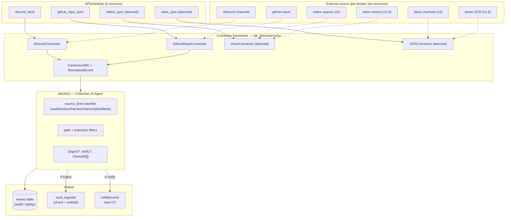

# 04 — Collection Engine

> **One-line:** A pluggable connector framework (`ConnectorABC`) that turns events from every supported source (Discord, GitHub, Voice, OCR, ...) into a single `NormalizedEvent` shape. A per-event `decide()` function asks "should this be ingested, notified, or both?" using `source_kind` + path filters. Watermarks let us re-run safely.

## 1. Executive view

The Collection Engine is the *afferent* nervous system of Sediment — it pulls signal from where teams already work (chat, docs, repos) and hands it to the distillation pipeline (05) in a uniform shape. Two design pressures:
1. **Add a source = add 1 file** (a new `ConnectorABC` implementation). No changes to the rest of the system.
2. **Decide once, replay forever** — the watermark + dedup + `events` table mean any failure downstream (chunker bug, embedding outage) can be replayed without re-hitting the source.

The Collection AI Agent isn't (yet) "AI" — it's a deterministic `decide()` function over source-kind taxonomy. The "AI" qualifier becomes real when we add automatic source-kind detection from repo content (proposed v2).

## 2. Capture flow



## 3. The `ConnectorABC` contract

```python
# lab_lib/connectors/base.py
class ConnectorABC(abc.ABC):
    source_name: str   # matches events.source CHECK constraint
    
    @abc.abstractmethod
    async def list_resources(self) -> list[Resource]:
        """Enumerate discoverable resources (channels, repos, spaces, etc.).
        Used during onboarding to populate integrations.config.resources."""
    
    @abc.abstractmethod
    async def fetch_since(
        self,
        resource: Resource,
        after_external_id: str | None,
        limit: int = 100,
    ) -> list[NormalizedEvent]:
        """Pull events newer than the watermark. Returns oldest-first.
        Implementations MUST be idempotent."""
    
    async def aclose(self) -> None:
        """Release HTTP clients, sockets."""
```

Two value types:

```python
@dataclass
class Resource:
    id: str                # source-native (channel snowflake, "owner/repo", etc.)
    name: str              # display name
    kind: str              # "channel" | "thread" | "repo" | "space" | ...
    extra: dict            # connector-specific metadata

@dataclass
class NormalizedEvent:
    source: str            # "discord" | "github" | "voice" | "ocr" | ...
    kind: str              # "message" | "file_revision" | "voice_memo" | ...
    external_id: str       # source-native unique id (dedup key)
    ts: datetime           # source UTC timestamp
    payload: dict          # raw + enrichment
    member_external_id: str | None
    resource_id: str | None
```

The `external_id` discipline is non-negotiable: every event must have one, and `(tenant_id, source, external_id)` must be unique per source. Connectors can compose external_ids — `GitHubRepoConnector` uses `{commit_sha}::{file_path}`. The watermark contract is "last successfully-seen external_id"; on next call, the connector parses what it needs out of that string.

## 4. Connector catalog

| Connector | Status | source_name | Resource kind | External ID shape | Watermark mechanism |
|---|---|---|---|---|---|
| **Discord** | ✅ shipped | `discord` | `channel` / `thread` | message snowflake | `after_external_id` = max snowflake in events |
| **GitHub Repo** | ✅ shipped | `github` | `repo` | `{commit_sha}::{file_path}` | `head_sha` stored in `integrations.config.state` |
| **Voice (memo + meeting)** | spec'd, P1 | `voice` | `upload_session` | upload UUID | per-upload, no re-poll |
| **Photo OCR** | spec'd, P1 | `ocr` | `upload_session` | upload UUID | per-upload, no re-poll |
| **Notion** | not started, P2 | `notion` | `database` / `page` | page id + revision | `last_edited_time` |
| **Slack** | not started, P2 | `slack` | `channel` / `thread` | message `ts` | `oldest` param |
| **Google Drive** | not started, P3 | `drive` | `folder` / `file` | file id + revision | `pageToken` + `modifiedTime` |
| **Email (IMAP/Gmail)** | not started, P3 | `email` | `mailbox` / `thread` | message-id header | UID sequence |
| **Jira** | not started, P4 | `jira` | `project` / `issue` | issue key + updated | JQL `updated > ...` |
| **KakaoTalk export upload** | not started, P3 | `kakaotalk` | `upload_session` | upload UUID | per-upload, BYOData only |
| **❌ KakaoTalk live auto-fetch** | **NEVER** | — | — | — | **PIPA violation — forbidden forever** |

See `12-source-kinds-catalog.md` for the source_kind → ingest/notify defaults per connector type.

## 5. The `decide()` function (Collection AI Agent)

For each `NormalizedEvent`, the agent answers across **three orthogonal axes** — an event can trigger any combination of (ingest, notify, reply):

```python
@dataclass
class CollectionDecision:
    # Axis 1: passive memory
    ingest: bool                        # chunk + embed + store as artifact

    # Axis 2: outbound alert (one-way push to a channel)
    notify: bool
    notify_event_type: str | None       # e.g. "new_decision"
    notify_channels: list[str]          # logical channel slugs
    notify_template: str | None         # override default template

    # Axis 3: INTERACTIVE reply (added 2026-05-22 — closes the
    # "doing → knowing" loop by posting an answer back to the same
    # source the question came from, where it gets re-ingested next tick)
    reply: bool
    reply_transport: str | None         # "discord_thread" | "slack_thread"
    reply_query: str | None             # the question text (after mention strip)

    distill_strategy: str | None
    matched_rule: str                   # for debugging

def decide(
    event: NormalizedEvent,
    integration_config: dict,           # from integrations.config
) -> CollectionDecision:
    source_kind = integration_config.get("source_kind", "default")
    rules = load_default_rules(source_kind)
    rules.merge(integration_config.get("event_rules", {}))
    return rules.apply(event)
```

**The "reply" axis is what makes Sediment's loop close.** A question
asked in Discord (or Slack, or — future — email) triggers a chat
composition; the answer is posted back as a thread reply; the reply
itself is ingested next tick (Phase 4 also extracts any decisions
from the Q+A); next time someone asks a similar question, the prior
Q+A is in the citable pool. Doing → knowing → doing → knowing.

**Anti-loop guards** for `reply`:
1. `decide()` skips events with `payload.is_bot == True` (rule
   `transcript.bot_author_skip` runs first in the transcript ruleset)
2. The orchestrator (`discord_gateway_runner.py`) additionally checks
   `author_id == bot.user_id` before doing any DB work
3. Re-ingest of the bot's own reply IS desired (so future queries can
   find it), but `is_bot=True` prevents it from triggering ANOTHER reply

Default rules per `source_kind`:

```yaml
# default rules embedded in code; tenant config overrides via integration_config.event_rules
vault:                     # the content IS the knowledge
  defaults:
    ingest: true
    notify: false
  overrides:
    - when: path matches "**/decisions/**"
      action: [ingest, notify]
      notify_event_type: new_decision
      notify_channels: [primary]
    - when: path matches "**/.raw/**"
      action: []           # skip both
    - when: kind == "file_delete"
      action: [delete_artifact]

product:                   # code repo — content is software
  defaults:
    ingest: false          # don't ingest source files
    notify: false
  overrides:
    - when: path matches "(SPEC|DECISIONS|README|CHANGELOG).md"
      action: [ingest]
    - when: path matches "docs/**/*.md"
      action: [ingest]
    - when: kind == "release"
      action: [notify]
      notify_event_type: release_deployed
      notify_channels: [primary]

harness:                   # shared tooling repo
  defaults:
    ingest: false
    notify: false
  overrides:
    - when: path matches "skills/*/SKILL.md"
      action: [ingest, notify]
      notify_event_type: skill_published
      notify_channels: [primary]
    - when: path matches "docs/**/*.md"
      action: [ingest]

transcript:                # Discord/Slack message stream
  defaults:
    ingest: true
    notify: false          # already in the channel; no re-notify
  overrides:
    # ORDERED first — bot's own messages skip everything (anti-loop)
    - when: payload_eq: {is_bot: true}
      action: []
    - when: channel_name in ["공지사항","rule","온보딩-가이드"]
      action: []           # noise channels
    # Interactive reply — @mention of self triggers chat composition
    - when: payload_eq: {is_bot_mention: true}
      action: [ingest, reply]
      reply_transport: discord_thread
      distill_strategy: chat_thread

artifacts:                 # binary release blobs
  defaults:
    ingest: false
    notify: false
  overrides:
    - when: kind == "release"
      action: [notify]
      notify_event_type: release_deployed
      notify_channels: [primary]
```

The function is pure — no side effects, no IO. Side effects happen in the *caller* (the fetch script) based on the returned decision.

**v1 implementation note:** today's `github_repo_fetch.py` hardcodes the ingest decision (all matching files get chunked, no notify). The `decide()` function is the v2 generalization. Migration plan in `05-distillation-pipeline.md §9`.

## 6. Watermark + dedup discipline

Three guarantees the system relies on:

1. **External ID uniqueness within (tenant, source)**: enforced by application-level pre-check (`SELECT 1 FROM events WHERE ...`), not (yet) a DB unique index. Adding the index is a P1 schema task.
2. **Watermark monotonicity**: connectors advance watermarks only after successful ingest of the corresponding event. Failed inserts → watermark stays put → next run retries.
3. **Idempotent ingest**: `vault_ingester /v1/ingest/document` upserts by `(tenant_id, ref)` — re-running with same content is a no-op semantically. This lets the dedup-on-event short-circuit fall through to ingest, self-healing transient chunk failures (see commit history of `github_repo_fetch.py` for the bug we hit and fixed).

## 7. The `events` table (the spine)

```sql
CREATE TABLE events (
  id           UUID PRIMARY KEY DEFAULT uuid_generate_v4(),
  tenant_id    UUID NOT NULL REFERENCES tenants(id) ON DELETE CASCADE,
  source       TEXT NOT NULL CHECK (source IN ('discord','github','cron','web','email')),
  kind         TEXT NOT NULL,
  member_id    UUID REFERENCES members(id) ON DELETE SET NULL,
  payload      JSONB NOT NULL DEFAULT '{}'::jsonb,
  ts           TIMESTAMPTZ NOT NULL DEFAULT now()
);
```

The `payload` carries the connector's `NormalizedEvent.payload` plus `external_id` promoted to first-class for the dedup query.

**CHECK constraint expansion:** when adding a new connector (Slack, Notion, Voice, OCR), the migration must add the new source name to the CHECK list. This is the only schema change required per connector — everything else flows through `payload` JSONB.

## 8. Scheduling

Currently APScheduler in-process (`scripts/scheduler.py`). Each connector type gets one job that walks all tenants with that integration kind:

```yaml
# config/cron.yaml
discord:
  fetch_schedule: "*/30 * * * *"   # every 30 min
  channels: [ ... ]                # legacy: hardcoded list (Phase 2: DB-driven)

github_repo_sync:
  enabled: true
  schedule: "0 0-13 * * *"         # hourly 09–22 KST, idle overnight

# (planned)
slack_sync: { ... }
notion_sync: { ... }
voice_transcribe: { ... }
```

**Migration trigger to Celery:** sustained > 5 jobs/sec or > 10 tenants × hourly cadence. Documented in `11-deployment.md`.

## 9. Configuration model (per-tenant)

`integrations` table — one row per `(tenant_id, kind)`:

```jsonc
{
  "kind": "github",                          // matches CHECK constraint
  "config": {
    "repos": ["JinyongShin/hypeproof_kids_edu"],
    "source_kind": "vault",                  // ← drives decide() defaults
    "path_prefixes": ["kids_edu_vault/wiki/", "meeting_notes/"],
    "path_excludes": [".raw/", ".obsidian/", "node_modules/"],
    "extensions": [".md"],
    "branch": null,                          // null = repo default
    "schedule": "hourly_daytime_kst",
    "event_rules": {                         // optional overrides
      "decision_paths": ["kids_edu_vault/wiki/decisions/**"]
    },
    "state": {                               // mutable runtime state
      "head_sha": "71e166...3674fbc",
      "last_sync_at": "2026-05-22T05:00:00Z"
    }
  }
}
```

`state` is updated by the fetch script after each successful run. Everything outside `state` is config and only changes via admin action (or seed_lab.py).

## 10. Boundary principle (for this doc)

> **A connector knows only its own source. It does not know other connectors exist, does not know which tenants use it, and does not write to any table directly.**
>
> Allowed: `httpx` client, `NormalizedEvent` emission, watermark parsing
> Forbidden: importing `lab_lib.db`, looking up tenants, calling other connectors

The orchestration (loop over integrations, insert events, advance watermark) lives in the fetch script (Layer 2), not the connector. This keeps connectors testable in isolation with `httpx.MockTransport`.

## 11. Coverage matrix

| Capability | hypeproof-lab | kids-edu | acme-test |
|---|---|---|---|
| Discord (8 channels @ 30min) | ✅ | — | — |
| GitHub repo ingest | — | ✅ 1 repo @ 1h | — |
| Voice ingest | ❌ Phase A | ❌ Phase A | — |
| Photo OCR ingest | ❌ Phase A | ❌ Phase A | — |
| Slack ingest | ❌ Phase 2 | ❌ Phase 2 | — |
| Notion ingest | ❌ Phase 3 | ❌ Phase 3 | — |
| `decide()` function | ⏳ implicit (hardcoded) | ⏳ implicit | — |
| Auto source_kind detection (v2) | ❌ | ❌ | — |

## 12. Open questions

- **Q1**: When to add the DB-level unique index `(tenant_id, source, external_id)` on `events`? *Current:* app-level dedup pre-check. *Risk:* race condition between two cron firings (currently impossible — single VM, APScheduler `max_instances=1`). Worth adding for safety + Phase 2 multi-VM future. *Effort:* 1 migration + backfill check.
- **Q2**: Where does `decide()` actually live? *Options:* (a) inside each fetch script (current implicit), (b) in `lab_lib/collection_agent.py` as a shared module, (c) in a separate service. *Recommended:* (b) — testable, single place to evolve rules.
- **Q3**: Per-tenant `event_rules` schema — YAML in config or structured JSONB? *Recommended:* JSONB with explicit schema validated on write via pydantic.
- **Q4**: Auto-detection of source_kind from a new repo's content (v2). *Options:* (a) inspect README/SPEC.md/`pyproject.toml`, (b) ML classifier over file mix, (c) human always confirms. *Recommended:* (a) heuristic + (c) human confirm.

## 13. References

- `services/sediment/lab_lib/connectors/base.py` — `ConnectorABC`, `NormalizedEvent`, `Resource`
- `services/sediment/lab_lib/connectors/discord.py` — first concrete connector
- `services/sediment/lab_lib/connectors/github_repo.py` — second connector (vault use case)
- `services/sediment/scripts/discord_fetch.py` — orchestration pattern reference
- `services/sediment/scripts/github_repo_fetch.py` — same pattern + idempotency lessons
- `services/sediment/scripts/scheduler.py` — APScheduler wiring
- `services/sediment/config/cron.yaml` — current cadences
- `infra/init.sql` lines 199–209 — `events` schema
- [voice-ocr-connector-spec.md](./voice-ocr-connector-spec.md) — P1 voice + photo connectors
- [05-distillation-pipeline.md](./05-distillation-pipeline.md) — what happens after `decide() = ingest`
- [07-notifications.md](./07-notifications.md) — what happens after `decide() = notify`
- [12-source-kinds-catalog.md](./12-source-kinds-catalog.md) — per-kind defaults table

## Changelog

- 2026-05-22 — v0.1 — first unified collection-engine doc; supersedes `collection-and-distillation.md` v0.3 + `collection-engine-v1.md`.
