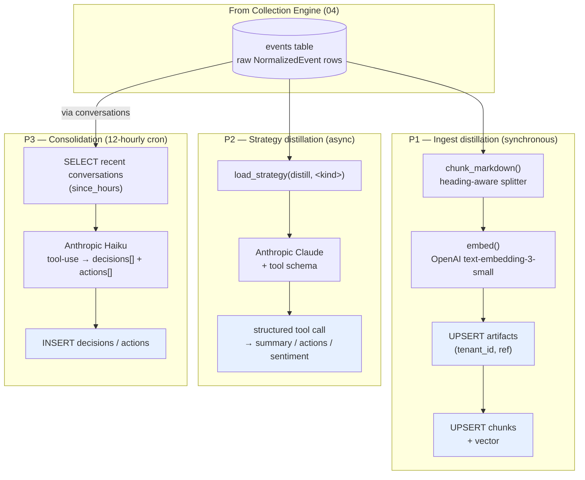

# 05 — Distillation Pipeline

> **One-line:** After the Collection Engine writes raw events, three pipelines turn them into queryable knowledge: (1) chunk + embed for RAG, (2) strategy-routed LLM extraction for structured facts, (3) 12-hourly consolidation for decisions/actions. Each step is idempotent and traceable.

## 1. Executive view

Distillation is what makes Sediment different from a generic CMS — raw events become *typed, structured, attributable* knowledge. We use Anthropic Claude for the heavy intelligence, OpenAI for embeddings, and Postgres+pgvector for storage.

Three sub-pipelines, three cadences:
- **Ingest distillation** (synchronous on event arrival): chunk + embed markdown → `chunks`. Always-on, cost-bounded.
- **Strategy distillation** (per-event-kind, async): use LLM tool-use to extract structured fields from raw text (transcript → summary; chat thread → decisions; voice memo → SOP). Cost-bounded by skip-low-confidence + per-tenant rate limits.
- **Consolidation** (12-hourly cron): walk recent conversations, extract decisions/actions to durable tables. Cheap Anthropic Haiku.

Cost discipline is structural: cheap model (Haiku) for high-volume work, expensive model (Sonnet/Opus) only at chat compose time when the user is waiting.

## 2. Pipeline overview



## 3. P1 — Ingest distillation (the RAG fuel)

### 3.1 Triggered by

- `vault_ingester /v1/ingest/document` — synchronous endpoint called by every connector orchestrator (Discord ingest, GitHub fetch, webhook, manual upload)
- `vault_ingester /v1/ingest/batch` — multi-document version, used by GHA webhook on push

### 3.2 Chunker (`lab_lib/chunker.py`)

```python
@dataclass
class Chunk:
    seq: int                # 0-indexed position in the doc
    content: str            # the text
    heading_path: str       # "/" joined headings, e.g. "A/B/C"

def chunk_markdown(
    text: str,
    max_tokens: int = 1500,
    overlap_tokens: int = 200,
) -> list[Chunk]:
    ...
```

**Properties:**
- **Heading-aware**: splits at `# / ## / ###` boundaries first; merges small sections to hit `max_tokens` floor
- **Heading-path preserved**: each chunk knows its breadcrumb (helps citation render the right context)
- **Overlap**: 200-token overlap between adjacent chunks to bridge boundary loss
- **Token counter**: simple word-count × 1.3 approximation (no tiktoken — saves 30MB dep)

Edge cases:
- No headings → single chunk (or split by paragraph if > max_tokens)
- Single section > max_tokens → hard split with overlap
- Empty body → returns `[]`, caller raises 400

### 3.3 Embedder (`lab_lib/embeddings.py`)

```python
def embed(texts: Sequence[str], batch_size: int = 64) -> list[list[float]]:
    # Batches → OpenAI text-embedding-3-small → 1536-d vectors
```

- **Model**: OpenAI `text-embedding-3-small` (1536-d, $0.02 / 1M tokens)
- **Batching**: up to 64 inputs per call
- **Fallback**: if `OPENAI_API_KEY` is missing, returns zero vectors — search falls back to BM25-only (with OR-joined ts_query)
- **Cost**: ~$0.005 per 200-file markdown vault ingest (Lab dogfood scale)

Provider abstraction is a v2 task (Q1 in 01).

### 3.4 Upsert pattern

```sql
INSERT INTO artifacts (tenant_id, ref, type, ...)
VALUES (...)
ON CONFLICT (tenant_id, ref) DO UPDATE SET
    type = EXCLUDED.type,
    body = EXCLUDED.body,
    updated_at = now()
RETURNING id;

DELETE FROM chunks WHERE artifact_id = :aid;

INSERT INTO chunks (tenant_id, artifact_id, seq, content, embedding)
VALUES (...);
```

**Atomicity:** the whole upsert runs in a single transaction. Re-running on the same content is a no-op semantically; re-running on changed content fully replaces chunks (no orphan rows). This idempotency is what makes the connector retry path safe (see `04 §6 guarantee 3`).

### 3.5 `artifacts.type` taxonomy

CHECK constraint allows: `column | research | novel | note | decision | meeting | message | event`.

| Source | Default `type` |
|---|---|
| Markdown in `meeting_notes/` or with "meeting" in stem | `meeting` |
| Markdown in `decisions/` or starting with `adr-` | `decision` |
| Markdown in `research/` | `research` |
| Other markdown (specs, concepts, runbooks, intel, ...) | `note` |
| Discord message distilled to artifact | `message` |
| Phase 4 extracted decision (rare — usually goes to `decisions` table not `artifacts`) | `decision` |

Heuristic in `scripts/github_repo_fetch._classify_doc_type`. If you ever add a new category to the CHECK constraint, the classifier must be updated synchronously.

## 4. P2 — Strategy distillation (the structured-extraction pipeline)

### 4.1 Strategy framework

Per-event-kind YAML in `services/sediment/prompts/distill/strategies/`:

```
prompts/distill/
├── base.yaml                       # workhorse template
└── strategies/
    ├── chat_thread.yaml            # Discord/Slack/Teams messages
    ├── meeting_transcript.yaml     # Gemini/Otter/Fireflies/own recordings
    ├── doc_edit.yaml               # Notion/Confluence/Drive page revisions
    ├── code_change.yaml            # GitHub/GitLab PR diffs
    ├── voice_dump.yaml             # (planned) single-speaker stream
    ├── paper_minutes.yaml          # (planned) OCR'd minutes
    └── sop_capture.yaml            # (planned) repeated-pattern → SOP
```

Each strategy YAML contains:
- `system_prompt` — base instruction (never overridable from tenant config)
- `user_template` — Jinja2 over event payload
- `tool_schema` — Anthropic tool-use JSON schema defining the extracted structure

Example (`chat_thread.yaml`):
```yaml
system_prompt: |
  You extract decisions, actions, and open questions from a chat thread.
  Output via the provided tool. Cite message IDs that support each finding.

user_template: |
  Channel: {{ channel }}
  Authors: {{ authors | join(', ') }}
  Messages:
  
  [{{ m.id }}] {{ m.author }} ({{ m.ts }}): {{ m.content }}
  

tool_schema:
  name: extract_thread
  input_schema:
    type: object
    properties:
      decisions: { type: array, items: { ... } }
      actions:   { type: array, items: { ... } }
      open_qs:   { type: array, items: { ... } }
    required: [decisions, actions, open_qs]
```

### 4.2 Loader contract (`lab_lib/prompts.py`)

```python
strat = load_strategy("distill", "chat_thread", tenant_id="<uuid>")
msgs  = render_messages(strat, channel="...", messages=[...])
resp  = await client.messages.create(
    model=settings.llm_model_default,
    system=strat.system_prompt,
    tools=[strat.tool_schema],
    tool_choice={"type": "tool", "name": strat.tool_schema["name"]},
    messages=msgs,
)
```

**Tenant override invariants:**
- `system_prompt` — base never replaceable; tenant addendum APPENDED via `tenants.feature_flags.prompt_override.<strategy>.system_addendum`
- `user_template` — base never replaceable
- `tool_schema` — base never replaceable

Tenants can adjust *style* (KO-only / EN-only / formal tone) but not *structure*. Structure changes require code (and a new schema version).

### 4.3 Cost-aware routing

Per-tenant rate limit at the loader: `tenants.feature_flags.distill_max_calls_per_hour`. Default 100. Over budget → log + skip (don't queue indefinitely).

Strategy precision is logged into `llm_calls.metadata.distill_strategy`. The validator can roll up precision per strategy per tenant for the cost-quality tradeoff dashboard (Q2 in 08).

## 5. P3 — Consolidation (the 12-hourly cron)

### 5.1 What it does

Walks recent conversations (default 13-hour look-back) and extracts:
- `decisions` — durable statements of "we decided X because Y", with conv_id provenance
- `actions` — assigned tasks ("@person to do Z by date"), with owner + due_date

Uses Anthropic Haiku (fast + cheap). 12-hour cadence ensures accumulating chat gets distilled without thrashing.

### 5.2 Schedule

```yaml
# config/cron.yaml
consolidate:
  schedule: "15 */12 * * *"   # 00:15 + 12:15 UTC = 09:15 + 21:15 KST
  tenant: "hypeproof-lab"     # v1 single-tenant; v2 walk all
  since_hours: 13             # overlaps cadence so missed run self-heals
  limit: 50                   # max conversations per run
```

### 5.3 Dedup

```python
# Skip if (tenant_id, topic, conv_id) already has a decision row
EXISTS (SELECT 1 FROM decisions
        WHERE tenant_id=:t AND topic=:topic AND conv_id=:cid)
```

Same conversation with new content still gets re-walked, but new decisions are detected by NOT-EXISTS on `(tenant, topic, conv_id)`. Topic comes from the LLM output, so it's robust to "we decided again" repetition.

### 5.4 Multi-tenant migration (v2)

Today the cron is hardcoded for `hypeproof-lab`. The v2 generalization:

```python
# scripts/scheduler.py
async def _run_consolidate_all():
    async with service_session() as s:
        tenants = await s.execute(text(
            "SELECT id::text, slug FROM tenants WHERE status='active' "
            "AND feature_flags->>'consolidate_enabled' = 'true'"
        ))
    for tid, slug in tenants:
        await consolidate_run(tenant=slug, since_hours=13, limit=50)
```

Trigger: when `kids-edu` accumulates enough chat to test. Currently `kids-edu` has zero conversations.

## 6. Configuration model

| Setting | Storage | Default | Scope |
|---|---|---|---|
| Embedding model | env `EMBEDDING_MODEL` | `text-embedding-3-small` | Global |
| Embedding dim | env `EMBEDDING_DIM` | 1536 | Global |
| Default LLM | env `LLM_MODEL_DEFAULT` | `claude-haiku-4-5-20251001` | Global |
| Heavy LLM | env `LLM_MODEL_HEAVY` | `claude-sonnet-4-6` | Global |
| Chunk max_tokens | function arg (default 1500) | 1500 | Global, per-call override |
| Chunk overlap | function arg (default 200) | 200 | Global, per-call override |
| Per-tenant distill rate limit | `tenants.feature_flags.distill_max_calls_per_hour` | 100 | Per-tenant |
| Per-tenant strategy override | `tenants.feature_flags.prompt_override.<strategy>` | none | Per-tenant |
| Consolidate schedule | `config/cron.yaml` | every 12h | Per-tenant once v2 |

## 7. Boundary principle (for this doc)

> **No distillation code reads from `tenants` or `members` tables to decide what to extract.**
>
> Allowed: tenant_id passed in as an argument; strategies loaded by name; per-tenant overrides applied via the strategy loader's contract
> Forbidden: `if tenant_slug == "kids-edu": use_strategy("...")`, hardcoded path heuristics per tenant

The strategy YAMLs are global. Tenant overrides are JSONB addenda. Adding a per-tenant pipeline = code violation.

## 8. Coverage matrix

| Capability | hypeproof-lab | kids-edu | acme-test |
|---|---|---|---|
| Ingest distillation (chunker+embedder) | ✅ | ✅ 192 artifacts / 1987 chunks | — |
| `chat_thread` strategy (Discord) | ✅ active | ❌ no Discord ingest | — |
| `meeting_transcript` strategy | ✅ (Gemini meeting notes channel) | ❌ | — |
| `doc_edit` strategy | ⏳ awaiting Notion connector | ⏳ | — |
| `code_change` strategy | ⏳ awaiting GitHub PR connector | ⏳ | — |
| Consolidation (decisions/actions extraction) | ✅ 12h | ⏳ wiring needed | — |
| Strategy precision tracking | ⏳ | ⏳ | — |
| Per-tenant prompt override | ⏳ schema ready, no UI | ⏳ | — |

## 9. Open questions

- **Q1** (in 04): when to add a `lab_lib/collection_agent.py` that owns `decide()` AND orchestrates the after-decide flow (insert event → optionally chunk → optionally notify). Right now the orchestration is duplicated in each `*_fetch.py` script. Consolidation = remove ~150 lines of duplication.
- **Q2**: strategy versioning — if we change `chat_thread.yaml`'s tool schema, do we re-distill historical events? *Current:* no, accept drift. *Open:* a `distill_runs` table tracking which event was distilled with which strategy version, enabling targeted re-runs.
- **Q3**: voice strategy chunker — voice transcripts have no headings. Use speaker turns? Time windows? Both? *Recommended:* speaker turns + 30s silence boundary.
- **Q4**: should the consolidator deduplicate decisions across overlap windows? *Current:* yes via `(tenant, topic, conv_id)`. *Risk:* same decision in two different convs → 2 rows. *Open:* topic-similarity dedup via embedding.

## 10. References

- `services/sediment/lab_lib/chunker.py` — `chunk_markdown`, `Chunk`
- `services/sediment/lab_lib/embeddings.py` — `embed`, `embed_one`
- `services/sediment/lab_lib/prompts.py` — `load_strategy`, `render_messages`, `Strategy`
- `services/sediment/applications/vault_ingester/main.py` — synchronous ingest path
- `services/sediment/scripts/consolidate_memory.py` — Phase 4 consolidator
- `services/sediment/prompts/distill/base.yaml` + `strategies/*.yaml` — strategy library
- `services/sediment/tests/test_chunker.py`, `test_distill.py`, `test_prompts.py` — coverage
- [04-collection-engine.md](./04-collection-engine.md) — upstream provider
- [06-retrieval-and-chat.md](./06-retrieval-and-chat.md) — downstream consumer
- [08-cost-and-observability.md](./08-cost-and-observability.md) — cost tracking

## Changelog
- 2026-05-22 — v0.1 — extracted from `collection-and-distillation.md` v0.3 and lived implementation.
