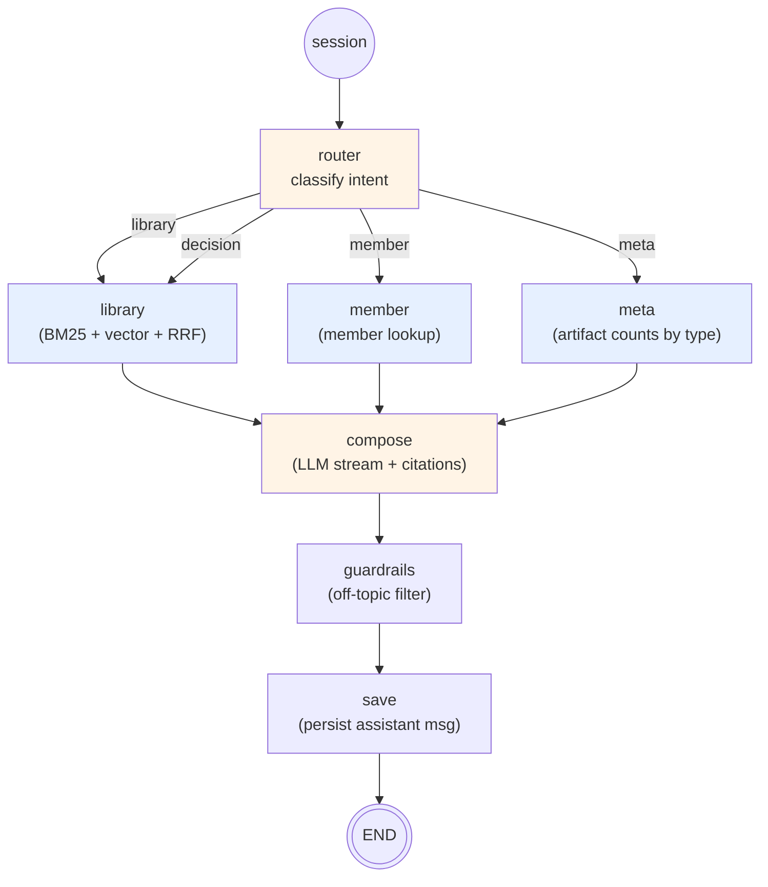

# 06 — Retrieval & Chat

> **One-line:** A LangGraph state machine routes each query (intent classifier → library/member/meta) to the right retrieval node, fuses BM25 + pgvector results via RRF, and streams a cited answer via SSE. Every answer carries inline `[N]` references; absence = regression.

## 1. Executive view

The chat path is the value-bearing moment for users — what they remember Sediment for. Three competing requirements:
1. **Cited every time.** The system prompt requires inline `[N]` refs; missing citations fails our differentiation test.
2. **Fast first token.** SSE streams deltas; target TTFB < 2s.
3. **Cheap per turn.** Heavy model (Sonnet) only for the compose step; everything else uses Haiku or pure Postgres.

The retrieval mix is deliberately simple — BM25 + pgvector cosine + Reciprocal Rank Fusion. No re-ranker model in v1 (too expensive per query). Quality is measured by recall@3 against a golden set; current baseline 27/40 (hypeproof-lab) and 5/10 (kids-edu).

## 2. The chat graph



**State (`SedimentState`)**: `tenant_id`, `member_id`, `conv_id`, `query`, `intent`, `citations`, `answer_chunks`, `task_tag`. Threaded through every node by LangGraph's MemorySaver checkpointer.

## 3. Intent routing

The `router` node makes a single LLM call to classify the query into one of four intents:

| Intent | When | Downstream node | Retrieval source |
|---|---|---|---|
| `library` | "What did we decide about X?" / "Find the chunk that says Y" / general Q&A | `library` | artifacts + chunks (BM25 + vector) |
| `member` | "Who works on X?" / "What's Ryan good at?" | `member` | members table |
| `decision` | "What decisions did we make this week?" | `library` (today; future: dedicated `decisions` table query) | artifacts + decisions |
| `meta` | "How many columns? How many research notes?" | `meta` | aggregate over artifacts |

Routing uses Anthropic Haiku via `lab_lib.llm.stream_chat(tier="default")` with a constrained tool schema. Output validated; falls back to `library` on any error (the safe default).

## 4. Library retrieval (the RAG core)

The `library` node implements hybrid search.

### 4.1 The three-arm fusion

```sql
-- Arm 1: BM25 (Postgres tsvector) — keyword/term match
SELECT c.id, c.artifact_id, c.content, a.ref, a.type,
       row_number() OVER (ORDER BY ts_rank(c.tsv, plainto_tsquery('simple', :q)) DESC) AS rank
FROM chunks c JOIN artifacts a ON a.id = c.artifact_id
WHERE c.tsv @@ plainto_tsquery('simple', :q)
ORDER BY ts_rank(c.tsv, plainto_tsquery('simple', :q)) DESC
LIMIT 30
```

```sql
-- Arm 2: pgvector (cosine on HNSW) — semantic similarity
SELECT c.id, c.artifact_id, c.content, a.ref, a.type,
       row_number() OVER (ORDER BY c.embedding <=> CAST(:qvec AS vector)) AS rank
FROM chunks c JOIN artifacts a ON a.id = c.artifact_id
ORDER BY c.embedding <=> CAST(:qvec AS vector)
LIMIT 30
```

```python
# Arm 3: Reciprocal Rank Fusion (RRF) merge
def rrf(rank: int, k: int = 60) -> float:
    return 1.0 / (k + rank)

scores = defaultdict(float)
for chunk_id, rank in bm25_results:
    scores[chunk_id] += rrf(rank)
for chunk_id, rank in vector_results:
    scores[chunk_id] += rrf(rank)
top = sorted(scores.items(), key=lambda x: -x[1])[:K]
```

**Constants:**
- BM25 limit: 30 chunks
- Vector limit: 30 chunks
- RRF k: 60 (industry-standard)
- Final K returned to compose: 6 (covers the LLM context budget without dilution)

### 4.2 The fallback paths

| Condition | Fallback |
|---|---|
| `OPENAI_API_KEY` missing → embed returns zero vector | BM25-only, OR-joined ts_query (treats query as multi-term) |
| BM25 returns 0 results | Vector-only, top-6 by cosine |
| Both return 0 results | Empty citations → compose says "no citations found" |

The zero-vector case is detected by `embed_one` returning all-zeros; the search code branches early. This kept the system functional during the OpenAI-key rotation incident.

### 4.3 Pre-retrieval query augmentation

```python
def _augment_query_for_retrieval(query: str, history: list[dict]) -> str:
    # If the new turn is short (< 20 chars) or anaphoric ("그것", "이거"),
    # prepend the last user turn so BM25 has more signal.
    # LLM still sees the literal new query — only retrieval is augmented.
```

This matters for multi-turn conversations where the user says "더 자세히" — bare BM25 returns nothing useful; the augmented "더 자세히 + previous turn keywords" returns relevant chunks.

## 5. Compose (the streaming LLM call)

The `compose` node makes the heavy LLM call (Sonnet via `stream_chat(tier="heavy")`) with:

```python
system = (
    "You are Sediment, a knowledge assistant for HypeProof Lab. "
    "Answer concisely in the user's language (Korean or English, matching the question). "
    "Use [N] inline references that map to the provided citations. "
    "When a citation is a 'vault summary' with artifact counts, USE those counts in your answer. "
    "When a citation describes a 'Member', summarize their title and expertise. "
    "If the citations don't actually answer the question, say so plainly. "
    "Don't fabricate. Don't pad. Keep it ≤ 4 short paragraphs."
)
```

Citation block formatting:
- `library` citation: `[N] <ref> (<type>)\n<content excerpt up to 600 chars>`
- `member` citation: `[N] Member: <name>\n  - title: <title>\n  - expertise: <expertise>`
- `summary` citation: `[N] (vault summary)\nArtifact counts by type:\n  - column: 42\n  ...`

The LLM is instructed (and prompt-tested) to cite via `[N]`. Absence of `[N]` in output → caught by the post-compose validator + the chat-smoke E2E.

## 5a. Freshness intent (added 2026-05-22 per sediment#16 #4)

A v1 design gap, surfaced when a user asked "가장 최신 볼트가 언제꺼야?" and the LLM hallucinated "5/19" while 5/21 was the actual newest in DB. Root cause: queries about *recency* of the dataset got routed to RAG (`library` node), which scores by RRF relevance, not date. The LLM then "picked" a date from the citation list.

**Fix**: a deterministic `freshness` intent that bypasses RAG entirely.

```
Router heuristic adds:
  if query contains any of {최신, 가장 최근, latest, newest, this week,
                              어제, 오늘, yesterday, today, 언제꺼} → freshness

freshness node:
  SELECT ref, type, date::text, updated_at::text
  FROM artifacts
  WHERE tenant_id = current_tenant_id()      -- RLS
    AND tenant_id = CAST(:tid AS uuid)        -- defense-in-depth
    [AND type = <inferred type>]              -- pull "research"/"decision" etc from query
  ORDER BY COALESCE(date, updated_at::date) DESC, updated_at DESC
  LIMIT 5;

compose:
  - LLM sees citations ALREADY in date order
  - System prompt tells it: "citations are already sorted; cite [1] as latest, don't re-rank"
```

**Why this is the right shape**: the question isn't about content, it's about the *dataset's metadata*. SQL `ORDER BY` is the only correct answer; LLM can only re-render. Cost: zero LLM tokens for the rank (only the wrapper paragraph), and the answer is deterministic.

## 5b. Accuracy framework (added 2026-05-22 per sediment#16 #4)

Another v1 design gap. We had **recall@3** (retrieval correctness) and **E2E** (functional correctness) but no metric for **answer correctness** — does the LLM's composed reply actually match the cited content? The freshness bug was invisible to existing checks because retrieval returned *some* citations and the chat *streamed* an answer — both checks PASS, both were wrong.

New three-axis nightly check (`validator/scripts/accuracy_check.py`):

| Axis | What it measures | How (cheap) |
|---|---|---|
| **freshness_accuracy** | Returned "latest X" matches actual newest in DB | Ask `latest <type>` for each artifact type; assert first citation has the max date by ORDER BY (verifiable from ref filename + DB) |
| **citation_precision** | LLM doesn't fabricate `[N]` references | Parse `[N]` from answer, assert every N ≤ len(citations). No N may exceed the returned set. |
| **cross_tenant_isolation** | Citations stay within the asking tenant | For each tenant, ask a generic query, assert no citation `ref` matches OTHER tenants' path fingerprints |

What's deliberately NOT here (yet):
- **Factual correctness** (does the answer match the cited *content*?) — needs LLM-as-judge or human eval. Expensive; defer until recall@3 is consistently > 80% and freshness_accuracy is stable.
- **Drift trend** — needs N>30 nightly runs to fit a trend. Wire when accuracy_check.py has been running a week.

Wiring: TBD nightly via `.github/workflows/nightly-recall.yml` after the script has produced its first stable baseline.

## 6. SSE stream contract

The endpoint `POST /v1/sediment/stream` returns `text/event-stream` with this frame structure:

```
event: message
data: {"v": "thinking", "metadata": {"tag": "status", "step": "router", "intent": "library"}}

event: citation
data: {"v": {"ref": "...", "type": "note", "content": "...", "score": 0.41}}

event: delta
data: {"v": "<token>", "metadata": {"tag": "answer_word"}}

event: message
data: {"v": "", "metadata": {"tag": "answer_end"}}

data: [DONE]
```

**Discipline:**
- All structured payloads use `{"v": <value>, "metadata": <optional>}` wrapper. Never bare strings.
- `[DONE]` is the terminator; client closes after seeing it.
- **Persist BEFORE [DONE]**: the assistant message row is written before the terminator yields, because client-closing the connection cancels the server-side generator (lesson learned the hard way).

Frontend parser: `frontend/app/sediment/lib/sse.ts`. Smoke test parser: `validator/scripts/chat_smoke_kids_edu.py`. Both rely on the same wrapper convention.

## 7. Member intent (the meta-lookup path)

```python
async def node_member_lookup(state: SedimentState) -> dict:
    # Pull all active members for this tenant, hand to LLM with the question
    # → LLM matches "AI engineer with embedded background" → Ryan
    # Citations contain {"type": "member", "display_name": "Ryan", "title": "...", "expertise": [...]}
```

Tested in `test_intent.py::test_decision_routing` (the test that's pre-existing flaky — unrelated to this design doc).

## 8. Meta intent (the count path)

For "how many columns?" / "how much research from last month?":

```sql
SELECT type, COUNT(*) FROM artifacts 
WHERE tenant_id = current_tenant_id()
GROUP BY type
```

The compose step then narrates these counts. No LLM call needed for the data itself — only for the natural-language wrapper.

## 9. MCP server (the Claude Code path)

`services/sediment/applications/sediment_mcp/server.py` exposes the same retrieval as MCP tools for Claude Code clients:

| Tool | Equivalent endpoint | Purpose |
|---|---|---|
| `vault.search` | `library` node retrieval | Hybrid search over chunks |
| `library.list` | `/api/v1/library?type=...` | List artifacts by type/filter |
| `decisions.recent` | (planned) `/api/v1/decisions?since=...` | Walk recent decisions |
| `members.list` | `/api/v1/members` | Roster |

Why MCP? Lets Claude Code workflows (planning sessions, retros, "what did we decide about X last quarter?") use Sediment's memory inline without context-switching to the web UI.

## 10. Configuration model

| Setting | Storage | Default |
|---|---|---|
| BM25 limit | code constant | 30 |
| Vector limit | code constant | 30 |
| RRF k | code constant | 60 |
| Final K | code constant | 6 |
| Default model (router/distill) | env `LLM_MODEL_DEFAULT` | `claude-haiku-4-5-20251001` |
| Heavy model (compose) | env `LLM_MODEL_HEAVY` | `claude-sonnet-4-6` |
| Provider preference | env `LLM_PROVIDER` | auto (Anthropic if API key set, else Gemini, else offline mock) |
| Per-tenant system prompt addendum | `tenants.feature_flags.prompt_override.compose.system_addendum` | none |
| Per-tenant heavy-model override | `tenants.feature_flags.llm_model_heavy` | none (use global) |

## 11. Boundary principle (for this doc)

> **The chat path produces zero side effects outside `messages`, `events`, and `llm_calls`.**
>
> Allowed: read from artifacts/chunks/members/decisions, write to messages/events/llm_calls
> Forbidden: trigger ingest, mutate integrations, send notifications, run cron jobs

Notifications live in the OUTBOUND path (07); chat is INBOUND only.

## 12. Coverage matrix

| Capability | hypeproof-lab | kids-edu | acme-test |
|---|---|---|---|
| Library hybrid retrieval | ✅ recall@3 27/40 | ✅ recall@3 5/10 | — |
| Member intent | ✅ | ✅ (2 members) | — |
| Decision intent | ✅ (routes to library) | ✅ | — |
| Meta intent | ✅ | ✅ | — |
| Multi-turn (anaphora) | ✅ E2E-09 | ⏳ | — |
| Citation rendering | ✅ inline [N] | ✅ 6 cits, 4 to ai-native-assets | — |
| Korean answer | ✅ | ✅ | — |
| English answer | ✅ | ✅ (golden set has EN) | — |
| MCP server tools | ✅ (used by Claude Code) | ✅ (same tools, scope by tenant) | — |
| Per-tenant prompt override | ⏳ schema ready, no UI | ⏳ | — |

## 13. Open questions

- **Q1**: Re-ranker model — would Cohere Rerank improve recall@3 meaningfully? *Cost:* $1 / 1K queries ≈ $5/mo at current volume. *Effort:* 1 day to wire. *Trigger:* when recall@3 on D+A archetype golden drops below 60% in production.
- **Q2**: Korean tokenizer — Postgres `'simple'` config doesn't handle Korean morphology. *Options:* (a) use `'korean'` if available, (b) preprocess with MeCab/Komoran, (c) lean harder on vector. *Current:* (c) — vector arm carries most of the load for KO queries.
- **Q3**: `decision` intent today routes to `library`. *Plan:* dedicated retrieval over `decisions` table (Phase 4 consolidator's output) — semantic search over decision summaries directly. *Trigger:* when decisions table > 100 rows for a tenant.
- **Q4**: Streaming chunk citations — currently all citations yielded before any delta. *Alternative:* interleave citations with the deltas as they're consumed. *Trade-off:* better UX but harder to implement (LLM tool-use callback timing).

## 14. References

- `services/sediment/applications/sediment_langgraph/main.py` — SSE endpoint, history, augmentation
- `services/sediment/applications/sediment_langgraph/graphs/sediment_graph.py` — graph nodes (router, library, member, meta, compose, guardrails, save)
- `services/sediment/lab_lib/llm.py` — provider resolution + `stream_chat`
- `services/sediment/lab_lib/embeddings.py` — query embedding
- `infra/init.sql` lines 113–141 — `chunks` table + HNSW index
- `frontend/app/sediment/lib/sse.ts` — client-side parser
- `validator/scripts/chat_smoke_kids_edu.py` — end-to-end smoke (no Playwright)
- `validator/golden_queries*.yaml` — recall@3 datasets
- `services/sediment/tests/test_search_bm25.py`, `test_intent.py` — coverage

## Changelog
- 2026-05-22 — v0.1 — codified the 3-arm RRF retrieval, the SSE wrapper convention, the chat-only-side-effects boundary.
