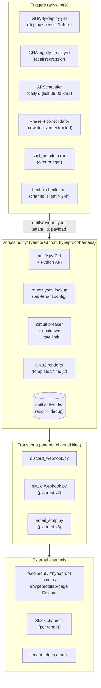

# 07 — Notifications

> **One-line:** A shared `scripts/notify/` module (vendored from `hypeproof-harness` into every product repo) renders Jinja2 templates and dispatches via Discord/Slack/email transports. Per-tenant `routes.yaml` maps event types to channels. The boundary principle plus the source-kind classification (04) ensures Sediment, Studio, and lab-page each get notifications without code-level coupling.

## 1. Executive view

Notifications close Sediment's loop. The Collection Engine pulls signal in; the chat path serves it on demand; notifications are the *push* that turns passive memory into active team awareness. Without push, the memory layer is 50% of its value — users only see content when they remember to ask.

Four design constraints:
1. **Cited content, not raw alerts.** A deploy notification with the changed commits + their decision context is differentiated. A bare "build green" is noise.
2. **Per-tenant routing.** Same `event_type` may go to different channels per tenant; Sediment must not know channel names by tenant.
3. **Cross-product reusability.** Studio + lab-page + Sediment all emit notifications. The transport + template + circuit breaker is shared via `hypeproof-harness`.
4. **No alert storms.** Per-channel circuit breaker; per-event cooldown; per-tenant rate limit.

## 2. The pipeline



## 3. Where the code lives (cross-repo)

`hypeproof-harness` is the canonical source; consumers (Sediment, Studio, hypeprooflab) vendor it via `sync.sh`:

```
hypeproof-harness/                          ← canonical
├── scripts/notify/
│   ├── notify.py                            single-file CLI + Python API
│   ├── transports/
│   │   ├── discord_webhook.py
│   │   ├── slack_webhook.py                (placeholder)
│   │   └── email_smtp.py                   (placeholder)
│   ├── templates/                           Jinja2 base templates
│   │   ├── deploy_success.md.j2
│   │   ├── deploy_failure.md.j2
│   │   ├── recall_regression.md.j2
│   │   ├── daily_digest.md.j2
│   │   ├── cost_over_budget.md.j2
│   │   ├── new_decision.md.j2
│   │   └── release_published.md.j2
│   ├── circuit_breaker.py
│   ├── routes_schema.py                     pydantic validation
│   └── README.md
├── skills/hp-notify/                        Claude Code skill wrapper
│   └── SKILL.md
└── scripts/sync.sh                          (existing) vendors scripts/notify/ → consumers

# After sync:
sediment/scripts/notify/                     ← vendored (rsync target)
sediment/config/notify_routes.yaml           ← per-product config (NOT vendored)
sediment/.github/workflows/fly-deploy.yml    ← calls notify.py
sediment/services/sediment/scripts/scheduler.py  ← calls notify.py for cron events

hypeproof-studio/scripts/notify/             ← vendored
hypeproof-studio/config/notify_routes.yaml   ← per-product
hypeproof-studio/.github/workflows/*.yml     ← calls notify.py

hypeprooflab/scripts/notify/                 ← vendored
hypeprooflab/config/notify_routes.yaml       ← per-product
hypeprooflab/.github/workflows/*.yml         ← calls notify.py
```

**Vendoring rationale:**
- The notify module is small (~500 LOC + templates)
- Dependencies are minimal (`httpx`, `jinja2`)
- Existing harness pattern (`skills/skill-creator/`, `skills/onboard-member/`) uses rsync; consistency wins
- `sync.sh --check` runs in each consumer's CI to detect drift

Alternative considered: pip-install from `hypeproof-harness` as a Python package. Rejected because it adds a publish step + version dance per release without buying meaningful isolation. Re-visit if the module grows to > 2000 LOC or gets sub-modules.

## 4. CLI contract

```bash
# Send one event
python scripts/notify/notify.py send <event_type> \
  --tenant <slug> \
  --data key1=value1 --data key2=value2 \
  --routes config/notify_routes.yaml

# Render-only (no send) for template development
python scripts/notify/notify.py render <event_type> \
  --data ... --template-dir scripts/notify/templates/

# Validate routes.yaml
python scripts/notify/notify.py validate-routes config/notify_routes.yaml
```

Python API (used by APScheduler cron jobs that don't want subprocess):

```python
from scripts.notify import notify  # vendored module
await notify(
    event_type="recall.regression",
    tenant_slug="hypeproof-lab",
    payload={"prev": 27, "current": 19, "delta_pct": -29.6},
    routes_path="config/notify_routes.yaml",
)
```

## 5. routes.yaml schema (per product)

```yaml
# sediment/config/notify_routes.yaml
version: 1

# Channel slugs → webhook URL env var names. Webhook URLs themselves
# stay in fly secrets / GH org secrets — never in this file.
channels:
  sediment:           { transport: discord_webhook, secret_env: DISCORD_WEBHOOK_SEDIMENT }
  hypeproof-studio:   { transport: discord_webhook, secret_env: DISCORD_WEBHOOK_STUDIO }
  hypeprooflab-page:  { transport: discord_webhook, secret_env: DISCORD_WEBHOOK_LAB_PAGE }
  meeting-notes:      { transport: discord_webhook, secret_env: DISCORD_WEBHOOK_MEETING_NOTES }
  manager-notices:    { transport: discord_webhook, secret_env: DISCORD_WEBHOOK_MANAGER }
  primary_email:      { transport: email_smtp,      to: jay@hypeproof.io }   # v3

# Per-tenant routing of (event_type → channels[]). Tenant slug "*" = global default.
routes:
  "*":  # applies to every tenant unless overridden
    deploy.success:        { channels: [sediment], template: deploy_success, cooldown_min: 0 }
    deploy.failure:        { channels: [sediment], template: deploy_failure, severity: critical }
    recall.regression:     { channels: [sediment], template: recall_regression, severity: major }
    cost.over_budget:      { channels: [sediment], template: cost_over_budget, severity: minor }
    daily.digest:          { channels: [sediment], template: daily_digest, schedule: "0 0 * * *" }
    new_decision:          { channels: [sediment], template: new_decision, cooldown_min: 5 }
  
  hypeproof-lab:  # overrides for the dogfood tenant
    new_decision:
      channels: [sediment, meeting-notes]
      template: new_decision

  kids-edu:  # overrides for kids-edu tenant
    daily.digest:
      channels: [sediment]   # later: their own #kids-edu channel
      template: daily_digest

# Global defaults
defaults:
  cooldown_min: 30
  circuit_breaker:
    consecutive_failures_to_open: 5
    open_duration_min: 60
  rate_limit:
    per_tenant_per_hour: 200
    per_channel_per_minute: 30
```

## 6. Template structure

Jinja2 over markdown. Templates are *content*, not just formatting — they decide what's interesting to the human reader.

```jinja
{# scripts/notify/templates/recall_regression.md.j2 #}
🚨 **Recall regression detected**

Tenant: **{{ tenant_slug }}**
Previous: {{ prev }}/{{ total }} PASS
Current:  {{ current }}/{{ total }} PASS ({{ delta_pct | round(1) }}%)


Regressed queries:

- `{{ q.id }}` — {{ q.text | truncate(60) }}



[Open dashboard]({{ dashboard_url }}) · [Run details]({{ run_url }})
```

```jinja
{# scripts/notify/templates/new_decision.md.j2 #}
🎯 **New decision recorded**

> {{ summary }}

Source: {{ source_label }} · Decided by: {{ deciders | join(', ') }}

**Why:** {{ rationale }}


[{{ ref }}]({{ vault_url }}/{{ ref }})
```

```jinja
{# scripts/notify/templates/daily_digest.md.j2 #}
☀️ **Daily digest — {{ date }}**

**Yesterday in {{ tenant_name }}:**
- 💬 {{ chat_count }} chat queries ({{ unique_askers }} people)
- 📝 {{ new_decisions }} new decisions extracted ({{ new_actions }} actions)
- 📥 {{ ingested_artifacts }} new artifacts ingested
- 💰 ${{ cost_usd | round(2) }} LLM spend ({{ '%.0f' % (cost_usd / budget * 100) }}% of daily budget)

**Top sources:**

- `{{ s.ref }}` ({{ s.cite_count }} cites)



**Decisions:**

> {{ d.summary }} — [{{ d.ref }}]({{ vault_url }}/{{ d.ref }})


```

Per-tenant template overrides (v3): live in `notification_templates(tenant_id, event_type, template_text)` DB table. Until then, all tenants share the base templates.

## 7. The 7 v1 event types

| Event type | Triggered by | Frequency (worst case) | Default template | Default channel | Severity |
|---|---|---|---|---|---|
| `deploy.success` | GHA `fly-deploy.yml` success | 5/day | `deploy_success` | `sediment` | info |
| `deploy.failure` | GHA `fly-deploy.yml` any failure | 1/week | `deploy_failure` | `sediment` | critical |
| `recall.regression` | GHA `nightly-recall.yml` drops below threshold | 1/week | `recall_regression` | `sediment` | major |
| `cost.over_budget` | `cost_monitor` cron exceeds daily budget | 1/week | `cost_over_budget` | `sediment` | minor |
| `daily.digest` | APScheduler 09:00 KST | 1/day per tenant | `daily_digest` | `sediment` | info |
| `new_decision` | Phase 4 consolidator inserts a decision | 0-3/day | `new_decision` | `sediment` | info |
| `release.published` | hypeproof-studio-releases tag push (planned) | 0-1/week | `release_published` | `hypeproof-studio` | info |

Phase 2 additions: `member.silent_24h`, `ingest.stalled`, `quota.threshold_warning`, `tenant.signup_complete`.

## 8. Circuit breaker & cooldown

```python
class CircuitBreaker:
    """Per-channel: opens after N consecutive failures, stays open M minutes."""
    
    state: dict[str, ChannelState]  # channel_slug → state
    
    def is_open(self, channel) -> bool: ...
    def record_success(self, channel) -> None: ...
    def record_failure(self, channel) -> None: ...
```

Stored in Redis (per-channel state survives restart) or in-memory + persisted to `notification_log` (v1 simpler path).

**Cooldown** is per-`(tenant, event_type)`: don't re-fire the same event for the same tenant within `cooldown_min`. Suppresses alert storms when (e.g.) recall flaps. Override-able per event type in routes.yaml.

## 9. notification_log (audit + dedup)

```sql
CREATE TABLE notification_log (
  id           UUID PRIMARY KEY DEFAULT uuid_generate_v4(),
  tenant_id    UUID REFERENCES tenants(id) ON DELETE CASCADE,
  event_type   TEXT NOT NULL,
  channel_slug TEXT NOT NULL,
  template     TEXT NOT NULL,
  payload      JSONB,
  rendered     TEXT,             -- the actual sent message (for audit)
  status       TEXT NOT NULL CHECK (status IN ('sent', 'failed', 'suppressed_cooldown', 'suppressed_circuit')),
  http_status  INT,
  error_detail TEXT,
  sent_at      TIMESTAMPTZ NOT NULL DEFAULT now()
);
CREATE INDEX notification_log_tenant_ts_idx ON notification_log (tenant_id, sent_at DESC);
```

RLS enforced (tenant admin sees own log only). Service role used by the notify path to insert.

Functions:
- **Audit**: tenant admin can answer "did we send X to channel Y at time T?"
- **Dedup gate**: before sending, check if `(tenant, event_type, channel)` was sent within cooldown — DB-backed, survives process restart
- **Replay**: for debugging, can re-render any historical event with new template version

## 10. Configuration model

| Setting | Storage | Default | Scope |
|---|---|---|---|
| Webhook URLs | fly secrets + GH org secrets (per channel) | (set per channel) | Global per product |
| `routes.yaml` location | env `NOTIFY_ROUTES` or default `config/notify_routes.yaml` | default | Per product |
| Template directory | env `NOTIFY_TEMPLATES` or vendored `scripts/notify/templates/` | vendored | Per product |
| Default cooldown | routes.yaml `defaults.cooldown_min` | 30 | Per route override |
| Default circuit threshold | routes.yaml `defaults.circuit_breaker.consecutive_failures_to_open` | 5 | Per channel override |
| Per-tenant routing | routes.yaml `routes.<slug>.<event>` | uses `routes."*"` if absent | Per tenant |
| Per-tenant template override (v3) | `notification_templates` table | base template | Per tenant |
| Quiet hours (v3) | `tenants.feature_flags.notify_quiet_hours` JSONB | none | Per tenant |

## 11. Boundary principle (for this doc)

> **No template references tenant names. No transport hardcodes a webhook URL.**
>
> Allowed: templates pull data from `payload` JSON; transports look up URLs by `secret_env` key from `routes.yaml`
> Forbidden: `if tenant_slug == "hypeproof-lab":` in templates, hardcoded webhook URL strings in transport code

The single test: *"Can a new tenant get fully customized notifications by only editing routes.yaml + adding webhook secrets, with zero code changes?"* If yes, boundary intact.

## 12. Coverage matrix

| Capability | hypeproof-lab | kids-edu | Studio | lab-page |
|---|---|---|---|---|
| Webhook URL generated (bot API) | ⏳ pending | ⏳ pending | ⏳ pending | ⏳ pending |
| Webhook secret in fly/GH secrets | ⏳ | ⏳ | ⏳ | ⏳ |
| `scripts/notify/` vendored from harness | ⏳ harness module not yet built | ⏳ | ⏳ | ⏳ |
| `routes.yaml` written | ⏳ | ⏳ | ⏳ | ⏳ |
| `deploy.success/.failure` wired | ⏳ | n/a | ⏳ | ⏳ |
| `recall.regression` wired | ⏳ | ⏳ | n/a | n/a |
| `daily.digest` wired | ⏳ | ⏳ | n/a | n/a |
| `new_decision` wired | ⏳ | ⏳ | n/a | n/a |
| `cost.over_budget` wired | ⏳ | ⏳ | n/a | n/a |
| `release.published` wired | n/a | n/a | ⏳ | n/a |
| Admin UI for editing routes (v2) | ❌ | ❌ | ❌ | ❌ |

## 13. Open questions

- **Q1**: Should `daily.digest` use LLM (Anthropic) to compose the prose, or pure template? *Recommended:* template + LLM-generated "what's interesting" paragraph (Haiku, ~$0.001/tenant/day). Pure template is too dry; full LLM is too costly to scale.
- **Q2**: Quiet hours — opt-in per-tenant or per-channel? *Recommended:* per-channel (more granular). Default off.
- **Q3**: Per-member personal digest — when? *Recommended:* v3, when first user requests it. Not a v1 differentiation.
- **Q4**: Failure handling for transient transport errors — exponential backoff vs immediate circuit break? *Recommended:* exp backoff (3 retries 5/15/45s) before counting as a failure for circuit purposes.
- **Q5**: Do we mirror sent notifications to `events` table? *Pro:* visible in chat search ("did we ever announce X?"). *Con:* doubled storage, noisy events. *Recommended:* yes, `kind="notification_sent"`, payload trimmed to event_type + channel + ref.

## 14. References

- `hypeproof-harness/scripts/notify/` (planned) — canonical code
- `hypeproof-harness/scripts/sync.sh` — vendoring mechanism
- (planned) `services/sediment/scripts/notify/` — vendored copy
- (planned) `services/sediment/config/notify_routes.yaml` — per-product config
- `infra/init.sql` (planned migration) — `notification_log` table
- [04-collection-engine.md §5](./04-collection-engine.md) — `decide(event)` may emit notify
- [06-retrieval-and-chat.md §11](./06-retrieval-and-chat.md) — chat does NOT trigger notifications
- [08-cost-and-observability.md](./08-cost-and-observability.md) — `cost.over_budget` source

## Changelog
- 2026-05-22 — v0.1 — supersedes `notifications-and-broadcast.md` v0.1; cross-repo vendoring model from `hypeproof-harness`; 7 v1 event types pinned.
