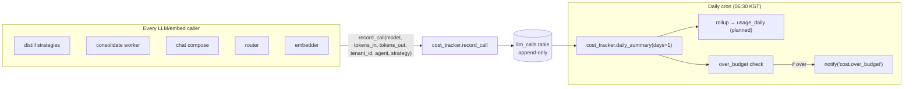

# 08 — Cost & Observability

> **One-line:** Every LLM/embedding call is metered into `llm_calls`; per-tenant rollups land in `usage_daily`; a daily cron compares spend to budget and fires `cost.over_budget` notifications. Structured JSON logs carry `tenant_id` + `request_id` on every line for downstream aggregation.

## 1. Executive view

Cost discipline is what makes Y1 SaaS economics work. Target: per-tenant LLM cost ≤ $5/mo for the D+A archetype. Achievable only if:
1. Cheap model (Haiku) does ingest/distill/router; heavy model (Sonnet) only at chat-compose
2. Every call is metered — no "we'll add tracking later"
3. Budget is enforced — over-budget triggers an alert (07), not a silent cost overrun

Observability serves two audiences:
- **Ops**: "is anything broken right now?" → structured logs aggregated by tenant + service + level
- **Product**: "what's working?" → per-strategy precision, per-query recall, per-source ingest velocity

Both share the same JSON log shape — there's no separate metrics pipeline in v1 (logs-as-metrics is enough until > 10 tenants).

## 2. Cost tracking pipeline



## 3. The `llm_calls` table

```sql
CREATE TABLE IF NOT EXISTS llm_calls (
  id              UUID PRIMARY KEY DEFAULT uuid_generate_v4(),
  tenant_id       UUID,                       -- nullable for system-wide / pre-tenant calls
  ts              TIMESTAMPTZ NOT NULL DEFAULT now(),
  model           TEXT NOT NULL,              -- "claude-haiku-4-5-..." | "claude-sonnet-4-6" | "text-embedding-3-small"
  agent           TEXT,                       -- "distill" | "consolidate" | "chat_compose" | "router" | "embed"
  strategy        TEXT,                       -- e.g. "chat_thread" | "meeting_transcript" | null
  prompt_version  TEXT,                       -- e.g. "v0.1" pulled from strategy metadata
  tokens_in       INT NOT NULL,
  tokens_out      INT NOT NULL,
  cost_usd        NUMERIC(10, 6),             -- computed at insert if model is priced; else null (unpriced_calls)
  latency_ms      INT,
  metadata        JSONB                       -- per-call extras (request_id, conv_id, recall_score, etc.)
);
CREATE INDEX idx_llm_calls_ts ON llm_calls (ts DESC);
CREATE INDEX idx_llm_calls_tenant_ts ON llm_calls (tenant_id, ts DESC);
```

**Why not RLS?** Cost data is intentionally cross-tenant readable by `service_session()` for billing rollups. Application code never reads `llm_calls` directly (no chat path needs it), so no cross-tenant leak vector through user paths.

**Pricing table** (in code, `_PRICING_USD_PER_M_TOKENS`):

| Model | Input $/Mtok | Output $/Mtok |
|---|---|---|
| `claude-haiku-4-5-20251001` | 1.00 | 5.00 |
| `claude-sonnet-4-6` | 3.00 | 15.00 |
| `claude-opus-4-7` | 15.00 | 75.00 |
| `gemini-2.5-flash` | 0.075 | 0.30 |
| `gemini-2.5-pro` | 1.25 | 5.00 |
| `text-embedding-3-small` | 0.02 | — |

Unknown models → `cost_usd = null` and counted in `unpriced_calls`. The daily summary flags this — adding a new model requires adding a price (single source).

## 4. `record_call` contract

```python
async def record_call(
    *,
    model: str,
    agent: str,                 # required — segments cost dashboards
    strategy: str | None = None,
    prompt_version: str | None = None,
    tokens_in: int,
    tokens_out: int,
    tenant_id: str | None = None,
    latency_ms: int | None = None,
    metadata: dict | None = None,
) -> None:
    """Insert one row. Never raises — cost tracking failure must not break
    the calling pipeline. Logs at WARN if insert fails."""
```

Discipline:
- **Every call site uses this.** Forgetting it = silent revenue leak.
- **Never raise** — if the cost table is down, the chat shouldn't 500.
- **Don't track inside loops** — batch and report once per logical operation.

## 5. Daily summary

`scripts/scheduler.py` registers `_run_cost_monitor` at `30 21 * * *` UTC (06:30 KST):

```python
from lab_lib.cost_tracker import daily_summary

summary = await daily_summary(days=1)
# {
#   "total_calls": 423,
#   "total_tokens_in": 1_234_567,
#   "total_tokens_out": 89_012,
#   "total_cost_usd": 1.23,
#   "unpriced_calls": 5,
#   "by_agent":  {"chat_compose": 0.85, "distill": 0.30, "consolidate": 0.08},
#   "by_model":  {"sonnet-4-6": 0.95, "haiku-4-5": 0.28},
#   "by_tenant": {"<uuid>": 1.10, "<uuid2>": 0.13}    # planned
# }

over_budget = summary["total_cost_usd"] > daily_budget_usd
log.info("scheduler.cost.daily", ..., over_budget=over_budget)

if over_budget:
    await notify(event_type="cost.over_budget",
                 tenant_slug="hypeproof-lab",   # or per-tenant once v2
                 payload=summary)
```

Phase 2: split the rollup into a per-tenant `usage_daily` table, derived nightly, so tenant admin dashboards don't scan `llm_calls`.

## 6. The `usage_daily` table (planned)

```sql
CREATE TABLE IF NOT EXISTS usage_daily (
  tenant_id   UUID NOT NULL REFERENCES tenants(id) ON DELETE CASCADE,
  date        DATE NOT NULL,
  total_calls INT NOT NULL DEFAULT 0,
  tokens_in   BIGINT NOT NULL DEFAULT 0,
  tokens_out  BIGINT NOT NULL DEFAULT 0,
  cost_usd    NUMERIC(10, 4) NOT NULL DEFAULT 0,
  by_agent    JSONB DEFAULT '{}',
  by_model    JSONB DEFAULT '{}',
  PRIMARY KEY (tenant_id, date)
);
```

RLS enforced (tenant admin sees own usage only). Populated by a daily job (00:30 KST after the cost monitor runs at 06:30 prior day — overlap window handles late inserts).

## 7. Structured logging

`lab_lib/logging.py` wires `structlog` to emit JSON to stdout:

```python
configure_logging()
log = get_logger("vault_ingester")

log.info("ingest.document.ok",
         ref=req.ref,
         chunks=len(chunks),
         elapsed_ms=elapsed,
         tenant_id=req.tenant_id,
         request_id=request_id)
```

Output (Fly logs via `fly logs`):
```json
{"event": "ingest.document.ok", "ref": "...", "chunks": 12, "elapsed_ms": 340,
 "tenant_id": "ab418134-...", "request_id": "abc123", "level": "info",
 "timestamp": "2026-05-22T05:00:00.123Z", "service": "vault_ingester"}
```

**Event naming convention:**
- `<service>.<noun>.<verb_or_state>` — e.g., `ingest.document.ok`, `github.fetch.failed`, `scheduler.cost.daily`
- Tense: completed actions in past (`ok`, `failed`, `done`), state observations in present (`silent`, `over_budget`)
- Pluralized counts go in fields, not event names — `events=193` not `events.ingest_193`

**Required fields on every event:**
- `event` — the dotted name above
- `level` — info / warn / error
- `timestamp`
- `service` — the application name
- `tenant_id` if applicable (omit for system-wide events)
- `request_id` if request-scoped

**What goes in logs vs metrics vs traces:**
- Logs: everything — they're the source of truth
- Metrics: derived from logs in aggregation (no separate Prometheus in v1)
- Traces: per-request span ID = `request_id`; multi-service correlation via that ID

## 8. Per-strategy precision tracking (planned)

Strategies' tool-use outputs can be evaluated for correctness — e.g., did the LLM correctly extract a decision? Two paths:
1. **Inline**: when the user pulls a citation that traces to a Phase-4-extracted decision, log `cite.precision.hit/miss` based on user feedback (👍/👎)
2. **Batch**: nightly, sample N artifacts per strategy, ask Anthropic to evaluate extraction quality, log `strategy.precision.daily`

Output land in `llm_calls.metadata` so the daily cost dashboard can join cost × precision → cost-per-correct-extraction.

Not wired in v1. Trigger: when a strategy's perceived quality drops in user feedback.

## 9. Quotas and enforcement

`subscriptions` table carries per-tenant quotas:

```sql
CREATE TABLE subscriptions (
  tenant_id              UUID PRIMARY KEY REFERENCES tenants(id) ON DELETE CASCADE,
  seat_count             INT NOT NULL DEFAULT 8,
  query_quota_per_month  INT NOT NULL DEFAULT 10000,
  storage_quota_gb       INT NOT NULL DEFAULT 5,
  plan                   TEXT NOT NULL DEFAULT 'free',
  status                 TEXT NOT NULL DEFAULT 'active',
  trial_ends_at          TIMESTAMPTZ
);
```

**v1 enforcement**: warning-only at 80% quota; hard rejection at 100%. Enforced at `require_identity` time for chat (`/v1/sediment/stream`) — the most expensive endpoint. Ingest is service-role so no quota check.

**v2 enforcement**: per-action middleware that checks the relevant counter:
- `query_quota_per_month` — incremented by chat turns
- `storage_quota_gb` — sum of `pg_total_relation_size` of tenant's chunks/artifacts (estimated nightly)

## 10. Configuration model

| Setting | Storage | Default |
|---|---|---|
| Daily cost budget USD | `config/cron.yaml` `cost_monitor.daily_budget_usd` | 5.00 |
| Cost monitor schedule | `config/cron.yaml` `cost_monitor.schedule` | `30 21 * * *` (06:30 KST) |
| Alert channel for cost | `config/cron.yaml` `cost_monitor.alert_channel_name` | `sediment` |
| Health check schedule | `config/cron.yaml` `health_check.schedule` | `0 21 * * *` (06:00 KST) |
| Per-tenant quotas | `subscriptions` table | seat=8, queries=10k/mo, storage=5GB |
| Log level | env `LOG_LEVEL` | INFO |
| Model pricing | code constant `_PRICING_USD_PER_M_TOKENS` | (per table above) |

## 11. Boundary principle (for this doc)

> **No code path other than `cost_tracker.record_call` writes to `llm_calls`. No user-facing handler reads from `llm_calls`.**
>
> Allowed: `record_call` from every LLM caller; `daily_summary` from the cron; tenant admin endpoint that reads `usage_daily` (v2)
> Forbidden: ad-hoc `INSERT INTO llm_calls` from scripts; chat handler reading historical cost

The single test: *"If this code path is removed, does cost tracking break?"* If yes, it's the only path — good. If no, you've added duplication.

## 12. Coverage matrix

| Capability | hypeproof-lab | kids-edu | acme-test |
|---|---|---|---|
| Per-call recording (`llm_calls`) | ✅ | ✅ | n/a |
| Daily summary cron | ✅ 06:30 KST | (rolls up cross-tenant in v1) | n/a |
| Cost over-budget alert | ⏳ Discord webhook pending | ⏳ | n/a |
| Per-tenant `usage_daily` rollup | ⏳ v2 | ⏳ v2 | n/a |
| Per-tenant quota enforcement | ⏳ chat path only, warning-only | ⏳ | n/a |
| Strategy precision tracking | ⏳ batch only, v2 | ⏳ | n/a |
| Structured JSON logs | ✅ all services | ✅ | ✅ |
| Log aggregation (external) | ❌ Fly logs only | ❌ | ❌ |

## 13. Open questions

- **Q1**: When to externalize logs (Datadog, Logflare, OpenObserve)? *Trigger:* when `fly logs` retention (24h) is too short for incident postmortems, or when log volume exceeds 100MB/day. Current: well below.
- **Q2**: Per-tenant cost dashboard endpoint — what shape? *Recommendation:* `GET /api/v1/admin/usage?range=30d` returns the `usage_daily` rolled up, gated by `role=admin`.
- **Q3**: Cost-per-correct-extraction metric — useful enough to build? *Recommendation:* yes, after we have ≥ 100 cited citations to evaluate against. Currently ~50 in hypeproof-lab; wait.
- **Q4**: Anthropic prompt caching — we don't track separately yet. *Effort:* extend `tokens_in_cached` field, compute discounted cost (cached tokens ~10× cheaper). *Impact:* probably 30-40% cost reduction on Sonnet compose path.

## 14. References

- `services/sediment/lab_lib/cost_tracker.py` — `record_call`, `daily_summary`, `_PRICING_USD_PER_M_TOKENS`
- `services/sediment/lab_lib/logging.py` — structlog wiring
- `services/sediment/scripts/scheduler.py` — `_run_cost_monitor`
- `services/sediment/config/cron.yaml` — `cost_monitor`, `health_check` blocks
- `infra/init.sql` — `subscriptions`, `usage_daily`, (lazy) `llm_calls`
- [05-distillation-pipeline.md](./05-distillation-pipeline.md) — biggest cost contributor
- [07-notifications.md](./07-notifications.md) — `cost.over_budget` event consumer

## Changelog
- 2026-05-22 — v0.1 — codified `record_call` discipline, pricing table location, log naming convention.
