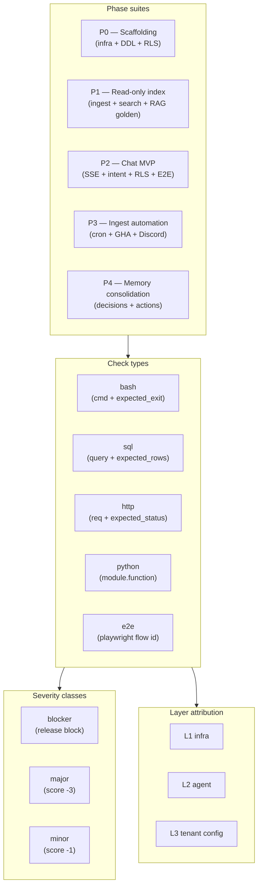

# 09 — Validator Harness

> **One-line:** A declarative rubric (`rubric.yaml`) with five phases (P0–P3 + memory) runs against every commit via `make validate-*`; an autonomous Ralph supervisor drives 50-iteration self-healing loops; a 4-tier code-mod policy (`recipes.yaml`) decides when AI can auto-fix vs when humans must.

## 1. Executive view

The harness exists because Sediment is being built by AI agents as much as by humans. Every check is declarative — the rubric defines what "good" means; runners execute; results land as JSON. This separation lets us:
1. Catch regressions in CI deterministically (no flaky bash scripts hidden in workflows)
2. Drive Ralph (the autonomous supervisor) with the same checks humans use
3. Document phase-by-phase progress in a single artifact (`output/validation/*.json`)

The four-tier code-modification policy bounds AI autonomy by risk: trivial fixes happen instantly; structural changes go through propose-review-commit; tenant isolation (`P*-RLS-*`) never auto-fixes.

## 2. The validation pyramid



## 3. Rubric structure

`services/sediment/validator/rubric.yaml`:

```yaml
phases:
  - id: P0
    name: "Scaffolding (infra + DDL + RLS)"
    description: "docker-compose up, init.sql applies cleanly, RLS policies active"
    pass_criteria:
      blockers_passed_pct: 100
      total_score_pct: 90
      layer_min_pct: 80
    checks:
      - id: P0-INFRA-01
        title: "Postgres reachable on :5433"
        layer: L1
        severity: blocker
        type: bash
        cmd: "docker exec curator-pg pg_isready -U curator -d curator"
        expected_exit: 0
      
      - id: P0-RLS-03
        title: "RLS isolates two tenants"
        layer: L3
        severity: blocker
        type: python
        module: validator.checks.rls
        function: test_two_tenant_isolation
      
      - id: P0-E2E-08
        title: "Cross-tenant negative test"
        layer: L3
        severity: blocker
        type: e2e
        flow: E2E-08
```

**Check ID naming**: `P<phase>-<area>-<seq>`. Areas: INFRA, RLS, INGEST, SEARCH, CHAT, INTENT, E2E, HEALTH, SEC, MCP, DDL, CHUNK, WEB.

**Stable across renames**: the check ID is a contract. Renaming `P2-CHAT-04` to `P2-CHAT-04b` breaks dashboards. Renaming the title is free.

## 4. Runner

`services/sediment/validator/runner.py`:

```python
async def run_phase(phase_id: str) -> PhaseResult:
    phase = load_phase(phase_id)
    results = []
    for check in phase["checks"]:
        runner = RUNNERS[check["type"]]   # bash | sql | http | python | e2e
        try:
            r = await runner(check)
        except Exception as e:
            r = CheckResult(passed=False, error=str(e), elapsed_ms=0)
        results.append({**check, **asdict(r)})
    
    return PhaseResult(
        phase=phase_id,
        results=results,
        passed=evaluate_pass_criteria(phase["pass_criteria"], results),
        score_pct=compute_score(results),
        layer_scores=per_layer_score(results),
    )
```

**Each runner is small** (~50 LOC each):
- `bash`: `subprocess.run`, check `expected_exit` + optional `expected_stdout_contains/regex`
- `sql`: `service_session().execute(text(...))`, check `expected_rows` / `expected_value` / `expected_min_rows`
- `http`: `httpx.AsyncClient.request(...)`, check status + json_path
- `python`: `importlib.import_module(check["module"]).getattr(check["function"])`
- `e2e`: dispatches to `e2e_runner.py` with the flow id

## 5. E2E runner

`services/sediment/validator/e2e_runner.py` wraps Playwright with our DSL:

```yaml
# validator/e2e_spec.yaml
base_url: "http://localhost:3000"
seed_member:
  email: "jayleekr0125@gmail.com"

environments:
  dev:
    base_url: "http://localhost:3000"
    auth_method: dev_token
    seed_member: { email: "jayleekr0125@gmail.com" }
  prod:
    base_url: "https://sediment.hypeproof-ai.xyz"
    auth_method: none
    seed_member: null

flows:
  - id: E2E-01
    name: "Sign-in flow"
    severity: blocker
    environments: [dev]
    repeat: 5
    pass_threshold: 4
    steps:
      - action: navigate
        url: "/sediment"
        wait_for: "input[placeholder='member email']"
      - action: fill
        selector: "input[placeholder='member email']"
        value: "{{seed_member.email}}"
      - action: click
        selector: "button:has-text('Mint dev token')"
        wait_for: "text=Conversations"
```

**Actions** (extend by adding to `e2e_runner.py`):
`navigate`, `click`, `fill`, `press_key`, `wait_for_selector`, `wait_for_text`, `wait_for_idle`, `signin_as`, `signout`, `ensure_signed_in`, `screenshot`, `assert`, `assert_no`

**Assertion types** (`assert.type`):
`text_contains`, `text_matches_regex`, `url_contains`, `selector_visible`, `localStorage_has`, `console_errors_max`, `count_min`, `count_exact`

**Environments** (v0.2 addition): per-flow `environments: [dev, prod]` tag filters which flows run where. `SEDIMENT_E2E_ENV` env var picks the target.

**Cookie consent pre-seeding**: `e2e_runner.py` sets `localStorage.cookie_consent` via `add_init_script` before navigation — Playwright sees a "consented" app, no modal blocks clicks. Same script also clears the dev token if present (clean slate).

## 6. The 5 phases

| Phase | Scope | When run | Owner |
|---|---|---|---|
| **P0** Scaffolding | `docker-compose up`, init.sql applies, RLS policies, 2-tenant isolation | local + CI | platform |
| **P1** Read-only index | RAG ingest + BM25/vector search + recall@3 golden | local + CI + nightly | agent (LLM intel) |
| **P2** Chat MVP | SSE stream + intent routing + RLS in chat + Playwright E2E | local + CI | agent + UI |
| **P3** Ingest automation | APScheduler cron + GHA workflows + Discord fetch + GitHub repo fetch | local + nightly | platform |
| **P4** Memory consolidation | decisions + actions extraction + Phase 4 cron | local + nightly | agent |

Each phase's output: `output/validation/<phase>-iter*.json`. Successive iterations show drift over time.

## 7. The 4-tier code modification policy

`services/sediment/validator/recipes.yaml`:

```yaml
recipes:
  # Tier 1: trivial fixes AI applies directly without review
  - pattern: "P*-INFRA-*"
    action: ai_apply_immediately
    agent: curator-fixer
  - pattern: "P*-HEALTH-*"
    action: ai_apply_immediately
    agent: curator-fixer
  - pattern: "P*-INGEST-01"
    action: ai_apply_immediately
    agent: curator-fixer
  
  # Tier 2: structural changes — AI proposes, AI reviewer reviews, AI commits
  - pattern: "P*-RAG-*"
    action: ai_propose_review_commit
    agent: curator-coder
    reviewer: curator-reviewer
  - pattern: "P*-SEARCH-*"
    action: ai_propose_review_commit
  - pattern: "P*-E2E-*"
    action: ai_propose_review_commit
  - pattern: "P*-INTENT-*"
    action: ai_propose_review_commit
  - pattern: "P*-MCP-*"
    action: ai_propose_review_commit
  - pattern: "P*-CHUNK-*"
    action: ai_propose_review_commit
  - pattern: "P*-WEB-*"
    action: ai_propose_review_commit
  
  # Tier 3: tenant isolation — NEVER auto. Always a human work-order.
  - pattern: "P*-RLS-*"
    action: human_required
    rationale: "RLS regressions = cross-tenant leak risk; never auto-fix"
  
  # Tier 4: forbidden at the tool level (.claude/guard.json blocks Edit/Write)
  # Listed here for documentation:
  forbidden_paths:
    - infra/init.sql
    - .env
    - services/sediment/applications/sediment_platform/routers/billing.py
    - credentials*
```

**Why four tiers?** Risk-bounded autonomy:
- T1: zero-risk repeatable patterns (service restarts, file-permission fixes)
- T2: code that affects behavior but is bounded by tests
- T3: anything that touches the tenant boundary — human eyes mandatory
- T4: catastrophic-blast-radius files — tool literally cannot write

Adding a new check ID to the rubric without a recipes.yaml entry → defaults to `human_required` (safe default).

## 8. Ralph supervisor (the autonomous loop)

`harness/ralph/supervisor.sh` wraps `claude -p` for 50-iteration self-improving runs:

```bash
bash harness/ralph/supervisor.sh \
  --max-iter 50 \
  --cost-budget 20 \
  --max-restarts 2
```

Per iteration:
1. Validate (current phase or specific check)
2. Read failures
3. For each failure, look up recipes.yaml → tier
4. T1: dispatch curator-fixer
5. T2: dispatch curator-coder → reviewer → commit
6. T3: write `output/work-orders/<check-id>-<iter>.json` for human
7. T4: log + skip
8. Re-validate
9. Snapshot state files (`STATE/RALPH_TODO.md`, `STATE/RALPH_JOURNAL.md`)
10. If green or budget exhausted, exit

State files:
- `STATE/RALPH_TODO.md` — what to fix next iteration
- `STATE/RALPH_JOURNAL.md` — what was tried, what worked
- `STATE/RALPH_STATE.json` — machine-readable progress

After run:
```bash
bash harness/scripts/harvest-ralph-results.sh /tmp/ralph-50iter.log
# writes RALPH_50ITER_RESULT.md
```

**Cost safety**: per-iter Anthropic spend tracked; exit when `--cost-budget` exceeded.
**Restart safety**: `--max-restarts` bounds rerun-on-crash; protects against runaway loops.
**Env scrub**: supervisor unsets parent's `CLAUDE_CODE_*` env vars so child sessions don't inherit unexpected config.

## 9. AI commit protocol

`harness/scripts/ai-commit.sh` — the audit trail for every AI-driven change:

```bash
bash harness/scripts/ai-commit.sh baseline <CHECK_ID> <PHASE>
  # records current validator state for the check before changes

bash harness/scripts/ai-commit.sh begin <CHECK_ID>
  # marks the start of work

# ... AI edits files via Edit tool ...

bash harness/scripts/ai-commit.sh gate <CHECK_ID> <PHASE>
  # 1. bounce-services (restart only changed services)
  # 2. lint-sql (block `:NAME::TYPE` casts)
  # 3. re-run validator for the check
  # 4. compare to baseline — must not regress

bash harness/scripts/ai-commit.sh commit <CHECK_ID> [MSG]
  # creates a commit with structured message
```

**Service bounce on code change**: `harness/scripts/restart-services-if-changed.sh` maps changed file paths to running uvicorn pids and restarts only those — idempotent (no-op if nothing changed), wired into the `gate` step.

**SQL `:NAME::TYPE` lint**: `harness/scripts/lint-sql-cast.sh` forbids `:NAME::TYPE` (SQLAlchemy + asyncpg incompatibility — bites repeatedly). Hard block in `gate`.

## 10. Coverage matrix

| Capability | Status |
|---|---|
| 5 phase suites (P0–P4) | ✅ |
| `bash/sql/http/python/e2e` runners | ✅ |
| E2E v0.2 (multi-env dev/prod) | ✅ |
| Cookie-consent pre-seeding | ✅ |
| 4-tier recipes.yaml | ✅ |
| Ralph supervisor (50-iter) | ✅ |
| Per-iter snapshot/restore | ✅ |
| AI commit protocol | ✅ |
| Service bounce hook | ✅ |
| SQL lint hook | ✅ |
| Nightly recall@3 (kids-edu) | ✅ via `recall_live.py` |
| Per-tenant golden sets | ⏳ kids-edu added; expand to future tenants |
| Per-tenant rubric (planned) | ❌ rubric is global; per-tenant TBD |
| Validator alert into Discord | ⏳ via notify in 07 |

## 11. Boundary principle (for this doc)

> **The validator never edits production data. Its writes are confined to `output/validation/`, `STATE/`, and git commits authored by AI.**
>
> Allowed: read everything, write to validator output dirs + git
> Forbidden: INSERT/UPDATE/DELETE on prod tables; force-push; bypass guard.json

The single test: *"If the validator was deleted, would any user-facing behavior change?"* If yes, it's a smell — validator should reflect reality, not create it.

## 12. Open questions

- **Q1**: Per-tenant rubric — when do golden sets / E2E flows / cron checks need to be tenant-specific in the rubric? *Trigger:* when 3+ tenants want different SLAs. *Solution sketch:* `rubric.<tenant>.yaml` overlay merged at runtime.
- **Q2**: Validator-as-a-service for tenants — should a tenant admin trigger their own validation suite from the UI? *Yes, eventually.* *Effort:* small; gates: which checks are tenant-safe to expose (RLS isolation tests are dangerous from a tenant context).
- **Q3**: Ralph cost ceiling — current $20 / 50 iter. *Question:* is this still right after Sonnet 4.6 pricing? Re-measure after first 5 paid tenants live.
- **Q4**: Ralph's `recipes.yaml` tier 3 escalation — currently writes work-orders; nobody is consuming them. *Plan:* file a GitHub issue automatically (with reproducer + diff), notify the platform Discord.

## 13. References

- `services/sediment/validator/rubric.yaml` — phase definitions + checks
- `services/sediment/validator/e2e_spec.yaml` — Playwright flows + environments
- `services/sediment/validator/recipes.yaml` — 4-tier code-mod policy
- `services/sediment/validator/runner.py` — phase executor
- `services/sediment/validator/e2e_runner.py` — Playwright DSL executor
- `services/sediment/validator/checks/*.py` — per-area check functions
- `harness/ralph/supervisor.sh` — autonomous loop driver
- `harness/ralph/RALPH_PROMPT.md` — Ralph agent contract
- `harness/scripts/ai-commit.sh` — change protocol
- `harness/scripts/restart-services-if-changed.sh` — service bounce
- `harness/scripts/lint-sql-cast.sh` — SQL lint
- `.claude/guard.json` — tool-level forbidden-path enforcement

## Changelog
- 2026-05-22 — v0.1 — codified rubric / e2e / recipes / Ralph / commit protocol as one design doc.
