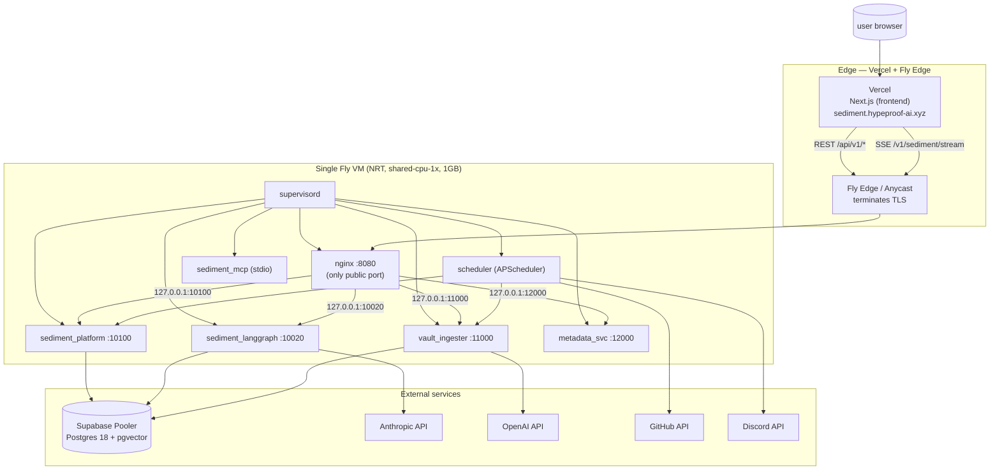

# 11 — Deployment

> **One-line:** Backend is single-VM on Fly.io (NRT region) with supervisord running 5 uvicorns + nginx + scheduler. Frontend on Vercel. CD via GitHub Actions: paths-filtered, Playwright-cached, ~2m38s end-to-end. Secrets in `fly secrets` (backend) + Vercel env (frontend) + GH org secrets (cross-repo).

## 1. Executive view

Deployment is the boring-on-purpose layer. The Y1 sizing decision was: single VM, single Postgres (Supabase pooler), zero Kubernetes. The trade-off is bounded — we hit a clean migration trigger at 10+ tenants or 5 jobs/sec sustained, but until then the carrying cost of operability is essentially zero.

Three discipline pillars:
1. **Reproducible images.** Every commit builds an immutable Docker image; rollback is `fly machine rollback <prev>`.
2. **Path-filtered CD.** Only commits touching runtime paths trigger deploy. Docs, tests, validator changes do not. Cuts CD cost ~70%.
3. **Smoke after deploy.** Every successful deploy runs E2E-12 prod smoke; failure rolls forward to alert, not rollback automatically (humans decide).

## 2. Topology



**5 services + nginx + scheduler + MCP = 8 supervised processes**, one VM. Resource ceiling: ~80% RAM on 1GB shared-cpu-1x at quiet load; chat compose spikes briefly. Scale-up trigger: sustained > 90% RAM or > 80% CPU.

## 3. The image build (`Dockerfile`)

Multi-stage:
1. **Builder stage** — `python:3.11-slim` + `uv` for fast dependency resolution → compiled wheel cache
2. **Runtime stage** — same base + Node 20 (for Playwright + validator) + supervisord + nginx + the wheels

Image size: ~600MB. Most of it is Playwright Chromium (~400MB) — used only for validator E2E. Strip if validator moves to a separate sidecar image (Phase 2).

Build context: limited to `services/sediment/`, `infra/`, `frontend/package.json` lockfile (NOT the full frontend tree — Vercel handles that).

## 4. Fly configuration (`infra/deploy/fly.toml`)

```toml
app = "hypeproof-sediment"
primary_region = "nrt"

[build]
  dockerfile = "Dockerfile"

[env]
  PUBLIC_PORT = "8080"
  SEDIMENT_PLATFORM_PORT = "10100"
  SEDIMENT_LANGGRAPH_PORT = "10020"
  VAULT_INGESTER_PORT = "11000"
  METADATA_SVC_PORT = "12000"
  LOG_LEVEL = "INFO"

[http_service]
  internal_port = 8080
  force_https = true
  auto_stop_machines = "stop"        # idle scale to zero NOT used in v1
  auto_start_machines = true
  min_machines_running = 1
  
  [[http_service.checks]]
    grace_period = "30s"
    interval = "15s"
    timeout = "5s"
    method = "GET"
    path = "/healthz"

[deploy]
  release_command = "python -m scripts.seed_lab"   # runs once per release; idempotent

[[mounts]]
  source = "sediment_data"
  destination = "/data"
```

**`release_command`** runs `make seed` equivalent on every deploy → ensures the 3 tenants + their members + integration rows are present.

**Volume**: `/data` — used for sqlite cache (langgraph checkpointer) + ephemeral file uploads. Postgres lives in Supabase, not on the volume.

## 5. supervisord (`infra/deploy/supervisord.conf`)

One stanza per service, all `autostart=true autorestart=true`. Inherits env from `start.sh`. Notable:

```ini
[program:nginx]
command=nginx -g 'daemon off;'
priority=20      ; start AFTER backends

[program:scheduler]
command=python -m scripts.scheduler
priority=30      ; last; needs DB + services up
```

Start order: backends (priority=10) → nginx (20) → scheduler (30). Crash of any one → supervisord restarts it. Crash loop > 3 in 60s → process declared failed (Fly health check eventually pages).

## 6. nginx (`infra/deploy/nginx.conf`)

Reverse proxy with path-based routing:

```nginx
location /api/v1/         { proxy_pass http://127.0.0.1:10100; }
location /v1/sediment/    { proxy_pass http://127.0.0.1:10020;
                            proxy_buffering off;            # SSE
                            proxy_read_timeout 300s; }
location /v1/ingest/      { proxy_pass http://127.0.0.1:11000; }
location /v1/metadata/    { proxy_pass http://127.0.0.1:12000; }
location /webhook/        { proxy_pass http://127.0.0.1:11000; }
location /healthz         { return 200 "OK\n"; }
```

### CORS (credentialed) — sediment#80

Credentialed CORS (`allow_credentials=True`) is centralized in `lab_lib/cors.py`
(`build_cors_kwargs()`), shared by both `sediment_platform` and
`sediment_langgraph`. Policy:

- **Production / default**: only first-party origins are allowed — `http://localhost:3000`,
  `http://127.0.0.1:3000`, `https://sediment.hypeproof-ai.xyz`, `https://hypeproof-ai.xyz`,
  `https://hypeproof.studio`. The prod frontend lives on the custom domain, so this is all
  prod needs. There is **no** blanket `*.vercel.app` allowance.
- **Why not `*.vercel.app`**: `vercel.app` is a shared, multi-tenant apex — anyone can deploy
  `attacker.vercel.app`. Combined with `allow_credentials=True`, a blanket regex let any such
  origin send the victim's cookies/session and read the response. Removed.
- **No team-slug regex either**: scoping previews with `https://[a-z0-9-]+-<team>\.vercel\.app`
  does **not** work. `[a-z0-9-]+` spans hyphens, so `evil-<team>.vercel.app` — a project name
  anyone can register — fullmatches. More fundamentally, a real preview URL and an attacker URL
  are both a single label in front of `vercel.app`, so no regex can tell tenants apart on a
  shared apex. `SEDIMENT_VERCEL_TEAM_SLUG` has been removed; setting it does nothing.
- **Preview / staging opt-in**: enumerate the exact origins in
  `SEDIMENT_CORS_EXTRA_ORIGINS=<csv>` — e.g.
  `fly secrets set SEDIMENT_CORS_EXTRA_ORIGINS="https://sediment-git-main-hypeprooflab.vercel.app,https://staging.hypeproof-ai.xyz"`.
  Each entry must be a full scheme+host origin (no path, no trailing slash, no wildcard).
  Unset by default. Vercel preview URLs change per branch/deploy, so prefer a stable alias
  domain over pinning a per-commit URL.
- **Guard**: `build_cors_kwargs()` refuses (raises `ValueError`) any credentialed config that
  would match a hostile probe origin (broad shared-apex regex, or a `-<team>.vercel.app`-shaped
  origin) or a `*` wildcard, so the vulnerable pattern cannot regress back in.
- **Rollback**: that `ValueError` is raised at import time, so a bad
  `SEDIMENT_CORS_EXTRA_ORIGINS` value makes the app fail to boot — if a deploy comes up
  unhealthy right after a CORS change, `fly secrets unset SEDIMENT_CORS_EXTRA_ORIGINS` and
  redeploy to restore the first-party-only default.

## 7. start.sh

`infra/deploy/start.sh` is the supervisord entrypoint:

```bash
#!/bin/bash
set -euo pipefail

# 1. Require DATABASE_URL (Fly Postgres URL or external)
: "${DATABASE_URL:?DATABASE_URL must be set}"

# 2. Normalize URL (asyncpg expects postgresql+asyncpg://)
normalize_pg_url() {
  echo "$1" | sed 's|^postgresql://|postgresql+asyncpg://|' | sed 's|?sslmode=disable||'
}
export DATABASE_URL="$(normalize_pg_url "$DATABASE_URL")"
export DATABASE_URL_APP="$(normalize_pg_url "${DATABASE_URL_APP:-$DATABASE_URL}")"
export DATABASE_URL_SERVICE="$(normalize_pg_url "${DATABASE_URL_SERVICE:-$DATABASE_URL}")"

# 3. Print resolved env so logs prove what's set (no secret values)
echo "Env:"
echo "   PUBLIC_PORT=$PUBLIC_PORT"
echo "   platform=$SEDIMENT_PLATFORM_PORT langgraph=$SEDIMENT_LANGGRAPH_PORT"
echo "   ingester=$VAULT_INGESTER_PORT metadata=$METADATA_SVC_PORT"

# 4. Hand off to supervisord
exec supervisord -c /etc/supervisord.conf
```

**No DB migration on start** — schema is managed in `infra/init.sql` (applied once by Supabase admin or via `make init`). `release_command` runs `seed_lab.py` which is idempotent ALTER ... ADD COLUMN IF NOT EXISTS for safe schema evolution.

## 8. Release command (`infra/deploy/release.sh`)

Runs in a temporary container on every `fly deploy`:

```bash
#!/bin/bash
set -euo pipefail
echo "release.start"
python -m scripts.seed_lab
echo "release.done"
```

Idempotent — re-running is a no-op. Fly only marks the deploy successful if release exits 0.

## 9. CD pipeline (`.github/workflows/fly-deploy.yml`)

```yaml
on:
  push:
    branches: [main]
    paths:
      # Allowlist — runtime code + image inputs only.
      - 'services/sediment/applications/**'
      - 'services/sediment/lab_lib/**'
      - 'services/sediment/lab_platform/**'
      - 'services/sediment/scripts/**'
      - 'services/sediment/prompts/**'
      - 'services/sediment/data/**'
      - 'services/sediment/config/**'
      - 'services/sediment/pyproject.toml'
      - 'services/sediment/uv.lock'
      - 'Dockerfile'
      - 'infra/deploy/**'
      - '.github/workflows/fly-deploy.yml'
  workflow_dispatch:

concurrency:
  group: fly-deploy
  cancel-in-progress: false        # serialize; never overlap deploys

jobs:
  deploy:
    runs-on: ubuntu-latest
    steps:
      - uses: actions/checkout@v4
      - uses: superfly/flyctl-actions/setup-flyctl@master
      - run: flyctl deploy --remote-only --config infra/deploy/fly.toml
        env: { FLY_API_TOKEN: "${{ secrets.FLY_API_TOKEN }}" }

  prod_smoke:
    needs: deploy
    runs-on: ubuntu-latest
    steps:
      - uses: actions/checkout@v4
      - uses: actions/setup-python@v5
        with: { python-version: "3.11" }
      - uses: actions/cache@v4
        with:
          path: ~/.cache/ms-playwright
          key: playwright-1.60.0
      - run: pip install playwright==1.60.0 && playwright install chromium
      - run: SEDIMENT_E2E_ENV=prod python -m validator.e2e_runner E2E-12
        working-directory: services/sediment
```

**Path filter** excludes `validator/`, `tests/`, `docs/`, `harness/` — those changes don't need a deploy. Reduces median CD count by ~70%.

**Playwright cache** keyed by version — saves ~90s per run.

**Concurrency**: `cancel-in-progress: false` because we never want overlapping deploys (release_command races + supervisord chaos).

**Prod smoke**: E2E-12 walks 6 public routes, asserts brand badge reads `prod`, asserts ≤ 8 console errors. ~30s. Failure → workflow red, **does NOT** automatically roll back — humans decide (could be data drift, not deploy regression).

Pipeline median: 2m38s. Best case: 2m05s. Worst case (cache cold): 4m10s.

## 10. Nightly recall (`.github/workflows/nightly-recall.yml`)

```yaml
on:
  schedule: [{ cron: "30 18 * * *" }]    # 03:30 KST daily
  workflow_dispatch:

jobs:
  recall:
    runs-on: ubuntu-latest
    steps:
      - uses: actions/checkout@v4
      - uses: actions/setup-python@v5
      - run: pip install httpx pyyaml
      - run: RECALL_MIN_PASS=20 python -m validator.scripts.recall_live
        working-directory: services/sediment
```

Threshold `≥ 20/40` for hypeproof-lab. Below → workflow red → triggers `recall.regression` notification (07).

`kids-edu` golden set runs in the same job once we add the second `recall_live` invocation; pending Phase 2.

## 11. Secrets management

| Secret | Where | Used by |
|---|---|---|
| `DATABASE_URL` | Fly secret | backend (start.sh) |
| `ANTHROPIC_API_KEY` | Fly secret | backend (lab_lib.llm) |
| `OPENAI_API_KEY` | Fly secret | backend (embeddings) |
| `GEMINI_API_KEY` | Fly secret | backend (Gemini fallback) |
| `DISCORD_BOT_TOKEN` / `HYPEPROOF_DISCORD_BOT_TOKEN` | Fly secret | backend (DiscordConnector) |
| `GITHUB_TOKEN` | Fly secret | backend (GitHubRepoConnector) |
| `JWT_SECRET` | Fly secret | backend (auth) |
| `GITHUB_WEBHOOK_SECRET` | Fly secret | backend (webhook signature verify) |
| `DISCORD_WEBHOOK_<CHANNEL>` | Fly secret (planned 07) | notify dispatcher |
| `FLY_API_TOKEN` | GH repo secret | CD workflow |
| `AUTH_GITHUB_ID`, `AUTH_GITHUB_SECRET` | Vercel env | frontend (NextAuth) |
| `NEXTAUTH_SECRET` | Vercel env | frontend |
| `NEXT_PUBLIC_*` | Vercel env | frontend (build-time) |

**Rotation discipline**: any secret quarterly minimum. Discord bot token: when a bot ACL changes. GitHub PAT: when contributor leaves the org.

## 12. Backup & restore

- **Postgres**: Supabase auto-backup (daily, 7-day retention). Plus weekly `pg_dump` snapshot to private S3 bucket (planned).
- **Fly volume `/data`**: Fly snapshot every 24h; restorable to a new VM.
- **DR test**: none yet. Trigger to schedule: first paying tenant. Plan: tear down `kids-edu` from a backup-only restore on a side VM, verify.

## 13. Cost (Y1 estimate)

| Item | Monthly |
|---|---|
| Fly VM (shared-cpu-1x, 1GB) | ~$2 |
| Supabase Pro (Postgres + pgvector) | $25 |
| Vercel (Pro tier, supports custom domain) | $20 |
| Anthropic (Claude + Haiku dogfood usage) | ~$10 |
| OpenAI (embeddings) | ~$2 |
| **Total** | **~$60/mo** |

At 30-50 paying tenants × $5 LLM cost cap = $150–250/mo LLM + $50 infra = ~$300/mo total cost. Plan: tenants @ ₩99K/mo Studio price = $75/tenant. 50 tenants × $75 = $3750/mo revenue. 92% margin. Numbers tight enough that the cost discipline in 08 is load-bearing.

## 14. Boundary principle (for this doc)

> **No application code calls `fly` or `vercel` CLIs at runtime. All deployment artifacts are immutable per commit.**
>
> Allowed: scripts under `harness/scripts/` or `.github/workflows/` invoke `flyctl` / `vercel`
> Forbidden: a request handler that triggers a redeploy, or a cron job that calls `vercel --prod`

The single test: *"Can we exactly reproduce this deploy from a git tag?"* If yes, boundary intact.

## 15. Coverage matrix

| Capability | Status |
|---|---|
| Backend single-VM Fly NRT | ✅ |
| Supabase pooler Postgres+pgvector | ✅ (legacy Fly PG stopped) |
| Frontend Vercel + custom domain | ✅ `sediment.hypeproof-ai.xyz` |
| Backend CD (path-filtered + Playwright cache) | ✅ ~2m38s median |
| Frontend CD (Vercel auto on push to main) | ✅ |
| Prod smoke E2E-12 | ✅ |
| Nightly recall@3 (hypeproof-lab) | ✅ |
| Nightly recall@3 (kids-edu) | ⏳ wire 2nd call |
| Cross-product CD (Studio, hypeprooflab-page) | ⏳ each repo has own |
| DR test (full restore drill) | ❌ Y1 |
| Multi-region failover | ❌ Y2+ |
| Blue/green deploy | ❌ relying on supervisord restart |

## 16. Open questions

- **Q1**: When to add a second region? *Trigger:* p95 chat latency > 3s from non-Asia users. Currently NRT-only is fine for KR + JP + most of US-West.
- **Q2**: Auto-scale to zero overnight? *Trigger:* unit cost of an idle VM matters. Currently $2/mo — irrelevant. Revisit after 10+ tenants.
- **Q3**: Migrate scheduler out of in-VM APScheduler? *Trigger:* documented in 04 (5 jobs/sec or 10+ tenants × hourly). Plan: Celery + Redis.
- **Q4**: Separate validator image (drop Playwright from prod image, save ~400MB)? *Effort:* low; *value:* small image = faster cold start; *Trigger:* if image size becomes a deploy bottleneck (currently 2m38s end-to-end is fine).

## 17. References

- `infra/deploy/Dockerfile` — image build
- `infra/deploy/fly.toml` — Fly app config
- `infra/deploy/supervisord.conf` — process supervision
- `infra/deploy/nginx.conf` — reverse proxy
- `infra/deploy/start.sh`, `release.sh` — startup + release commands
- `.github/workflows/fly-deploy.yml` — CD pipeline
- `.github/workflows/nightly-recall.yml` — recall canary
- `frontend/vercel.json` — Vercel config
- [09-validator-harness.md](./09-validator-harness.md) — E2E-12 prod smoke definition

## Changelog
- 2026-05-22 — v0.1 — codified single-VM topology, supervisord stack, path-filtered CD, secrets table.
