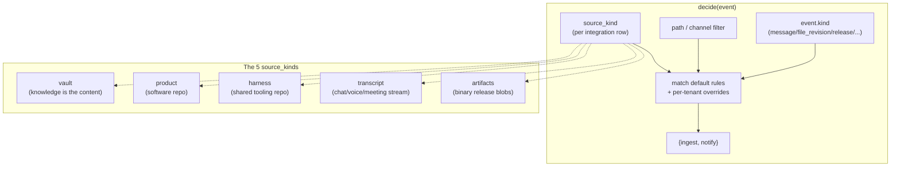

# 12 — Source Kinds Catalog

> **One-line:** Every source the Collection Engine touches is classified into one of five **source_kinds**: `vault`, `product`, `harness`, `transcript`, or `artifacts`. The kind drives the `decide()` defaults — ingest? notify? both? — so adding a new repo or channel becomes a config row, not a code change.

## 1. Why this catalog exists

The Collection Engine (04) makes two decisions per event: ingest, notify. Those decisions vary wildly by what *kind* of source the event came from:
- A markdown change in a wiki = "the content IS the knowledge" → ingest aggressively
- A `.py` commit in a backend repo = "the code is not knowledge" → don't ingest
- A new Discord message in a noise channel = neither

Without a classification system, every connector reimplements its own ingest+notify policy. With it, one taxonomy + one set of default rules + per-tenant overrides covers everything.

## 2. The 5 source_kinds



| source_kind | What it is | Examples | Default ingest | Default notify |
|---|---|---|---|---|
| **vault** | Repo or space whose content IS the knowledge | hypeprooflab, kids_edu_vault, Notion knowledge bases | YES — chunk + embed every matching file | digest only; new decisions notified inline |
| **product** | Code repo for a software product | sediment, hypeproof-studio, hypeprooflab-page (the marketing site) | Only `docs/`, `SPEC.md`, `DECISIONS.md`, `README.md`, `CHANGELOG.md` | release/deploy events |
| **harness** | Shared cross-product tooling | hypeproof-harness | Skill specs + docs only | new skill published, skill version bumped |
| **transcript** | Async chat or live-recorded stream | Discord channels, Slack channels (planned), meeting recordings (Phase A), voice memos (Phase A) | YES — Phase 4 distillation extracts decisions/actions | Usually NO — readers are already in the channel |
| **artifacts** | Binary release blobs | hypeproof-studio-releases, Docker images on GHCR | NO — content isn't text | release tag → notify |

## 3. Per-kind detailed defaults

### 3.1 `vault`

Default ingest: **YES** for every file matching the connector's path/extension filter.
Default notify: **NO** for routine file changes; **YES** for files matching "decision" patterns.

```yaml
defaults:
  ingest: true
  notify: false
overrides:
  - when: path matches "**/decisions/**"
    action: [ingest, notify]
    notify_event_type: new_decision
    notify_channels: [primary]
  - when: path matches "**/adr-*.md"
    action: [ingest, notify]
    notify_event_type: new_decision
    notify_channels: [primary]
  - when: path matches "**/.raw/**"
    action: []
  - when: path matches "**/.obsidian/**"
    action: []
  - when: kind == "file_delete"
    action: [delete_artifact]
```

Why: a wiki's whole purpose is to be queryable. A decision in a wiki is also worth interrupting the team for.

**Examples:**
- `jayleekr/hypeprooflab` (hypeproof-lab tenant)
- `JinyongShin/hypeproof_kids_edu` (kids-edu tenant)
- Future: a paying tenant's company wiki (Notion / Confluence)

### 3.2 `product`

Default ingest: **NO** for source code; **YES** for docs.
Default notify: **YES** for releases; **NO** for routine commits.

```yaml
defaults:
  ingest: false
  notify: false
overrides:
  - when: path matches "(SPEC|DECISIONS|README|CHANGELOG|CONTRIBUTING|ARCHITECTURE).md"
    action: [ingest]
  - when: path matches "docs/**/*.md"
    action: [ingest]
  - when: path matches "docs/**/decisions/**"
    action: [ingest, notify]
    notify_event_type: new_decision
    notify_channels: [primary]
  - when: kind == "release"
    action: [notify]
    notify_event_type: release_deployed
    notify_channels: [primary]
  - when: kind == "deploy.failure"
    action: [notify]
    notify_event_type: deploy_failure
    notify_channels: [primary]
    severity: critical
```

Why: source code isn't directly queryable for end users; specs/decisions inside the repo are. Release events matter for everyone.

**Examples:**
- `jayleekr/sediment` (this repo) — Sediment's own SPEC.md, DECISIONS.md, design/ all ingested
- `jayleekr/hypeproof-studio`
- `jayleekr/hypeprooflab-page`

### 3.3 `harness`

Default ingest: **NO** for shell scripts; **YES** for skill specs and docs.
Default notify: **YES** when a new skill ships; **NO** otherwise.

```yaml
defaults:
  ingest: false
  notify: false
overrides:
  - when: path matches "skills/*/SKILL.md"
    action: [ingest, notify]
    notify_event_type: skill_published
    notify_channels: [primary]
  - when: path matches "docs/**/*.md"
    action: [ingest]
  - when: path matches "README.md"
    action: [ingest]
```

Why: harness exists to enable other repos. The "what changed" worth knowing is "is there a new skill I should adopt?"

**Examples:**
- `jayleekr/hypeproof-harness`

### 3.4 `transcript`

Default ingest: **YES** (Phase 4 distillation produces structured decisions/actions from messages).
Default notify: **NO** — the readers are already in the channel by definition.

```yaml
defaults:
  ingest: true
  notify: false
overrides:
  - when: channel_name in ["공지사항","rule","온보딩-가이드","hackathon"]
    action: []                # noise channels — skip both
  - when: channel_name in ["meeting-notes"]
    action: [ingest]
    distill_strategy: meeting_transcript
  - when: channel_name in ["sediment","hypeproof-studio","insights"]
    action: [ingest]
    distill_strategy: chat_thread
```

Why: re-notifying people about messages they're already seeing creates noise + a notification feedback loop (we'd notify about notifications). The value is in *consolidating* the chat into decisions, surfaced once via digest.

**Examples:**
- Discord channels in the HypeProof HQ guild
- Future: Slack channels in a paying tenant's workspace
- Phase A: voice memos, meeting recordings (different shape but same logical kind)

### 3.5 `artifacts`

Default ingest: **NO** (binary content isn't searchable text).
Default notify: **YES** for release tags.

```yaml
defaults:
  ingest: false
  notify: false
overrides:
  - when: kind == "release"
    action: [notify]
    notify_event_type: release_published
    notify_channels: [primary]
```

Why: a `.dmg` or `.tar.gz` has nothing for our chunker. But the release event itself is high signal.

**Examples:**
- `jayleekr/hypeproof-studio-releases`
- GHCR/Docker registry tags (planned)

## 4. Where source_kind is set

`integrations.config.source_kind` — one column-equivalent (JSONB field) per integration row. Set at integration creation time (today: hardcoded in `scripts/seed_lab.py`; future: tenant admin UI dropdown).

```yaml
# In integrations.config JSONB:
source_kind: vault          # vault | product | harness | transcript | artifacts
```

If absent → defaults to `vault` for safety (most aggressive ingest; least surprising for a new integration).

## 5. The override layer (per-tenant)

The defaults above can be overridden per-integration via `integrations.config.event_rules`:

```yaml
# kids-edu's integrations.config example
source_kind: vault
event_rules:
  - when: path matches "kids_edu_vault/wiki/specs/skins/dental/**"
    action: [ingest, notify]                  # special handling for dental skin curriculum
    notify_event_type: dental_curriculum_update
    notify_channels: [primary, dental-team]   # if there's a Discord channel for the dental team
```

Override semantics:
- Tenant overrides **append** to defaults — same path can match both default and override; both fire
- Last-match-wins for conflicting `action: []` (skip)
- `notify_channels` are logical slugs resolved via the tenant's `routes.yaml` (07)

## 6. Adding a new source_kind

If the 5 above don't fit a new source (e.g., a tenant's CRM, a kanban board, a calendar), the decision tree:

1. **Does the content itself answer questions?** → `vault`
2. **Is the source primarily software that produces docs/releases?** → `product`
3. **Is the source a shared resource other repos consume?** → `harness`
4. **Is the source a real-time stream people are already in?** → `transcript`
5. **Is the source binary blobs with metadata only?** → `artifacts`

If none fit: probably means a 6th kind is justified. Process:
1. Document in this catalog with the same template as above
2. Add to the default rules dictionary in `lab_lib.collection_agent` (planned location)
3. Update the `12-source-kinds-catalog.md` change log
4. PR review

Historical: we started with 4 (no `harness`), added it when hypeproof-harness materialized as a distinct repo type. Adding a kind is rare; it's a yearly+ event.

## 7. Concrete inventory (today)

| Source | tenant | source_kind | Connector | Status |
|---|---|---|---|---|
| HypeProof HQ Discord guild (13 channels) | hypeproof-lab | transcript | discord | ✅ |
| jayleekr/sediment | hypeproof-lab | product | github | ⏳ not ingested yet (proposal in this doc) |
| jayleekr/hypeprooflab | hypeproof-lab | vault | github | ⏳ via webhook today, planned for connector |
| jayleekr/hypeproof-harness | hypeproof-lab | harness | github | ⏳ planned |
| jayleekr/hypeproof-studio | hypeproof-lab | product | github | ⏳ planned |
| jayleekr/hypeproof-studio-releases | hypeproof-lab | artifacts | github | ⏳ planned |
| JinyongShin/hypeproof_kids_edu | kids-edu | vault | github | ✅ 192 artifacts / 1987 chunks |

After this catalog is wired into `lab_lib.collection_agent`, the "⏳ planned" items each become a `seed_lab.py` row + one APScheduler tick away from live.

## 8. Boundary principle (for this doc)

> **The catalog is descriptive, not prescriptive. Code uses it as defaults, tenant config overrides.**
>
> Allowed: import default rules from this catalog; let tenant `event_rules` add/override
> Forbidden: hardcoding "kids-edu's vault is special" into the catalog itself

The catalog stays generic. Tenant specifics live in tenant config rows. If you find yourself wanting to add a `kids-edu` if-branch here, you're violating the boundary.

## 9. Open questions

- **Q1**: Should `transcript` have a "distill_strategy" default per channel, or only per-source? *Current:* per-source via the override clause. *Open:* could automatic strategy detection from channel name patterns ("meeting" → meeting_transcript) cover the common cases.
- **Q2**: How do we handle a *mixed* repo (some folders are vault content, some are code)? *Today:* JinyongShin/hypeproof_kids_edu is exactly this. *Solution:* `source_kind: mixed` with explicit `path_prefixes` + per-prefix override. *Status:* working in practice as `source_kind: vault` + tight `path_prefixes` — formal `mixed` kind not yet needed.
- **Q3**: Photo OCR + voice memos — are they `transcript` or new kinds? *Recommended:* `transcript` — the content is human-utterance turned to text, same downstream pipeline.

## 10. References

- [04-collection-engine.md §5](./04-collection-engine.md) — `decide()` function consuming this catalog
- [05-distillation-pipeline.md §4](./05-distillation-pipeline.md) — strategy selection per transcript kind
- [07-notifications.md §7](./07-notifications.md) — `new_decision` / `release_deployed` event types this catalog emits
- Tenant inventory is maintained in the operational tenant registry; this public
  catalog stays limited to reusable source-kind defaults.
- (planned) `services/sediment/lab_lib/collection_agent.py` — code home for these defaults

## Changelog
- 2026-05-22 — v0.1 — 5-kind taxonomy defined; first inventory snapshot.
