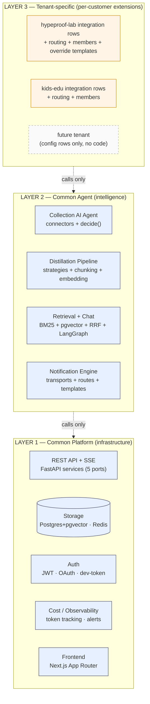

# Sediment — Design Documentation

> **Sediment** — "where doing becomes knowing". HypeProof Lab의 evidence-grounded memory layer. 모든 답에 인용이 붙는다. Multi-tenant SaaS로 확장.

This directory is the **detailed design spec** for Sediment. Each doc covers one functional area, following a single template (Mermaid → component map → data flow → API → config → boundary → coverage). Use this `README` as the master index + cross-cutting concepts; jump to a numbered doc for depth.

---

## 0. The 3-layer model (one diagram for everything)



**Boundary principle** (the single architectural law):

> **Layer 1 and Layer 2 do not know tenant names.**
> If `if tenant == "kids-edu":` appears in `lab_lib/` or `applications/`, it's a violation.
> Layer 3 is config rows (`integrations.config`, `notification_routes`, `members`) — never code.
> Adding a new tenant = adding rows, never editing files in Layer 1 or 2.

This rule is what keeps the SaaS unit economics defensible. Every breach of it adds a fixed cost per tenant; every preserve of it keeps the marginal cost at zero.

---

## 1. Master ToC

| # | Doc | What it covers | Audience |
|---|---|---|---|
| — | **[README.md](./README.md)** *(this file)* | Index + 3-layer model + boundary principle + cross-cutting concerns | Anyone landing here |
| 01 | **[architecture-overview.md](./01-architecture-overview.md)** | Layers crystallized, what's in each, service topology | All engineers, day 1 |
| 02 | **[multitenancy-and-rbac.md](./02-multitenancy-and-rbac.md)** | RLS, tenants/members/integrations, 3-layer RBAC | Anyone touching DB or auth |
| 03 | **[auth.md](./03-auth.md)** | JWT, dev-token, GitHub OAuth, prod vs dev | Frontend + backend auth code |
| 04 | **[collection-engine.md](./04-collection-engine.md)** | Connectors, source-kinds, `decide()`, watermarks | Anyone adding a source |
| 05 | **[distillation-pipeline.md](./05-distillation-pipeline.md)** | Strategy routing, chunking, embedding, Phase 4 consolidation | LLM pipeline work |
| 06 | **[retrieval-and-chat.md](./06-retrieval-and-chat.md)** | BM25 + pgvector + RRF, intent routing, SSE composition | Search + chat quality |
| 07 | **[notifications.md](./07-notifications.md)** | Outbound — transports, routes, templates, circuit breakers | Any team-facing alert |
| 08 | **[cost-and-observability.md](./08-cost-and-observability.md)** | Token tracking, daily summary, alerts, log shape | Cost guardrails + ops |
| 09 | **[validator-harness.md](./09-validator-harness.md)** | Ralph supervisor, validator phases, recipes, e2e | Anyone changing checks |
| 10 | **[frontend.md](./10-frontend.md)** | Next.js structure, library/members/admin/chat | UI work |
| 11 | **[deployment.md](./11-deployment.md)** | Fly + supervisord, Vercel, CD pipeline, secrets | Anything that touches prod |
| 12 | **[source-kinds-catalog.md](./12-source-kinds-catalog.md)** | vault / product / harness / transcript / artifacts taxonomy | Configuring a new source |
| 13 | **[tenant-catalog.md](./13-tenant-catalog.md)** | hypeproof-lab, kids-edu, acme-test, future | Onboarding a new tenant |
| 14 | **[reliability-and-grounding.md](./14-reliability-and-grounding.md)** | Freshness axes, citation hard gates, reliability SLOs | Reliability work / dogfood gate |

**Standalone specs** (not in numbered sequence — point-in-time deep dives):

| File | What | Status |
|---|---|---|
| [ICP-segmentation.md](./ICP-segmentation.md) | 4 archetypes (D/A/B/C), beachhead = D+A | active reference |
| [voice-ocr-connector-spec.md](./voice-ocr-connector-spec.md) | Voice + photo OCR connector design | active reference, links from 04 |

**Deprecated** (folded into the numbered docs, kept temporarily as historical):

| Old file | Folded into |
|---|---|
| `collection-and-distillation.md` v0.3 | 04 + 05 |
| `collection-engine-v1.md` | 04 |
| `notifications-and-broadcast.md` v0.1 | 07 |

---

## 2. Document template (every numbered doc follows this)

```
1. Executive view              ← 1 paragraph: why this layer/feature exists
2. Mermaid diagram             ← scoped to this feature's surface
3. Component map               ← file/service → role 1-liner
4. Runtime data flow           ← request/event sequence
5. API surface / object catalog ← (where applicable)
6. Configuration model         ← what's global, what's per-tenant
7. Boundary principle          ← what this doc's code MUST NOT do
8. Coverage matrix             ← feature state by tenant
9. Open questions              ← what's unresolved
10. References (optional)      ← code paths, prior art, prior decisions
```

The repeated template means contributors don't need a context switch when jumping between docs.

---

## 3. Cross-cutting concerns

These appear in many docs; defined once here.

### 3.1 Multi-tenancy unit

A **tenant** is the root scope for every read, write, and search. Every table that holds tenant data has:
- `tenant_id UUID NOT NULL REFERENCES tenants(id) ON DELETE CASCADE`
- `ROW LEVEL SECURITY ENABLE + FORCE`
- A policy: `USING (tenant_id = current_tenant_id())`

See [02-multitenancy-and-rbac.md](./02-multitenancy-and-rbac.md). The boundary principle (above) is the operational enforcement of this.

### 3.2 PIPA-first

Sediment serves Korean SMBs first. PIPA (한국 개인정보보호법) is the binding regulation. PIPA-aligned defaults:
- **BYOData** wherever possible — user uploads, user grants consent per-resource
- **No auto-fetch of conversational chat** (KakaoTalk 일반 단톡방 auto-fetch is forbidden forever)
- **Per-tenant audit log** for every external read + every PII redaction
- **No SOC2 / GDPR / HIPAA** in v1 scope — added when first relevant tenant signs

See [04-collection-engine.md §3](./04-collection-engine.md) for per-connector PIPA gating.

### 3.3 Cost discipline

Every LLM/embedding call is metered into `llm_calls`. Per-tenant rollups in `usage_daily`. Daily summary cron compares to budget; over-budget triggers an alert (07). Target: Y1 per-tenant LLM cost ≤ $5/mo for the D+A archetype.

See [08-cost-and-observability.md](./08-cost-and-observability.md).

### 3.4 Evidence-grounded answers

Every chat response cites its sources. The `[N]` inline reference convention is enforced by the system prompt. Citations land in `messages.citations` JSONB. Absence of citations = a regression (caught by E2E + golden recall).

See [06-retrieval-and-chat.md](./06-retrieval-and-chat.md).

### 3.5 Observable, not magical

The platform never silently drops events. Every connector failure logs `source.fetch.failed`; every distill skip logs why; every ingest writes an `events` row first then chunks. Replaying = walking `events`.

See [08-cost-and-observability.md](./08-cost-and-observability.md) for the log shape.

---

## 4. Tenant-level coverage at a glance

| Feature | hypeproof-lab | kids-edu | acme-test | Future paying tenant (D/A) |
|---|---|---|---|---|
| Discord ingest | ✅ 8 channels @ 30min | — | — | Phase 2 |
| GitHub repo ingest | — | ✅ 1 repo @ hourly daytime | — | Phase 1 |
| Voice/OCR ingest | ❌ Phase A (Q3 2026) | ❌ | ❌ | ✅ at launch |
| Chat (RAG + citation) | ✅ recall@3 baseline 27/40 | ✅ recall@3 baseline 5/10 | — | ✅ at launch |
| Daily digest notification | ⏳ v1 design | ⏳ v1 design | — | Phase 1 |
| Decision extraction (Phase 4) | ✅ 12h cadence | ⏳ to wire | — | Phase 1 |
| Cost alert | ⏳ Discord wiring | ⏳ to wire | — | Phase 1 |
| Member personal digest | ❌ v3 | ❌ v3 | — | Phase 2 |
| Admin UI for routing | ❌ v2 | ❌ v2 | — | Phase 2 |
| Slack ingest | ❌ Phase 2 | ❌ Phase 2 | — | Optional |
| Notion ingest | ❌ Phase 3 | ❌ Phase 3 | — | Optional |

See [13-tenant-catalog.md](./13-tenant-catalog.md) for the full per-tenant config.

---

## 5. How to add things without breaking the boundary

| Adding… | Where it goes | Code change required? |
|---|---|---|
| A new tenant | `tenants` + `members` + `integrations` rows (`seed_lab.py` or admin endpoint) | None |
| A new GitHub repo to an existing tenant | append to `integrations.config.repos[]` | None |
| A new Discord channel for an existing tenant | append to `config/cron.yaml` `discord.channels[]` | None (until v2 — then DB row) |
| A new source kind (e.g., Slack) | new `lab_lib/connectors/slack.py` implementing `ConnectorABC` + scheduler hook + `12-source-kinds-catalog.md` entry | Yes (Layer 2) |
| A new notification event type | template file + `routes.yaml` entry + caller `notify(event, ...)` | Yes (Layer 2 — template + emit) |
| A per-tenant prompt tweak | `tenants.feature_flags.prompt_override` JSONB | None |
| A per-tenant routing override | `integrations.config.notify.routes[]` JSONB | None |
| A *new* product (Studio, lab-page) consuming the harness | vendor `scripts/notify/` from `hypeproof-harness` into that repo, write its own `routes.yaml` | None in Sediment |

The third column is the architectural test. Anything that says "None" in v1 is a sign the boundary is intact.

---

## 6. Open architectural questions (carried forward across docs)

- **Q1**: Does Layer 2 contain LLM-specific code (Anthropic/Gemini/OpenAI), or do we wrap everything behind `lab_lib.llm.resolve_provider`? *Current:* wrapped, except embedding which is hard-coded OpenAI. *Open:* embedding provider abstraction (per-tenant choice) is Phase B.
- **Q2**: When does Layer 1's APScheduler move to Celery? *Trigger:* sustained > 5 jobs/sec or > 10 tenants with hourly cadences. *Current:* APScheduler.
- **Q3**: Is the harness skill (`scripts/notify/`) Python-vendored or pip-installed? *Current decision pending:* vendor pattern recommended for consistency with existing harness model (07 covers).
- **Q4**: Do we keep `acme-test` tenant in prod DB forever? *Current:* yes, RLS regression coverage. *Cost:* near-zero. Revisit when first paying tenant signs.

---

## 7. Changelog

| Date | What | Who |
|---|---|---|
| 2026-05-22 | v0.1 — design dir established, 13 docs created from prior fragmented sources | Jay + Claude |

Future changes append a row. Per-doc changelog lives at the bottom of each numbered file.
