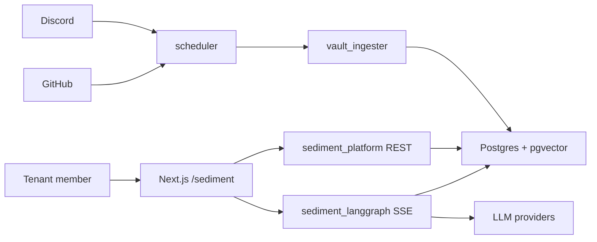

# Sediment Architecture

## Context View

Sediment connects tenant members, capture sources, model providers, and
stateful storage. Members use the Next.js frontend. Capture jobs pull or receive
events from Discord, GitHub, and future connectors. Backend services normalize,
distill, chunk, embed, retrieve, compose, cite, and persist answers. Postgres
and pgvector are the durable memory layer.

## Container View

The runtime is split into frontend, platform REST service, LangGraph chat
service, vault ingester, metadata service, MCP server, scheduler, nginx, and
Postgres/Redis. The split exists so ingestion or metadata failures do not take
down chat, and so tenant-aware REST concerns remain separate from retrieval and
composition. `infra/deploy` describes the single-VM deployment shape.

## Component View

`services/sediment/lab_lib` owns shared components: auth, tenant middleware,
db, logging, chunking, embeddings, connectors, cost tracking, prompts, rate
limits, and grounding. `applications/sediment_platform` owns REST routers.
`applications/sediment_langgraph` owns chat graph composition. `applications/
vault_ingester` owns ingest and embed. `frontend/app/sediment` owns the web UI.
Component changes must preserve tenant isolation, citation grounding, and cost
visibility.
